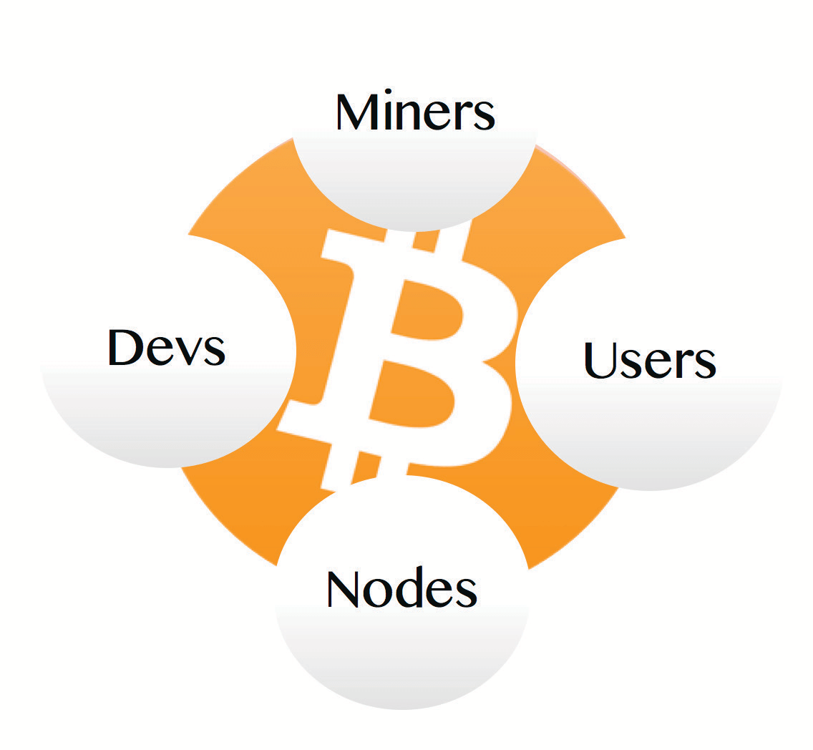

# BITCOIN EKOLA GYE KIKOLA?

Mateeka si Bafuzi

tik-tok/
/ekibinja ekiddako
* Bitcoin ekozesa obukakafu bw’omulimu, okusimba enkyusa ey’olukale
n’omutimbagano gwa peer-to-peer, okukola n’okukakasa
ebisasulo mu lukalala lw’ebyensimbi olw’ensi yonna, olugabanye, olwa ku mutimbagano.

>**Cryptography** (erinnya) /krɪpˈtɑːɡrəfi
>
>*: enkyusa n’okukyusa engeri obubaka gye buwandiikiddwamu
>mu koodi oba enkyusa ey’ekyama
>: enkola ey’obukodyo okusimba
>n’okukyusa amakulu g’ebipande*

~ Merriam Webster Dictionary

>**Hashing** (ekikolwa) /ˈhæʃɪŋ/
>
>*: enkola y’okukweka
>: enkola ey’okukozesa aligorizimu y’ekibalangulo okukola ku
>data okukola omukono ogw’ennamba (hash digest)
>ogukiikirira data eyo.*

~ crsc.nist.gov

>**Jjukira:**
>
>Enkola ya bitcoin erimu >>
>
>**bitcoin:** ebintu by’ensimbi ebya digito **ebyobugagga**
>
>**Bitcoin:** **omutimbagano gw’okusasula** ogw’abaminer n’obuntuntu

1 bitcoin = 100,000,000 satoshis (sats)

**(Osobola okugula sats, ekitundu ku bitcoin)**

---

>*Tutegeeza ssente ey’omukono ng’olukoloboze
lw’emikono egya digito. Buli nannyini yo atambuza
ssente eri omulala ng’asimba omukono ogwa digito
ku hash y’ekisasulo ekibaddewo n’enkyusa
ey’olukale ey’oyo addako ng’agattako
bino ku nkomerero ya ssente. Omusasulwa asobola
okukakasa emikono okukakasa olukoloboze
lw’obwannannyini.*

~ Satoshi Nakamoto
Ekiwandiiko Ekitangaaza eky’e Bitcoin, Pt.2, 2008
Ng’annyonnyola engeri ekisasulo kya bitcoin gye kikola
mu lukalala olugabanye

---
## ENKOLA YA BITCOIN..
**erimu Abaminer, Obuntuntu, Abakozesa, Abakugu**

bonna nga bakola ku bwabwe,

era mu kiseera kye kimu nga beegendereza ku balala,

okuzzaamu amaanyi ekyo ekiri

BITCOIN!

---
## ABAMINER
* **Obuntuntu obw’enjawulo** (computer eziyitibwa ASICS) **ezi
‘zimba’ ebibinja** ebiba ekitundu ku bitcoin
blockchain.
* Mu kukola ekyo, **bakakasa ebisaasulo ebikkakkasiddwa
ebyakolebwa abakozesa, batondawo bitcoini empya** era **bakuuma
omutimbagano gwonna.**

## ABAKOZESA
* **Ggwe nange. Ffenna. Abantu.**
* Okukkiriza n’okusiima omutindo gw’ebintu
n’obuweereza obuweereddwa, tukolagana: tuwa
era tuweebwa bitcoin, oba tugitereka okukozesebwa oluvannyuma, nga
kyetaagisa.

## OBUNTUNTU
* **Obuntuntu ze computer eziddukanya software ya bitcoin.**
* **Waliwo obuntuntu nkumu** obukola
omutimbagano ogutagibwako, ogw’ensi yonna, ogw’obwannakyewa **ogukakasa ebisaasulo** (bwe kityo ne kiziyiza
okukozesaamu ssente emirundi ebiri, era nga kiyamba okukuuma
enkola).

## ABAKUUGU (DEVS)
* **Abawandiisi ba koodi, abakola programmes n’abawandiisi ba digito** abakola
okukuuma **n’okugaziya omutimbagano, okwongera obukuumi,
ekyama n’omukozesa, n’okukyusa koodi** mu
lumu n’ebifaananyi bye tussa mu nkola era ne tubikozesa

---

## EKISASULO KYA BITCOIN:
Ali ayagala okusindika Benji bitcoin:

>1. Ali **aggulawo wallet app ya bitcoin** ku ssimu ye era
>**anyiga ‘Send’.**
>2. Benji **aggulawo wallet app ye** era **anyiga ‘Receive’.**
>3. **Bwe baba bali wamu:** Ali asoma QR code ku
>wallet app ku ssimu ya Benji.
>4. **Bwe baba tebali wamu:** Ali akopa n’akwata
>address Benji gy’amuweereza, mu address field mu
>wallet ye.
>5. Ali **ayingiza omuwendo ogw’okusindika,** era akuba **‘Send’.**
>6. **Oluvannyuma lw’obuwumbi obutono,** Benji aliraba omuwendo
>ogulindiriddwa mu wallet ye.
>7. **Bwe guba gusindikiddwa okuyita mu Lightning** gulikakkasibwa
>mu bwangu ddala, era nga gwa bwereere.
>8. **Bwe guba gusindikiddwa ‘onchain’** (ku Bitcoin mainchain),
>gulimu omutemwa mutono, era gutera okutwala nga 10
>eddakiika okukakkasibwa. Gusobola okutwala ebbanga,
>okusinziira ku mutimbagano.

---

## EKISASULO KYA BITCOIN WAMMANYU KITYA:
(Ennyonnyola y’ebigambo ebiri **mu nnukuta ennene** egenda okugoberera)

>1. Ali bw’asindika sats ezo eri Benji, okusasula
>**okutambuza** **kutangazibwa** eri omutimbagano.
>2. Okutambuza kukakkasibwa **obuntuntu**
>okukakasa Ali ddala alina bitcoin ey’okusindika, era
>nti tegusasulwanga dda (okuziyiza
>okukozesa ssente emirundi ebiri) .
>3. Bwe kikakkasibwa obuntuntu, kifulumira mu **mempool**
>n’okutambuza kw’abantu abalala.
>4. Okutambuza mu mempool kugattibwa mu
>kibinja ku **blockchain** miner bw’azuula **nonce**
>esobola okumatiza **difficulty algorithm.**
>5. Buli **kibinja** kirina **timestamp.**
>6. Kino kitondawo **obutakyuka,** era kiyamba okukuuma
>difficulty algorithm okukyusibwa okuva ku
>kulimbibwa.
>7. Buli kibinja kikiikirira okukakkasibwa okumu ku
>okutambuza okukwatiddwamu.
>8. Ng’ebibinja bigattibwa, buli ddakiika kkumi,
>obutakyuka bwa blockchain bweyongera.

---

## ENNONNYOLA Y’EBIGAMBO

---
>* **OKUTAMBUZA ~ Okusindika/okuweebwa bitcoin**
---
* Okukyusa omutindo mu ngeri ya satoshis, okuva ku
omukwata bitcoin omu okudda ku mulala.

---
>* **OBUNTUNTU ~ ‘Etteke’ lya bitcoin etagibwako
‘bbanka’. Omuntu yenna asobola okuddukanya obuntuntu.**
---

* Obuntuntu ze computer eziddukanya software ya bitcoin.
* Obuntuntu, wamu n’abaminer, abakozesa n’abakugu, bukola
omutimbagano gwa peer-to-peer ogwa Bitcoin
omutimbagano.
* Lowooza **buli obuntuntu obujjuvu ng’olukalala olulimu
ebipimo bya buli nkyusa ey’ekyama.**
* Byekolerera, era bituuka ku ndagaano (bakkiriza) buli
kimu n’ekirala nga bakkiriza era bakakasa
okutambuza okuva ku buntuntu obulala, wamu n’ebibinja
okuva eri abaminer, era oluvannyuma ne biwerezebwa eri
obuntuntu obulala.
* Obuntuntu buddukanyizibwa ekibiina eky’enjawulo eky’enkumi
z’abantu abakola ku bwabwe okwetooloola ensi.
* Obuntuntu obujjuvu bwe buba nga bwakakkasa
Bitcoin blockchain yonna ku bwabwo, okuva ku
Genesis Block eyazimbibwa Satoshi mu 2009.
* Obuntuntu obukola bwe bweyongera, omutimbagano gwonna
gweyongera okugabana, era bwe kityo ne guba gwa maanyi.
* Waliwo **kati obuntuntu obujjuvu obusobola okutuukirirwa
obusoba mu 19,000 mu nsi yonna, & n’obulala obungi obuteesobola kutuukirirwa.**
* Obuntuntu bwonna obwetabamu bulenkana.

---

---
>* **OKUTANGAZA ~ Okumanyisa omutimbagano nti osindika
bitcoin eri omuntu.**
---

* Bw’onyiga ‘Send’, wallet yo esimba omukono ku kutambuza n’enkyusa yo ey’ekyama era ne kitangaza,
ng’omanyisa obuntuntu obulala byonna ebyo ky’ogenderera
okukyusa omutindo osobole okukakasa
okutambuza

---
>* **MEMPOOL ~ Ekisenge eky’okulindirira okutambuza**
---

* Kino kye ‘kisenge eky’okulindirira’ we gutambuza we gusindikibwa okukakkasibwa eri miner era
ne gugattibwa ku kibinja.

---
>* **BLOCK ~ ‘Eppage’ mu lukalala lwa bitcoin**
---

* Olukalala olugabanye olwa Bitcoin lukolebwa ‘bibinja’ ebya digito.
* Buli kibinja kirimu okutambuza kwa bitcoin okukakkasiddwa
ekikuuma olukalala lw’ensi yonna nga lutuukiridde era nga lwa kati.
Era birimu nonce, time-stamp n’enkyusa
ey’ekibinja ekibaddewo, ebyo byonna
bitwala ku butakyuka bwa bitcoin
blockchain.

---
>* **BLOCKCHAIN ~ Olukalala lwa bitcoin lwonna**
---

* Bitcoin blockchain, era emanyiddwa nga
timechain, lye lukalala olugabanye olulimu
buli kibinja, n’okutambuza kwa bitcoin kwonna kwe kwakolebwa
kasookedde Genesis block yazimbibwa
Satoshi mu 2009.

---

---
>* **MINER ~ Obuntuntu obw’enjawulo obukakkasa
okutambuza era ne bufulumya bitcoini mpya**
---

* Abaminer ba bitcoin ze computer ez’enjawulo. Bakozesa
amaanyi ag’ekibalangulo mangi (hashrate) mu
lotale ey’omukono okukoppa ennamba eneemala
algorithm y’obuzibu, bwe batyo ne ‘bazimba’
‘ekibinja’ (ekitundu ku lukalala).
* Ekibinja ekizimbibwa kibalirirwa era ne kigattibwa ku
blockchain (era emanyiddwa nga timechain).

---
>* **DIFFICULTY ALGORITHM ~ Enkola ey’enjawulo, etereera
eyamba okukuuma okugabana kwa bitcoin empya nga
kutereera.**
---

* Eno y’emu ku nsonga za Satoshi ez’amagezi okuyamba
okukuuma okugabana kwa bitcoin okuva ku kusiima
ekiremeza, ng’obuteebereza butuukiridde.
* Abaminer bwe beeyongera ku mutimbagano, ennamba egendererwa (nonce) mu ‘lotale’ eggwaawo, era bwe kityo
ne kizibu okugizuula.
* Abaminer bwe baba batono ku mutimbagano, kyanguwa.
* Algorithm **ereetawo okukyusa buli
bibinja 2016** (nga buli wiiki bbiri), okukakasa omuwendo ogutereera ogw’okuweereza, we kibinja kimu kizimbibwa
nga buli ddakiika kkumi.

---
>* **NONCE ~ Ennamba ey’omukisa eya 32-bit**
---

* Ennamba ey’omukisa eya 32-bit abaminer gye bagatta ku
nkomerero y’olukalala lw’okutambuza, okugezaako
okumatiza ekigendererwa eky’obuzibu okuzimba ekibinja.
* Miner bw’azuula nonce ekuleetera
okukola enkyusa wansi w’ennamba egendererwa kati, bazimbye ekibinja era ne bafuna okukigatta
ku blockchain n’okulondawo empeera y’ekibinja kya bitcoin.
---

---
>* **TIMESTAMP ~ Asimba ekiseera**
---

* Buli kibinja ekizimbibwa kirina timestamp eggattiddwako.
* Kino kyongera okukuuma, obutakyuka n’okuyamba
okussaawo okukyusa okuzibu

---
>* **OBUTAKYUKA ~ Tekisobola kukyusibwa.**
---

* Kino kitegeeza blockchain ‘eteereddwa mu jjinja ery’omukono’.

---
>* **OBUKAKFU BW’OMULIMU (PoW) ~ Obukakafu obw’enkyusa
nti omulimu omuzibu gwakolebwa okumatiza algorithm.**
---

*  Abaminer bakozesa algorithm ya PoW okukakasa nti bakoze
amaanyi ag’ekibalangulo mangi okuyita mu masannyalaze
(omulimu), okutuuka ku ndagaano mu ngeri etagibwako, n’okuziyiza abakola ebikyamu
okuwamba omutimbagano.

---
>* **PUBLIC KEY CRYPTOGRAPHY ~ Enkola ekola
enkyusa ez’omukono okuggya bitcoini zo**
---

* Eno y’enkola we enkyusa ebbiri zikolebwa
okuyita mu algorithm y’enkyusa.
* **Enkyusa emu ya lukale** - Ng’ennamba ya banka yo, gy’osobola okuwa abantu okukusindikira bitcoin
ku lw’ebintu, ebirabo oba obuweereza.
* **Enkyusa endala ya kyama** - Ggwe wekka olina kopi,
era ogikozesa okuggulawo ekyama eri bitcoin yo,
ng’obugambo bw’ekyama bwe buggulawo banka yo
ku mutimbagano.
* **Olina okukuuma enkyusa yo ey’ekyama obulungi nnyo,**
okuva eri omuntu yenna alina okugituukirira alina okuggya eri
bitcoin yo.

---

---
>* **PEER-TO-PEER (P2P) NETWORK ~ Omutimbagano ogutagibwako
nga teriyo batabaganya**
---

* Obuntuntu obujjuvu (peers) bukuumira wamu omutimbagano gwa peer-topeer olw’okutambuza n’okukakkasa ekibinja n’okukakasa.
* Mu mutindo guno ogw’omutimbagano, buli obuntuntu busobola
okutambuza/okusaba data eri/okuva ku peers zaabwo.
* Tewali bakuumaddala mu mutimbagano gwa P2P.

---
>* **LIGHTNING NETWORK ~ Omutimbagano ogwazimbibwa ku bitcoin ogukola okusindika oba okuweebwa
sats mu bwangu nnyo era nga kumpi gwa bwereere.**
---

* Lightning lye ddala erisooka ekigambo ekimalayo eky’okugaziya. Kino kitegeeza
kiwa engeri bitcoin gy’erina okukuzibwa, nga kigiwa
obuyinza okukola ebisaasulo obukadde n’obukadde buli
omudaakiika (TPS).

---
>* **WALLET ~ ‘Wallet’ ekwata enkyusa ey’enkyusa
okuggya bitcoin yo.**
---

* Gisobola okubeera ku ssimu, computer oba ku nteetezi
ennene ey’ebyuma (esinga okukuuma).
* Bitcoin wallet kiyinza okuyitibwa entebe y’omukono. Bitcoin yo teva ku
blockchain, olukalala lw’omukono.
* Bw’oba oyagala okusindika oba okukozesa bitcoin yo,
wallet erisimba omukono n’okutangaza okutambuza eri
omutimbagano, kiryoke kikakkasibwe era
kigattibwe mu kibinja ku blockchain.

---
>* **ABAKUGU ~ Abakola Programmes za Computer**
---

* Cypherpunks/abakola programmes abakuuma omutimbagano, balongoosa obukuumi, baketta obuwuka, bakuba
okusaba okusindika (olw’enteekateeka empya oba ebintu), badda mu
okusaba okusindika, babaza koodi.

---

---
>* **PUBLIC KEY ~ Nga ennamba ya banka olw’okuweebwa bitcoin.**
---

* Osobola okugiwa abantu okukusindikira bitcoin,
ng’ennamba ya banka gy’owa omuntu kyokka asobole okukusindikira fiat

---
>* **PRIVATE KEY ~ Olw’okukuuma, okuggya n’okusindika bitcoin, ng’enkyusa eri essanduuko y’eby’obukuumi.**
---

* Enkyusa ey’ekyama eya bitcoin ze nnyukuta ze z’ekyama
n’ebiwandiiko ebikulembera okusindika/okukozesa
bitcoin yo.
* Ggwe wekka olina kopi. ** **Kikulu nnyo okugikuuma
nga kukuume mu ngeri ey’obukuumi obw’amaanyi, okuva eri omuntu yenna
afuna kopi asobola okukozesa bitcoin yo.** **

---
>* **DISTRIBUTED LEDGER ~ Olukalala olukuumibwa
buli muntu yenna ayagala okuyamba okulukuumira.**
---

* Mu kifo ky’olukalala olufugibwa wakati olutalabika eri
abantu, ng’olwo banka lwe zikuuma, Bitcoin lukalala lw’olwatuukirivu, olw’olukale, olutagibwako
olulabika eri buli muntu yenna, buli kiseera.
* Addresses ze nnyukuta n’ebiwandiiko,
nga tewali mannya gagattiddwako.
* Nga lwa lukato, kisoboka okulondoola okutambuza, naddala bitcoin bwe yaggalwa okuva eri
olukalo lwa KYC olufugibwa wakati.
* Omutimbagano gwa Bitcoin tegwesigwa era omuntu yenna asobola
okugubaza mu kiseera kyonna, okwawukana ku banka we omuntu ateekwa
okwesiga nti amakalala gakuumibwa mu butuufu.

---

## EBISINGAWO KU KUZIMBA
 Whatsminer M50S

 Antminer S21 Pro

 Bitaxe 401 Supra

* **Abaminer bakozesa amaanyi g’ekibalangulo AKA hashrate,
okuyita mu masannyalaze okugattako ebibinja ku
Bitcoin blockchain.**
* Computer zino zidduka essaawa 24 buli lunaku, mu bikonko
ebitono, okutuuka ku kikumi oba enkumi.
* **Batera okuddukanya lotale. Emwamu lwe
akoppa ennamba** (nonce) ekola
enkyusa emala ekigendererwa ekiriwo kati, **bafuna
okugatta ekibinja ekiddako ku timechain.**
* **Ebiri waggulu byonna bwe bukakafu bw’omulimu (PoW) obwetaagisa
okuzaala bitcoin empya.**

---

## EMPEERA Y’EKIBINJA KYA BITCOIN
**= Ennamba y’ensimbi + Omutemwa**

>* **Olw’omulimu gwabwe, abaminer bafuna:**
> * **Ennamba y’ensimbi, mu ngeri ya bitcoin empya emenyeddwa.**
> * **N’omutemwa okuva mu kutambuza okukkakkasiddwa
>ogukwatiddwa mu kibinja ekyo**

* **Bw’osindika bitcoin eri omuntu, okutambuza okwo
kulimu omutemwa** era kwetaaga okukakkasibwa miner,
era oluvannyuma ne kugattibwa mu kibinja.
* **Ennamba y’ensimbi y’ekibinja kya bitcoin** ekutulwa mu bibinja bibiri buli myaka ena
* **Kati 3.125 bitcoin** buli kibinja ekizimbibwa.
* **‘Okutema’ okuddako kuliba mu 2028,** we empeera y’ekibinja lwe
erigwa wansi okutuuka ku 1.5625 bitcoin buli
ekibinja ekizimbibwa.
* Nga bwe kyogeddwa waggulu, **kino kikuuma okutereera kw’okuwaayo.**
* **Mu mwaka gwa 2140, ekitundu ekisembayo eky’e bitcoin kirizimbibwa.**
* Oluvannyuma lw’ekyo, abaminer balifuna omutemwa gwokka okuva mu kutambuza gye bakakasa mu buli kibinja.

>*Mu myaka mitono empeera bw’efuuka ntono, omutemwa gw’okutambuza gulifuuka
okusasula okw’amaanyi olw’obuntuntu (abaminer).*

~ Satoshi Nakamoto
Bitcointalk.org, 2010-02-14

>* **Abaminer baliba beetaagisa okukakasa okutambuza,
bwe batyo ne bakuuma omutimbagano nga muggya era nga mukuumi.**

* Ng’omuntu bw’ateekwa okumanya nti waliwo ebikozesebwa, era okufuna amagoba tekiriiko
eri abaminer ab’awaka, ngeri ya maanyi okuyamba okukuuma era n’okukuuma
omutimbagano nga tegutagibwa.
* Abaminer bawangaala emyaka mingi. Kati waliwo bingi
Antminer S9, omukyalo, ezibadde zidduka
okumala emyaka 6.
* Abaminer bwe bawangalira **basobola okuggyibwawo mangu
era ne bazza buggya.**
* **Toni z’obukodyo obw’okusaaga buzze bujjawo,** nga
abantu bakozesa ebbugumu erisukkulumu okuva eri abaminer okwokya
amaka gaabwe, ebisauna, obusawo, ebbafu z’amazzi agookya,
okukaliza ennyama n’enva, okwokya emikutu, okukaliza embawo n’ebisingawo!

---
