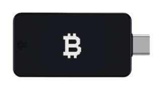

# ENGERI Y'OKUKOZESA BITCOIN

>**Okukozesa Bitcoin:** (ekikolwa) /tuːˈbɪtkɔɪn/
Nteesa okufuula ‘okukozesa bitcoin’ ekikolwa,
ekigatta obujjuvu bw'okwetaba
mu nkola ya bitcoin/Bitcoin.

* Kale, kati nga olina, nga bwe nsuubira ;) okuba nga omazze okuyiga ku bitcoin, era oli mwetegefu okufuuka bbanka yo yennyini, okwetaba mu ssente z'eddembe ez'ensi yonna ezisooka,
luno lwe lunaku olw'essanyu!

---

## OKUFUUKA BBANKA YO MWENNYINI
* Wano we wasangibwa enkyukakyuka ey'amaanyi mu kufuna obwetwaze bw'ebyenfuna, era, kiyinza okutwala obudde
okutegeera ddala, n'amazima ekitegeeza.
* Waliwo **okwagala n'obweteefuteefu obwetaagisa okutegeera engeri y'okukikola mu ngeri esinga obukuumi.**
* Mu mugongo gw'okukuuma ekitabo kino ‘ekitabo kya bitcoin ekisinga obwangu okukola ku kye kyonna ekyawandiikibwa’, nja kuwa entegeka eno, era oluvannyuma nkuwa eby'obuwanguzi ku nkomerero
olyo okuyingira mu byo eby'ebuziba okusinga
omugatte gw'ekitabo kino.

>**HODL:** (ekikolwa) /ho’dill/

: okunywerera ku bitcoin yo

: obutatunda

-Okuva mu kawandiiko ka 2013 aka bitcointalk.org, omuntu eyawandiika
nga yeegeya okutamiira, yawandiika bubi ‘HOLD’

-bitcointalk.org/index.php?topic=375643.0

* Nga omukutu gukyagenda mu maaso okukula, waliwo
omuwendo munene mu bukadde bw'abantu abakwata ku mpeera ey'enkomerero.

---

## OKUFUNA BITCOIN
* **Bitcoin eyita mu katale ng'abasimbi b'eby'obugagga eby'omuttaka abatunda ebimu ku
bitcoins ze bafuna ng'empeera,** okusobola okusasula
ebintu byabwe eby'okukozesa.
* **Oyinza okufuna bitcoin nga ogula ku lufula olutunda abantu ku bantu, ng'okkiriza ng'empeera ya
ebintu oba ebintu by'obuweereza by'owa, ng'ekirabo, oba ng'ogisimba.** (Enkomerero ey'enkomerero, si kutegeka, okugula
okuva ku lufula oluwandiisiddwa).
* Bw'ogifuna, oliyo mu bukenkeefu okufuna
enkomerero z'ekyama z'olina okuyingira mu bitcoin yo.
> * **Jjukira:** Bitcoin yennyini tevaamu
obudde.

* Oyinza okufuna bitcoin oba mu kyama, oba
nga waliyo okukkiriziganya kw'amannya (KYC - Manya Omukiriya Wo)

* KYC yetaagisa okusinziira ku mateeka okutuukiriza AML (amateeka agana okwoza ssente eziva mu bubbi) nga ogula okuva ku lufula.

>* Okugula bitcoin etali KYC **kukuuma eddembe lyo okuba nga oli mu kyama mu biseera eby'omu maaso.**

---

## Etali KYC >> Mu kyama
**Engeri y'okufuna Bitcoin etali KYC (Tewali Ndagamuntu):**

EKITEGEKEDDWA

>1. Download app ya wallet ya bitcoin yokka (laba olupapula 102).
>2. Londa engeri (laba wansi).
>3. Gula, funa oba simba bitcoin.
>4. Ggyawo bitcoin yo mu wallet yo.
>5. HODL, oba saasaanya era oddireyo.

* **Ggula okuva mu Robosats, Bisq, HodlHodl, Peach Bitcoin.**
* **Ggula okuva mu ATM ya bitcoin** - Weebalire ddala okulaba, nga
ebimu byetaaga ndagamuntu. Abandi bakusaba erinnya n'ennamba (oyinza okukozesa essimu ey'akaseera obuseera #).
* **Ggula Azteco voucher** - Gyenda ku azte.co olabe ebifo.
* **Gifunire omulimu gw'okola** - Saba okusasulwa mu bitcoin.
Owaamu okussa ku bbeeyi yo.
* **Ggula mu muntu ku nsisinkano ya bitcoin.**
* **Gisimbe** - Kikyangu okusimba awaka, oba
oyinza okwegatta ku kibiina ekisimba eby'obugagga eby'omuttaka, naye oluvannyuma DYOR okusigala
nga oli KYC-free. Ocean Pool y'engeri nnungi.

---

## KYC >> Okukkiriziganya kw'Endagamuntu Kwetaagisa

**Engeri y'okugula Bitcoin eya KYC (nga olina Ndagamuntu):**

SI KUTEGEKA

>1. Download app ya wallet ya bitcoin yokka (laba olupapula 102).
>2. Londa lufula lwa bitcoin yokka.
>3. Kola akaawunti & weegatte ku ngeri y'okusasula.
>4. Tuukiriza ebyetaagisa bya KYC.
>5. Ggula bitcoin.
>6. **Ggyawo bitcoin yo mu wallet yo yennyini.**
>7. HODL oba saasaanya era oddireyo.

* **Weegendereze nti bitcoin yo ejja kukkiriziganyizibwa emirembe gyonna ku
endagamuntu yo** bw'ogigula mu ngeri eno, bwatyo n'oyisa obudde obungi
eby'amaaso eri okugula kuno.
* Bw'olonda engeri eno, nkutegeka okunoonya
***lufula lwa bitcoin yokka*** olw'erinnya.
* ***Weebalire ddala okulaba nga lufula lukukkiriza okuggyawo
bitcoin yo mu wallet yo!***
* **Lufula lwetaagisa okusinziira ku mateeka okuba nga ‘bakukolera KYC’.**
* Bajja kutwala **erinnya lyo erijjuvu, enduukulu, social security
namba, email, essimu era emirundi mingi ekifaananyi kyo
ng'okutte ndagamuntu yo.**
* **Kakasa nga lufula lulina essimu ne email
okuyambako abakiriya**

---

* Baleke bakuyite mu kuweereza bitcoin yo
okuva mu akaawunti yo eri wallet yo yennyini, bw'otyo n'okwetwala
= **Okukwata enkomerero zo yennyini.**

>* **Ebigambo:** Kino TEKISANGULA mazima ggwe
>wagula bitcoin okuva gye bali.
>* **Ebikolwa bisobola okunoonyezebwa, era mu
>ensi nnyingi olina okuweebwa omusolo ng'osaasaanya
>bitcoin yo.**

* Bw'oyagala okugula okuyita mu Venmo oba Paypal,
weebalire ddala okusooka **okukakasa nti osigala ng'osobola okuggyawo
sats zo eri wallet yo eyeteekereteeke. Mu
ebyayita tewaali kusobola kukola bw'otyo.**
* Nga bwe bagamba:
> **“Tewali nkomerero, tewali caayi”** oba
>
>**“Si nkomerero zo, si bitcoin yo”**

* Ekyo kitegeeza, bwe kiba nga obuweereza obwa wakati
bukutte enkomerero z'ekyama eza bitcoin yo, kigenda kisigalaayo
obukodyo obusobola okukolebwa omukutu gwabwe ne gumenyeka, oba nga
bagenda mu maaso n'okukwatibwa kw'amateeka era n'obuza bitcoin yo.

>* **Buli kiseera ggyawo bitcoin yo eri yo yennyini
wallet eyeteekereteeke amangu ddala nga omala okugigula.**

---
## EO 6102
* Mu 1933 **President Roosevelt yalagira etteeka lya
6102, eryali lyetaaga buli muntu mu Amerika okuggya
ebintu byabwe ebya zzaabu ennyingi mu kuweereza embaawo z'obuwambi.**
* Zzaabu yali awereddwa $20.67/oz. Omwaka oguddako,
gavumenti yassa eggundu ku bbeeyi ya zzaabu okutuuka ku
$35/oz n'Etteeka lya Gold Reserve erya 1934,
nga kiggya omugaso ku mbaawo abantu ze baali
bafunye ekyokubiri, okuva omugaso gw'embaawo zaabwe
tegulinnya n'obuyinza obw'olutaano obwa zzaabu.

---

* Kyatwala okutuuka mu 1975, **emyaka 42 oluvannyuma, EO6102
okuggyibwawo,** era abantu okuddamu
okukkirizibwa okukwata okusinga 5oz eza zzaabu.
* Mu kifo kino, tetulina magezi matono ku ngeri abakulembeze
bwe bagenda okuddamu okukola ku bitcoin nga kigenda mu maaso okufuna
obuyinza n'okuteekebwa mu nkola okwesiigise.
* Okutuuka kati, wabaddewo okukkiriza okutabuddwa. Ku
ekiseera kino, kilabika nti bangi
bategeera, oba mpozzi bakkiriza, nti bitcoin
tegisobola kulemesebwa.
* Waliwo abakulembeze abatonotono abatandise okwogera
mu kuwagira bitcoin ng'omugatte gw'ebyokukola byabwe.
Era waliwo abamu abaagana.
* Nga omwaka gw'okulonda mu Amerika, 2024 kyandibadde
eky'okusiima, ng'abalonzi bonna abakulu abasatu aba Presidential
bakkiriza ebintu bya bitcoin mu kukungaanya ensimbi!
* El Salvador yagifuula engeri y'amateeka mu 2021.
Kyandibadde ky'okusiima okulaba eggwanga eririddako.

>* **Ku nkomerero, kyandibadde mu by'obugaso bwa buli gavumenti okugikuuma n'okugyongerako okwetikka kwabwe
empapula, ng'ekisa kye zzeeba z'okusaasaanya
ensimbi z'omu bbanka.**

---

## OKUTEEREKA BITCOIN MU BUKUUMI

* Bw'omala okutwala eddamu erikyusa obulamu okugula ekyo ky'osooka , olina **okusalawo engeri gy'ono kiteekamu mu bkuumi.**
>* **Okuba nga oli bbanka yo yennyini y'engeri ey'amaanyi eya
>obwetwaze.**
>* Kirina okutwalibwa **nga kya muganyulo**
* ***Weebalire ddala DYOR - Kola Okunoonya Kwo Okw'amaanyi * okusinga
ebyo bye ntegeka wano.**
* **Enkola ya bitcoin egenda ekyuka buli kiseera.**
* Nostr, Twitter ne bitcointalk.org bifo birungi
okusigala ku mbanda y'ebyenjawulo ebikyasinzeewo.

## LABA OMUKUTU GUNO KU MAZINA:
> * BTCSessions.ca nga @BTCSessions
>* Bitcoiner.guide nga @QnA
>* Armantheparman.com nga @ArmanTheParman
>* @SouthernBitcoiner ku YouTube
>* @wickedsmartbitcoin ku YouTube

---

## WALLETS ZA BITCOIN ZOKKA
* Bitcoin esinga okuteekebwa mu yo yennyini
 * **eya yekka**
 * **etali ya kulabirira**
 * **eya bitcoin yokka** ‘wallet’

* ‘Wallet’ ddala kitundu kya software ekituufu
ekiraga. Kirimu enkomerero zo z'ekyama kye kikozesa
okuteeka omukono ku kikolwa ky'oweereza (ky'osaasaanya).

## WALLET EYOKYA
* **Ensi eno wallet ya bitcoin ey'omukutu gy'ossa ku ssimu yo oba kompyuta.**
* Esinga okukozesebwa ku mpeera entono, ku buli lunaku
okusaasaanya
## WALLET EYOKYA ENNYOGOVU
* **Wallet eno si ya mukutu.** Era emanyiddwa nga hardware
wallet
* Kiyitimbe kya hardware ekya njawulo okuteekako
enkomerero zo.

>* Nga zonna zikola bulungi, kitegekeddwa
okukozesa wallet ennyogovu bw'oba olina okusinga
$500-1000 omugaso gwa bitcoin, nga **wa bkuumi nnyo.**

---
* **Weebalire ddala DYOR okulamba enjawulo
eziri wakati wa wallet zino wammanga.**

* **APPS ZA WALLET EZOKYA** - Ezitali za Kulabirira
Blue Wallet, Muun Wallet, Mutiny Wallet
Sparrow Wallet, Green Wallet, Phoenix
Wallet, Zeus Wallet, Breez Wallet

* **WALLETS EZOKYA ENNYOGOVU** - Ezitali za Kulabirira
Cold Card, Trezor, Foundation Passport,
Blockstream Jade, Seed Signer, Bitbox,

>* **BULI LUNAKU** gula wallet yo ennyogovu **okuva
omukozi yennyini,** okuba nga kakasa tebakukolera
bubbi.

---

## OKUTEGEKA WALLET
* Ggondera @BTCSessions ku YouTube ku mazina ag'okutegeka wallet, ne bingi okusinga.

>* Ng'otegeka wallet yo, weebalire ddala ***okuwandiika
>Seed Phrase ey'ebigambo 12 oba 24 ku lupapula.***
>* ***Gikuume nga tali mu mukutu. Tokwata kifaananyi.***
>* **TEEKA SEED PHRASE MU KIFO EKIRUNGI.**
>* **MU KIFO EKIRUNGI NNYO!**

* **Kampuni nnyingi zikola ebipande by'ensigo ze waamu
oyinza okuteekako seed phrase yo ku by'okukuuma omuliro/amazzi/okwonoonika.**
* Bw'oba owonoonye okuyingira mu wallet yo eyokya oba ennyogovu,
oyinza okugizzaawo ne seed phrase era n'ozzaawo
ebintu byo.
* Oyinza okukola bw'otyo ku wallet yonna esinga
engeri y'emu eya BIP39 seed phrase (ebigambo 12/24).
* Enkola esinga obulungi yandibadde okuteeka
wallet descriptor ya wallet yo nga ogasseeko ensigo yo.
>* **JJUKIRA: Buli muntu alina ensigo yo alina
okuyingira mu bitcoin yo!**

---
## KU BY'EKISUKU
* Okuba nga oli mu kyama bw'oba **ogula (etali KYC), okukuuma, okuteeka
era n'osaasaanya** bitcoin agenda akula nnyo
omugaso, naddala olw'ebyo ebigenda mu maaso
ne akaawunti za bbanka ezikwatiddwa/eziggaddwa.
>* Mu kweyongerako, **okukuuma ebintu byo mu kyama ddala kikulu bw'oba
oyagala okufuna obwetwaze bw'omu mukutu, n'okwerinda wekka okuva mu kukola obubi okw'amaanyi n'obubbi.**

* Wansi waliwo obuweereza obukulu obw'ekisuku obuliwo.
* Kiri ebweru w'omugatte gw'ekitabo kino okuyingira munda
buli kimu ku bino eby'oluvannyuma, okusobola ddala DYOR, era
gondera akaawunti ze njogera wano ku Nostr oba
Twitter ku by'okukyusa.

>*Okukuuma ebintu byo mu kyama kwetaagisa ku kibiina ekiggule mu myaka egy'obukodyo
Okukuuma ebintu byo mu kyama si kyamukisa. Ekintu ky'ekyama kintu
omuntu ky'atayagala ensi yonna okukimanya, naye ekintu eky'ekyama
omuntu ky'atayagala omuntu yenna okukimanya.
Okukuuma ebintu byo mu kyama bw'obuyinza okubikkula
omuntu gwe wekka eri ensi.*

~Eric Hughes, Okuva mu ‘A Cypherpunk’s Manifesto’

---
