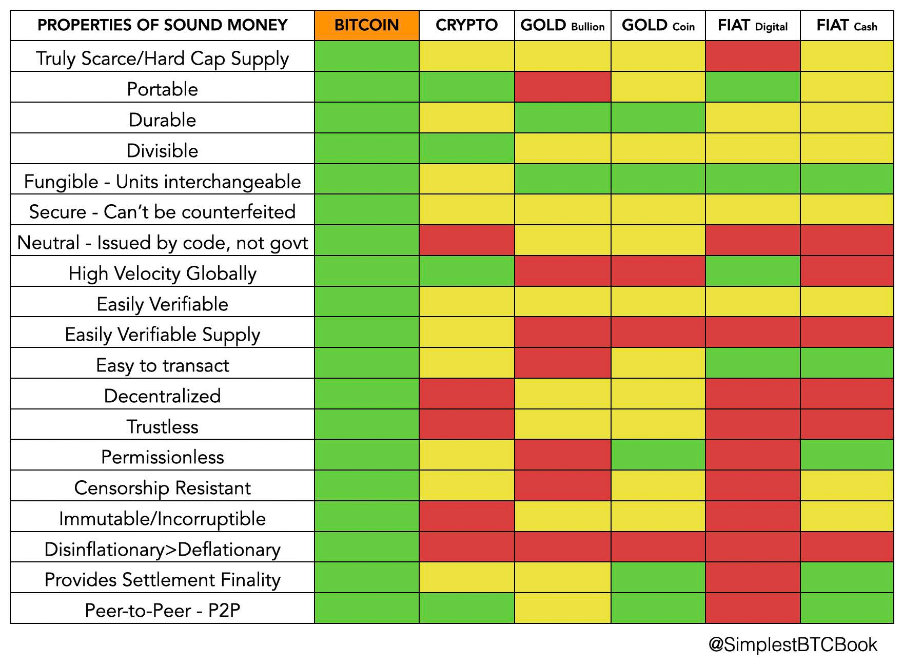

# 什么是比特币？

>*“为普通大众撰写关于这东西的描述
非常困难。
没有什么可以与之相关联。”*

~ 中本聪 2010-07-05

>*总发行量将为 21,000,000
个币。它将分发给网络
节点（矿工），当他们创建区块时，
金额每4年减半。
前 4 年：10,500,000 个币
接下来 4 年：5,250,000 个币
接下来 4 年：2,625,000 个币
接下来 4 年：1,312,500 个币等等...
当这用完后，系统可以支持
交易费用（如果需要）。它是基于
开放市场竞争，并且可能
总会有节点愿意
免费处理交易。*

~ 中本聪 2009-01-09

* **比特币是自由货币……** 从某种意义上说，它有
潜力将我们所有人从中央银行系统的
全面操纵和控制中解放出来
* **在比特币中，货币规则对于
每个人、每个地方都是一样的。**
* 比特币是包容性的，因为任何拥有互联网连接的人都可以参与到网络中，并且**必须遵守相同的规则。**

---
## 比特币是：
* **去中心化**
* **真正稀缺**
* **抗审查**
* **分布式账本**
* **不可腐败**
* 无需许可
* 可审计
* 透明
* 不可篡改
* 无国界
* 难以伪造
* 匿名
* 无摩擦
* 无需信任
* 点对点
---
* 比特币是去中心化的。
* **它由全球成千上万个节点运行，由成千上万个互不相识的人运行。**
* 没有任何一个人、政府或公司能够控制它。
* 你也可以运行一个节点，这很容易 ;)
* 通过运行自己的节点，你可以提高你的
隐私，并在你验证自己的交易时帮助保护网络安全。
> **不要信任。验证**
---
* **比特币（大写“B”）**是一种货币网络。
* **比特币（小写“b”）**是货币，或货币资产，它是在比特币网络上发行和运行的。

---
* **比特币是伟大的激励者。**
>* **中本聪的天才之处在于，在比特币中，
好人和坏人都被激励去遵守规则，这还是第一次。**

> *“这种激励可能有助于鼓励
节点保持诚实。
如果一个贪婪的攻击者能够组装
比所有
诚实节点更多的CPU工作量证明，他将不得不选择
使用它通过
偷回他的付款来欺骗人们，
或者使用它来生成新的币。
他应该发现遵守规则更有利可图，
这些规则更有利于
他获得比
其他所有人加起来更多的新币，
而不是破坏系统和
他自己财富的有效性。”*

~ 中本聪 2008-10-31

---
* **比特币是第一个数字原生货币，** 与
你的在线支票账户不同，后者只是
央行法定货币的数字形式。
* 比特币是**去中心化**的数字货币。
* 比特币**没有中央机构。**
* 比特币是**无国界的。**
* 考虑一下这些含义...

>*比特币是一种去中心化的数字货币，可以
即时支付给世界上任何地方的任何人。
比特币使用点对点技术运行，没有
中央机构：交易管理和货币
发行由网络集体进行。*

~ 比特币维基
en.bitcoin.it

---
* 比特币是神奇的互联网货币。
* 不骗你，**比特币是我们修复
世界的方式。**
* 真的吗？是的。
---
* **比特币是一种转移价值的方式**
 * 任何金额
 * 安全地
 * 立即（在闪电网络上）
 * 在任何两方之间
 * 任何时候
 * 全天候
 * 任何地方
 * 是的，任何地方
 * 想想这一点。

 ---

>*有了基于密码学
证明的电子货币，无需信任第三方
中间人，货币可以是安全的，
交易可以是毫不费力的。*

~ 中本聪 2009-02-11

---
>*比特币以（几乎）零成本的方式确定性地转移。
我 100% 确定我收到了什么。*

~ Michael Saylor Microstrategy 首席执行官

* 你可以通过比特币网络或建立在比特币上的闪电网络向任何人、任何地方、任何时间发送 1.13 美元、46 美分、359 sats、500,000,000 sats 或 100 万美元。
* **而且没有人可以阻止你。**
* 你可以用黄金、白银、美元/英镑/欧元/日元/
人民币/南非兰特或任何其他中央银行法定货币做到这一点吗？

---
* **比特币是历史性的。** 这是历史上第一次
一个真正去中心化、抗审查、不可篡改、
无国界、无需许可且不可腐败的货币系统，具有绝对硬顶（2100 万个币）被创造出来
>* 比特币对于**权力下放
和增加金融包容性**具有重要意义，就像印刷术的发明，以及后来的万维网，**对于权力控制下放和
增加信息获取**具有重要意义一样。

>*很多人会自动
将电子货币视为失败的事业，
因为自 1990 年代以来，所有公司都失败了。
我希望很明显，
只有这些系统集中控制的性质注定了它们。
我认为这是我们第一次尝试
一个去中心化的、非基于信任的系统。*

~ 中本聪 2009-02-15
---
* **比特币是一个分布式的、去中心化的、透明的
且不可篡改的账户总账。**
* 世界上任何人都可以看到在任何
特定时刻谁拥有什么，而且它无法被更改。
* 除了“谁”不是一个名字，**它是由数字和字母组成的地址。**
>* 比特币地址的示例：
**bc1qar0srrr7xfkvy5l643lydnw9re59gtzzwf5mdq**

* 因此，比特币是**假名的。**
---
* **比特币是**
* 一个公正的资产发行者
* 一种价值储存手段
* 一种交换媒介
* 并且很快将成为一种记账单位
* **以及**
* **交换手段。**

* 它是发行者、黄金、现金、借记卡和
贝宝、银行、Venmo、Cashapp、西联汇款

**全部合而为一！**

---
* **比特币是一个记录员，它使用数学和
计算机科学，而不是银行家、簿记员
和会计师。**
* 它消除了中间人、银行、政府、透支
费用、支票账户费用、有限的服务时间、
审查的可能性、冻结账户、货币供应的操纵、利率、国际货币基金组织、
世界经济论坛、国际清算银行、实体建筑、自动取款机、
支票、退款、石油美元、欧洲美元、
银行铸币税、坎蒂隆效应、
部分准备金银行、维萨、万事达、美国运通、
西联汇款、等待你的电汇
通过的日子……

>* **与其在你和
>你想握手的人之间有中间人，你可以直接
>握他们的手。**
>* **无需请求允许发送你自己的
>钱！**
---

## 简单地说……
* **比特币是无人能从你手中夺走的数字财产。**
* >拥有比特币意味着拥有从
你用
你的私钥控制的特定地址向你选择的任何其他地址发送价值的权利。

*比特币是一种独立于
暴力垄断的财产权。*

~ Robert Breedlove @breedlove22

---

* **比特币是物种历史上的一次事件。**
* 比特币是一种选择。
* 比特币**产生主权。**
>* **15 年前比特币的发现，
对于人类的金融自由和主权来说，就像
50 万年前火的发现对于人类的繁荣，以及近
900 年前印刷术对于知识控制下放和
增加知识获取来说一样。**

---
* **比特币是一种真正的价值储存手段。**
* 它以这样一种方式储存你最宝贵的资源——你的时间，
以便你以后可以再次访问它。
>*比特币就像一个通往你未来自我的高带宽能量管道……你可以今天工作，比特币会深度
冻结你的能量以供以后使用。*

~ Robert Breedlove

>*金钱的根源是时间
时间的根源是价值*

~ Guy Swann

---
* 比特币是一个时间链，字面意义上。
* 中本聪在他的电子邮件中多次提到时间链
与早期的开发者。
* 你可以用区块来衡量时间，因为每 ~10 分钟
就会挖出一个区块。
>* **我们的时间是我们最稀缺和宝贵的资源。**
>* **它是我们字面意义上的生命力。**
>* **真正的金钱允许我们储存我们的时间。**

* 它是我们承认我们“花费”的时间的方式。
* 我们**用我们的时间换取金钱，而金钱仅仅是我们时间和努力的记录。**
* **比特币使我们有可能保存我们的时间，以便我们可以在
以后的人生中“访问”它，那时
我们不再能够像以前那样工作。**
---
* 比特币是一种 **价值储存手段。**
* 比特币是一种 **交换媒介。**
* 比特币**总有一天会成为一种记账单位。**
* 比特币**总有一天会成为 *唯一的记账单位。***
---
* **比特币是稀缺的**
* 它的硬顶是 21,000,000。
* 永远不会有更多。
* 代码在这里就是法律。*

*虽然“技术上”有可能更改代码，
但中本聪的天才之处在于阻止了这一点，因为增加
（通货膨胀）供应只会降低
所有流通中的比特币的价值。因此，这
激励每个人默认同意维持
21,000,000 的硬顶供应量。

* 查看 @TC 的 **timechaincalendar.com** 以查看
当前区块高度、可用供应量以及
关于比特币
时间链的众多其他指标。
---
* **比特币是无限可分的，而不会贬低
供应量。**
* **一个披萨就是一个披萨，无论切成多小的
片。**
* 它目前可分为八位
小数：1.00000000
* 1 个比特币中有 100,000,000 个聪。
* 1 聪 = 0.00000001
* 你可以购买任何数量的聪（satoshis）。
---
* **比特币是我们所知的最坚硬、最健全的货币。**
* 它甚至比黄金更健全，因为黄金不容易
分割或携带，速度慢（移动缓慢）
并且不容易验证
* **比特币具有
有史以来任何资产中最优越的货币属性。**

**健全货币属性比较表**

注意：这是一个总体概述，图表中无法解决
一些细微差别。

---
* **比特币是解药。**
* 试图通过纾困、
印钞、量化宽松和利率操纵来“稳定”经济，
就像用人工生命支持来维持它一样
* 这台“机器”只能运行这么长时间，然后变得越来越昂贵，
越来越难以维持，从而导致严重的崩溃。
* **比特币解决了这个问题**
* **比特币是更好的货币**
---
* **比特币是反脆弱的。**
* 并且随着每一次试图攻击、
每一个政府禁令、每一篇主流媒体的恐惧、不确定性和怀疑 (FUD) 的文章，它变得越来越反脆弱。
>* 比特币从未被黑客攻击过。*
* 尽管很多人尝试过。

*虽然你可能听说过黑客攻击，但
被黑客攻击的是交易所，而不是
比特币协议。
* **请记住：**
* 不是你的密钥，不是你的币。
* **始终**将你的聪提取到你**自己的钱包中。**
* **最好**进行点对点购买。
---
* **比特币是以下各项的组合：**
* 计算机科学
* 网络协议
* 电气系统
* 博弈论
* 坚定的信念
* 模因
* 热力学
* 网络效应
* 密码学
* 能源
* 真正的稀缺性
* 经济激励
* 软件工程
* 货币的时间价值
* 技术采用曲线
* 涌现现象
* 去中心化的力量
* 低时间偏好
* 激励对齐
* 货币中性
* 金融行动主义
* 不可篡改性

……所有这些共同努力，在
一个无需信任、去中心化的环境中创造信任，
以支持一个

* 中立的
* 安全的
* 抗审查的
* 无需许可的
* 全球性的

数字货币和货币网络。

---

* **比特币是一个很深的兔子洞，** 让你
质疑你认为你知道的大部分事情 ;)
* 比特币是自成一体的。
* **比特币就是。**
>*比特币就是。这就足够了。*

~ @Beautyon

---
* **比特币是以下各项之间的共生关系：**

**人类**

和

**转移和储存时间/价值的完美解决方案。**

* 人类需要比特币，比特币需要人类。
---
* **比特币是拜占庭将军问题的解决方案。**
* 这曾经被认为是
计算机科学中一个无法解决的问题
* 这个问题出现在去中心化系统中，其中
认为不可能证明发送的消息
= 收到的消息，因为“中间人”
可能是个坏人，并伪造该消息。
* 换句话说，似乎不可能在分布式和独立的计算机网络中达成共识。
* 通过使用时间戳以及密码学保护的分布式账本，中本聪解决了这个问题。
* 他的解决方案被称为 **中本聪共识。**
---
* **比特币是双重支付问题的解决方案。**
* 这意味着当你发送比特币时，接收者
可以确定你实际上拥有你
发送的比特币，并且，一旦你将其发送给他们，你就不能
通过将其发送给其他人来再次花费这些币（双重支付）。
* 就像我给你一个橙子一样。一旦它离开
我的手，并在你的手中，我就不再拥有
将橙子给别人的权利。
>*..永远不会将双重支付添加到
交易池中，因此每个节点都通过
努力将其放入区块中来见证其首先看到的交易。*

~ 中本聪 2010-12-09

---
* **比特币是一种无记名资产，** 就像现金或黄金，由
无记名持有人（所有者）直接持有

>* **这意味着，一旦发送（给出），它会直接
发送给新的无记名持有人（所有者），无需中间人
（银行）来处理交易。**

---
* **比特币是 P2P（点对点）的。**
* 比特币是抗审查的
>* **这意味着没有人有权阻止
或阻止交易转移到新的持有人。**
* 比特币自由流动。

* 不能有守门人。
---
* **比特币是无需信任的。**
>*传统
货币的根本问题在于，使其发挥作用需要的所有信任。必须信任
中央银行不贬低货币，但
法定货币的历史充满了
违背这种信任的行为。*

~ 中本聪论
比特币无需信任性质的重要性。

---
* **比特币是代码。**
* **代码就是言论。**
* 查看 github.com/bitcoin
* **这目前是主要的比特币存储库。**
* 单击以查看代码、拉取请求、
评论、提交、bip（比特币
改进提案）和开发人员，他们正在
开发、维护和改进
比特币的创造。

---

* **比特币是货币的互联网。**
* 当人们停止思考其他一切都在/已经数字化时，包括：
 * 音乐
 * 书籍
 * 银行业
 * 电影
 * 教育
 * 照片
 * 电话
 * 无线电
 * 地图
 * 游戏
 * 会议
 * 并且这个列表还在继续（无论好坏）

……那么人们就会明白**货币
跟随也是一个合乎逻辑的步骤。**

> **但是，**我们需要 **比特币，而不是 CBDC！**

---

## 中本聪的天才
>* 比特币是**所有**以下各项：
> * 一个去中心化的分布式账本
> * 一种支付系统
> * 以及正在转移的价值本身。

* 在比特币之外，**货币创造**（发行）和
**会计**（跟踪收到的/花费的货币）
**是集中式的，** 并且包括以下单独的
层：

* 各中央银行的货币发行
* 无论是书面还是数字的账户总账
* 将数字输入到总账中的可信方
* 保护实体总账安全或维护计算机数据库的可信方
* 努力防止
数据库被黑客入侵的可信安全团队

* 有了比特币，**所有这些层都组合在一起！**
* 虽然这听起来可能更集中，但中本聪的
天才之处在于使它与事实相反。
* 它是 **100% 去中心化的！**

---

>* **比特币没有中心故障点。**

* 它可以全部组合在一起并被去中心化的唯一方法是
**分布式账本由一个自愿的、世界范围的、临时的
人群进行维护，他们自愿进行挖矿和/或运行
完整节点。**
* 并且，网络的激励机制 **鼓励每个人都遵守规则**
* 你可以加入我们！

---
## 比特币是一场和平的革命
---
## 比特币是希望
---
