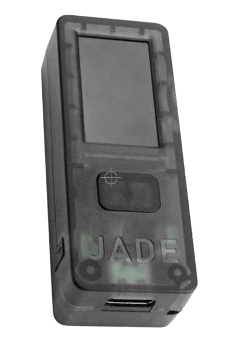

# 如何比特币

>**比特币化：**（动词）/tuːˈbɪtkɔɪn/
我在此提议将 “比特币化” 作为一个动词，
它概括了参与
比特币/Bitcoin 生态系统的全部内容。

* 好的，既然你已经，希望 ;) 被 “橙色药丸” 了，并且准备好成为你自己的银行，参与到世界首个全球自由货币中，
那么有趣的部分来了！

---

## 成为你自己的银行
* 这是真正史诗般的转变，成为金融上自主的地方，并且，它可能需要时间来
真正地、完全地掌握这意味着什么。
* 需要一些**意图和奉献精神来
理解如何以最安全的方式做到这一点。**
* 本着保持这本书是 “有史以来最简单的比特币书籍” 的精神，我将在这里提供一个
大纲，然后在结尾提供资源供你深入研究，这些资源比
本入门读物的范围更广。

>**HODL：**（动词）/ho’dill/

：持有你的比特币

：不卖

- 来自 2013 年 bitcointalk.org 的帖子，其中发帖者
声称自己喝醉了，拼错了 “HOLD”

-bitcointalk.org/index.php?topic=375643.0

* 虽然网络仍在增长，但数百万全球最后手段持有者 (hodl’rs) 具有很大的
价值。

---

## 获取比特币
* **比特币通过矿工出售一部分他们作为奖励收到的比特币进入市场，** 以支付
他们的运营成本。
* **你可以通过在点对点交易平台上购买，接受它作为你提供的商品或服务的付款，作为礼物，或者通过挖矿来获取比特币。**（作为最后的手段，不建议从注册的交易所购买）。
* 当你收到它时，从技术上讲，你正在接收
用于访问你的比特币的私钥。
> * **记住：** 比特币本身永远不会离开
时间链。

* 你可以匿名或
通过身份验证（KYC - 了解你的客户）来获取比特币。

* 根据法律规定，从交易所购买时需要 KYC，以履行 AML（反洗钱法）。

>* 购买非 KYC 比特币 **保留了你未来
隐私的权利。**

---

## 非 KYC >> 匿名
**如何获得非 KYC 比特币（无需身份验证）：**

推荐

>1. 下载一个仅限比特币的钱包应用程序（参见第 102 页）。
>2. 选择一种方法（见下文）。
>3. 购买、接收或挖掘比特币。
>4. 将你的比特币提取到你的钱包。
>5. HODL，或消费并替换。

* **从 Robosats、Bisq、HodlHodl、Peach Bitcoin 购买。**
* **从比特币 ATM 购买** - 务必检查，因为
有些需要身份验证。 其他的只需要一个姓名和
电话号码（你可以使用临时电话号码）。
* **购买 Azteco 凭证** - 访问 azte.co 获取地点。
* **通过你所做的工作赚取它** - 要求以比特币支付。
主动提出降低你的价格。
* **在比特币聚会上亲自购买。**
* **挖掘它** - 在家挖矿变得越来越容易，或者
你可以加入一个矿池，但要自己研究 (DYOR) 以保持
没有 KYC。 Ocean Pool 是一个不错的选择。

---

## KYC >> 需要身份验证

**如何购买 KYC 比特币（通过身份验证）：**

不推荐

>1. 下载一个仅限比特币的钱包应用程序（参见第 102 页）。
>2. 选择一个仅限比特币的交易所。
>3. 创建一个帐户并关联一种支付方式。
>4. 满足 KYC 要求。
>5. 购买比特币。
>6. **将你的比特币提取到你自己的钱包。**
>7. HODL 或消费并替换。

* **请注意，如果**你以这种方式购买比特币，你的比特币将永远与你的身份相关联，从而丧失
未来关于这些购买的假名。
* 如果你选择这种方法，我建议找到一个
信誉良好的 ***仅限比特币的交易所***
* ***请确保交易所允许你将你的
比特币提取到你自己的钱包！***
* **交易所需要依法对你进行 “KYC”。**
* 他们会获取 **你的全名、地址、社会安全
号码、电子邮件、电话号码，通常还会获取
你拿着身份证的照片。**
* **确认交易所同时提供电话和电子邮件
支持** 以提供客户服务。

---

* 让他们引导你将你的比特币
从你在他们那里的帐户发送到你自己的钱包，以便
你自行保管你的比特币
= **持有你自己的密钥。**

>* **注意：** 这并不能消除你
>从他们那里购买了比特币的事实。
>* **交易在链上是可追溯的，并且在
>许多国家，当你
>花费你的比特币时，你需要承担税款。**

* 如果你想通过 Venmo 或 Paypal 购买，请务必
**首先确认你仍然可以将你的
聪 (sats) 提取到你自己的自托管钱包。** 在
过去你不能这样做。
* 正如他们所说：
> **“没有密钥，就没有奶酪 (cheese)”** 或
>
>**“不是你的密钥，就不是你的比特币”**

* 这意味着，只要中心化服务机构
持有你的比特币的私钥，就仍然存在
其平台遭到黑客攻击或
他们受到监管俘获并且你丢失了你的
比特币的可能性。

>* **始终在你
>购买了比特币后立即将其提取到你自己的
自托管钱包中。**

---
## EO 6102
* 1933 年，**罗斯福总统发布了行政命令
6102，要求每位美国公民上交
他们的大部分黄金，以换取银行券。**
* 黄金的价值为 20.67 美元/盎司。 第二年，政府通过 1934 年的《黄金储备法》将黄金价格提高到
35 美元/盎司，
有效地贬低了人们收到的钞票的价值近一半，因为他们的钞票价值从未随着膨胀的黄金价格而上涨。

---

* 直到 1975 年，**42 年后，EO6102 才被
废除，** 私人公民才再次
被允许持有超过 5 盎司的黄金。
* 在这个阶段，我们几乎不知道监管机构将如何回应
比特币，因为它继续
获得普及和更广泛的采用。
* 到目前为止，人们的反应褒贬不一。 然而，目前看来，许多人
理解，或者只是接受，比特币
最终无法被阻止。
* 有一些政治家开始
支持比特币作为他们平台的一部分。
也有一些人反对它。
* 作为美国的选举年，2024 年非常
有趣，所有三位主要的总统
候选人都接受了比特币竞选捐款！
* 萨尔瓦多在 2021 年使其成为一种法定货币。
看看下一个国家是哪个国家将会很有趣。

>* **最终，拥抱它并将其添加到他们的资产负债表中，作为对冲其快速膨胀的法定货币，符合每个政府的利益。**

---

## 安全地存储比特币

* 一旦你采取了改变人生的步骤，购买了你的第一个 <binary data, 1 bytes><binary data, 1 bytes><binary data, 1 bytes>，你就需要
**决定如何安全地存储它。**
>* **成为你自己的银行是一种强大的
>自我主权形式。**
>* 需要 **认真** 对待
* ***请 DYOR - 做你自己的研究* 超出
我在这里的基本建议。**
* **比特币生态系统每时每刻都在发展。**
* Nostr、Twitter 和 bitcointalk.org 是保持
了解最新进展的好地方。

## 查看这些网站以获取教程：
> * BTCSessions.ca，作者 @BTCSessions
>* Bitcoiner.guide，作者 @QnA
>* Armantheparman.com，作者 @ArmanTheParman
>* YouTube 上的 @SouthernBitcoiner
>* YouTube 上的 @wickedsmartbitcoin

---

## 仅限比特币的钱包
* 比特币最好存储在你的
 * **自托管**
 * **非托管**
 * **仅限比特币** 的 “钱包” 中

* “钱包” 实际上是一段软件，它是一个
签名设备。 它包含你的私钥，它使用这些私钥来签署你发送（广播）的交易。

## 热钱包
* **这是一个在线比特币钱包应用程序，你将其下载到你的手机或电脑。**
* 它最适合用于较小的金额，用于日常
消费
## 冷存储钱包
* **这是一个离线钱包。** 也称为硬件
钱包
* 它是用于存储你的密钥的单独硬件设备。

>* 虽然两者都运行良好，但通常建议
一旦你的比特币价值超过
500-1000 美元，就使用冷钱包，因为这样 **更安全。**

---
* **请 DYOR 以比较下面显示的钱包之间的功能和
权衡。**

* **热钱包应用程序** - 非托管
Blue Wallet、Muun Wallet、Mutiny Wallet
Sparrow Wallet、Green Wallet、Phoenix
Wallet、Zeus Wallet、Breez Wallet

* **冷存储钱包** - 非托管
Cold Card、Trezor、Foundation Passport、
Blockstream Jade、Seed Signer、Bitbox、

>* **始终** 从 **制造商处直接** 购买你的冷存储钱包，以确保它没有被
篡改。

---

## 钱包设置
* 在 YouTube 上关注 @BTCSessions，以获取有关钱包设置的精彩
教程以及更多信息。

>* 设置你的钱包时，请务必 ***将
>12 或 24 字的助记词写在纸上。***
>* ***使其保持离线状态。 永远不要对其进行屏幕截图。***
>* **非常安全地存储助记词。**
>* **非常、非常安全！**

* **许多公司制造金属种子板，你可以在其中冲压你的助记词，以增加
防火/防水/防损坏能力。 强烈推荐！**
* 如果你无法访问你的热钱包或冷钱包，
你可以使用助记词恢复它并
取回你的资金。
* 你可以在任何支持相同
类型的 BIP39 助记词（12/24 个单词）的钱包上执行此操作。
* 最佳实践是将你的钱包描述符
与你的种子一起存储。
>* **记住：任何拥有你的种子的人都可以
访问你的比特币！**

---
## 关于隐私
* 在 **购买（非 KYC）、保护、存储
和花费** 比特币时，隐私变得越来越
重要，尤其是在最近银行帐户被查封/冻结的事件发生后。
>* 此外，**如果你希望获得在线主权，并保护自己免受不必要的监视和欺诈，那么一般的数字隐私至关重要。**

* 以下是一些当前以隐私为中心的服务。
* 深入研究
以下各项超出了本书的范围，因此绝对要 DYOR，并
关注我在 Nostr 或
Twitter 上提到的帐户以获取更新。

>*隐私对于电子时代开放的社会是必要的。
隐私不是秘密。 隐私是不希望全世界知道的事情，
而秘密是不希望任何人知道的事情。
隐私是有选择地向世界展示自己的力量。*

~Eric Hughes，摘自“密码朋克宣言”
---