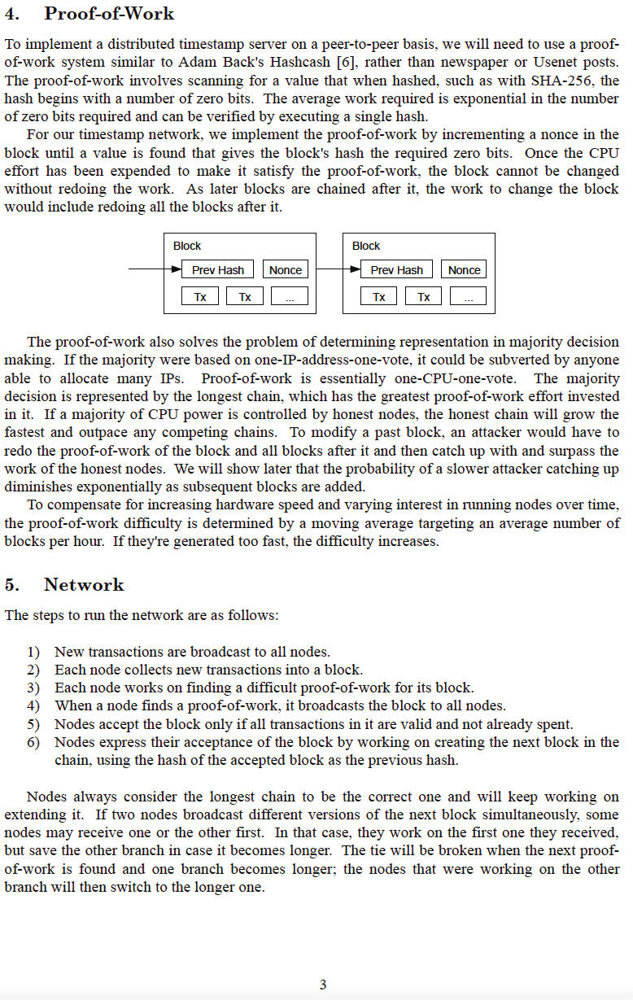

# الورقة البيضاء لبيتكوين
قُدِمت للعالم على موقع metzdowd.com
2008-10-31

**بقلم ساتوشي ناكاموتو**

شخصية مستعارة في عالم السايبربانك، والذي كانت آخر مراسلاته
مع مجتمع السايبربانك على منتدى bitcointalk.org
في 2010-12-10.

برحيله، سمح لبيتكوين أن يكون تجربة حقيقية في
البرية. كل من يعمل عليه هو متطوع بمعنى ما
<-> مستوحى من إمكانية تحرير البشرية
من قيود نظام مالي مُتلاعب به، قائم على الديون،
وبدلاً من ذلك، المشاركة في شبكة عالمية، لا تتطلب ثقة،
لا تحتاج إلى إذن، مقاومة للرقابة، نادرة حقًا، ند لند،
لامركزية، مالية وشبكة دفع مالية، تلهم نظامًا ناشئًا
للصعود من رماد العملات الورقية

**كلنا ساتوشي**
>*ذا تايمز 03/يناير/2009 المستشار على حافة
إنقاذ ثان للبنوك*

~ نص عنوان رئيسي من صحيفة التايمز اللندنية،
نُقِش في كتلة نشأة بيتكوين بواسطة ساتوشي
ناكاموتو في 2009-01-03

---

---

---

---

---

---

---

---

---

---

## كتلة نشأة بيتكوين ~ نسخة سداسية عشرية خام 2009-01-03

وهكذا،

عهد جديد،

أُطلِق
---
