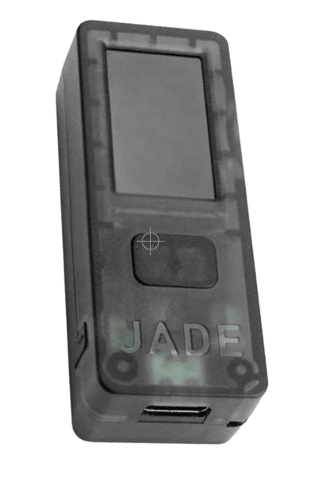

# كيف تستخدم البيتكوين

>**إلى البيتكوين:** (فعل) /ˈtuːˈbɪtkɔɪn/
أقترح بموجب هذا أن نجعل "إلى البيتكوين" فعلًا،
يلخص كل ما يتعلق بالمشاركة
في النظام البيئي للبيتكوين/Bitcoin.

* حسنًا، الآن بعد أن تم "تطبيعكم" باللون البرتقالي (orangepilled) على أمل ذلك ;)، وأنتم على استعداد لتصبحوا مصرفكم الخاص، والمشاركة في أول عملة حرية عالمية،
ها هو الجزء الممتع!

---

## أن تصبح مصرفك الخاص
* هنا يكمن التحول الملحمي حقًا في أن تصبح مستقلاً ماليًا، ويمكن أن يستغرق الأمر وقتًا
لتدرك حقًا ما يعنيه هذا.
* **يتطلب الأمر بعض النية والتفاني لـ
فهم كيفية القيام بذلك بأكثر الطرق أمانًا
ممكنة.**
* بروح إبقاء هذا الكتاب "أبسط
كتاب عن البيتكوين على الإطلاق"، سأقدم
هنا مخططًا تفصيليًا، ثم أقدم موارد في النهاية
لكي تتعمق فيها أكثر بكثير من
نطاق هذا الكتاب التمهيدي.

>**HODL:** (فعل) /ho’dill/

: الاحتفاظ بالبيتكوين الخاص بك

: عدم البيع

-من منشور على موقع bitcointalk.org عام 2013، حيث كتب الناشر
يدعي أنه في حالة سكر، وأخطأ في تهجئة كلمة "HOLD" (احتفظ)

-bitcointalk.org/index.php?topic=375643.0

* بينما لا تزال الشبكة في طور النمو، هناك الكثير من
القيمة في ملايين المحتفظين العالميين كملاذ أخير.

---

## الحصول على البيتكوين
* **يدخل البيتكوين السوق عن طريق قيام المعدنين ببيع بعض
عملات البيتكوين التي يحصلون عليها كمكافآت،** من أجل دفع
تكاليف التشغيل الخاصة بهم.
* **يمكنك الحصول على البيتكوين عن طريق الشراء من منصة تداول من نظير إلى نظير، عن طريق قبوله كدفعة مقابل
السلع أو الخدمات التي تقدمها، كهدية، أو عن طريق تعدينه.** (الملاذ الأخير جدًا، لا يوصى به، هو شرائه
من بورصة مسجلة).
* عندما تتلقاها، فإنك تتلقى تقنيًا
المفاتيح الخاصة التي يمكنك من خلالها الوصول إلى البيتكوين الخاص بك.
> * **تذكر:** البيتكوين نفسه لا يغادر أبدًا
 السلسلة الزمنية.

* يمكنك الحصول على البيتكوين إما بشكل مجهول، أو
مع التحقق من الهوية (KYC - اعرف عميلك)

* مطلوب KYC بموجب القانون للوفاء بقوانين مكافحة غسل الأموال (AML) عند الشراء من البورصات.

>* شراء عملات بيتكوين غير KYC **يحافظ على حقك في
الخصوصية في المستقبل.**

---

## غير KYC >> بشكل مجهول
**كيفية الحصول على بيتكوين غير KYC (بدون هوية):**

موصى به

>1. قم بتنزيل تطبيق محفظة بيتكوين فقط (انظر الصفحة 102).
>2. اختر طريقة (انظر أدناه).
>3. اشترِ أو استقبل أو عدّن البيتكوين.
>4. اسحب البيتكوين الخاص بك إلى محفظتك.
>5. احتفظ أو أنفق واستبدل.

* **اشترها من Robosats و Bisq و HodlHodl و Peach Bitcoin.**
* **اشترها من جهاز صراف آلي للبيتكوين** - تأكد من التحقق، حيث
يتطلب البعض هوية. البعض الآخر يطلب فقط اسمًا و
رقم (يمكنك استخدام رقم هاتف مؤقت).
* **اشتر قسيمة Azteco** - قم بزيارة azte.co لمعرفة المواقع.
* **اكسبها مقابل العمل الذي تقوم به** - اطلب أن يتم الدفع لك بالبيتكوين.
اعرض خصمًا على سعرك.
* **اشترها شخصيًا في اجتماع بيتكوين.**
* **عدّنها** - أصبح التعدين في المنزل أسهل، أو
يمكنك الانضمام إلى مجموعة تعدين، ولكن بعد ذلك قم بأبحاثك الخاصة للبقاء
خاليًا من KYC. Ocean Pool هو خيار رائع.

---

## KYC >> مطلوب التحقق من الهوية

**كيفية شراء بيتكوين KYC (مع الهوية):**

غير موصى به

>1. قم بتنزيل تطبيق محفظة بيتكوين فقط (انظر الصفحة 102).
>2. اختر بورصة بيتكوين فقط.
>3. أنشئ حسابًا واربط طريقة دفع.
>4. استوف متطلبات KYC.
>5. اشترِ بيتكوين.
>6. **اسحب البيتكوين الخاص بك إلى محفظتك الخاصة.**
>7. احتفظ أو أنفق واستبدل.

* **اعلم أن عملات البيتكوين الخاصة بك سترتبط إلى الأبد بـ
هويتك** إذا اشتريتها بهذه الطريقة، وبالتالي تتنازل
عن الاسم المستعار المستقبلي فيما يتعلق بهذه المشتريات.
* إذا اخترت هذه الطريقة، أوصي بالعثور على
***بورصة بيتكوين فقط*** ذات سمعة طيبة
* ***تأكد من أن البورصة تسمح لك بسحب
عملات البيتكوين الخاصة بك إلى محفظتك الخاصة!***
* **يتعين على البورصات بموجب القانون "التحقق من هويتك".**
* سيأخذون **اسمك الكامل وعنوانك ورقم الضمان الاجتماعي
والبريد الإلكتروني ورقم الهاتف وغالبًا صورة لـ
أنت تحمل هويتك.**
* **تأكد من أن البورصة لديها دعم عبر الهاتف والبريد الإلكتروني
لخدمة العملاء.**

---

* اطلب منهم إرشادك خلال عملية إرسال عملات البيتكوين الخاصة بك
من حسابك لديهم إلى محفظتك الخاصة، حتى
تكون أنت صاحب الحيازة الذاتية لعملات البيتكوين الخاصة بك
= **احتفظ بمفاتيحك الخاصة.**

>* **ملاحظة:** هذا لا يمحو حقيقة أنك
>اشتريت عملات البيتكوين منهم.
>* **المعاملات قابلة للتتبع على السلسلة، وفي
>العديد من البلدان، أنت مسؤول عن الضرائب عند
>إنفاق عملات البيتكوين الخاصة بك.**

* إذا كنت ترغب في الشراء من خلال Venmo أو Paypal، فتأكد
أولاً من **التأكد من أنه لا يزال بإمكانك سحب
الساتوشي الخاص بك إلى محفظتك المستضافة ذاتيًا.** في
الماضي لم يكن بإمكانك فعل ذلك.
* كما يقولون:
> **"لا مفاتيح، لا جبنة"** أو
>
>**"ليست مفاتيحك، ليست عملات البيتكوين الخاصة بك"**

* ما يعنيه هذا هو، طالما أن خدمة مركزية
تحتفظ بالمفاتيح الخاصة لعملات البيتكوين الخاصة بك، يبقى
هناك احتمال أن يتم اختراق منصتهم، أو أن
يخضعوا للاستيلاء التنظيمي وتفقد
عملات البيتكوين الخاصة بك.

>* **اسحب دائمًا عملات البيتكوين الخاصة بك إلى
محفظتك المستضافة ذاتيًا بمجرد حصولك عليها
اشترها.**

---
## الأمر التنفيذي 6102
* في عام 1933 **أصدر الرئيس روزفلت الأمر التنفيذي
6102، الذي يلزم كل مواطن أمريكي بتسليم
معظم ذهبهم مقابل الأوراق النقدية.**
* تم تقدير قيمة الذهب بـ 20.67 دولارًا للأوقية. في السنة التالية،
رفعت الحكومة سعر الذهب إلى
35 دولارًا للأوقية بموجب قانون احتياطي الذهب لعام 1934،
مما أدى فعليًا إلى تخفيض قيمة الأوراق النقدية التي حصل عليها الأشخاص
بما يقرب من النصف، حيث أن قيمة
أوراقهم النقدية لم ترتفع أبدًا مع ارتفاع سعر الذهب المتضخم.

---

* استغرق الأمر حتى عام 1975، **بعد 42 عامًا، لإلغاء الأمر التنفيذي 6102،** وحتى يُسمح للمواطنين العاديين مرة أخرى
بحيازة أكثر من 5 أونصات من الذهب.
* في هذه المرحلة، ليس لدينا فكرة تذكر عن كيفية استجابة المنظمين
للبيتكوين مع استمراره في
اكتساب شعبية واعتماد أوسع.
* حتى الآن، كان هناك استقبال مختلط. لـ
في الوقت الحالي، يبدو أن الكثيرين
يفهمون، أو ربما يقبلون ببساطة، أنه لا يمكن إيقاف البيتكوين في النهاية.
* هناك عدد من السياسيين بدأوا يتحدثون
دعمًا للبيتكوين كجزء من منصتهم.
هناك أيضًا بعض المعارضين له.
* نظرًا لكون عام 2024 عام انتخابات في الولايات المتحدة، فهو عام
مثير جدًا للاهتمام، حيث أن المرشحين الرئاسيين الثلاثة الكبار يقبلون تبرعات حملة البيتكوين!
* جعلتها السلفادور شكلاً من أشكال العملة القانونية في عام 2021.
سيكون من المثير للاهتمام معرفة الدولة التالية.

>* **في النهاية، سيكون من مصلحة كل حكومة أن تتبناه وتضيفه إلى ميزانيتها العمومية، كتحوط ضد عملاتها الورقية المتضخمة بسرعة.**

---

## تخزين البيتكوين بشكل آمن

* بمجرد اتخاذك الخطوة التي تغير حياتك لشراء أول عملاتك، تحتاج إلى **تحديد كيفية تخزينها بشكل آمن.**
>* **كونك مصرفك الخاص هو شكل قوي من
>السيادة الذاتية.**
>* يجب أن يؤخذ الأمر **على محمل الجد**
* ***يرجى البحث بنفسك - قم ببحثك الخاص * بما يتجاوز
توصياتي الأساسية هنا.**
* **يتطور النظام البيئي للبيتكوين كل دقيقة.**
* Nostr و Twitter و bitcointalk.org أماكن جيدة
للبقاء على اطلاع بأحدث التطورات.

## تحقق من هذه المواقع للحصول على دروس تعليمية:
> * BTCSessions.ca بواسطةBTCSessions@
>* Bitcoiner.guide بواسطةQnA@
>* Armantheparman.com بواسطةArmanTheParman@
>* SouthernBitcoiner@ على YouTube
>* wickedsmartbitcoin@ على YouTube

---

## محافظ البيتكوين فقط
* يتم تخزين البيتكوين على أفضل وجه في
 * **مستضافة ذاتيًا**
 * **غير خاضعة للحضانة**
 * **محفظة** "بيتكوين فقط"

* "المحفظة" هي في الواقع قطعة من البرامج التي
هي جهاز توقيع. يحتوي على مفاتيحك الخاصة التي
يستخدمها لتوقيع معاملة ترسلها (تبثها).

## المحفظة الساخنة
* **هذا هو تطبيق محفظة بيتكوين عبر الإنترنت تقوم بتنزيله على هاتفك أو جهاز الكمبيوتر.**
* من الأفضل استخدامها لكميات صغيرة، للاستخدام اليومي
إنفاق
## محفظة التخزين البارد
* **هذه محفظة غير متصلة بالإنترنت.** تُعرف أيضًا باسم الأجهزة
محفظة
* إنه جهاز أجهزة منفصل لتخزين
مفاتيحك.

>* على الرغم من أن كلاهما يعمل بشكل جيد، إلا أنه يوصى عمومًا
باستخدام محفظة باردة بمجرد حصولك على أكثر من
500-1000 دولار من عملات البيتكوين، حيث أنها **أكثر أمانًا.**

---
* **يرجى إجراء بحثك الخاص لمقارنة الميزات و
المقايضات بين المحافظ الموضحة أدناه.**

* **تطبيقات المحفظة الساخنة** - غير خاضعة للحضانة
Blue Wallet و Muun Wallet و Mutiny Wallet
Sparrow Wallet و Green Wallet و Phoenix
Wallet و Zeus Wallet و Breez Wallet

* **محافظ التخزين البارد** - غير خاضعة للحضانة
Cold Card و Trezor و Foundation Passport و
Blockstream Jade و Seed Signer و Bitbox و

>* **اشترِ دائمًا محفظة التخزين البارد الخاصة بك **مباشرة
من الشركة المصنعة،** للتأكد من عدم العبث بها.

---

## إعداد المحفظة
* تابعBTCSessions@ على YouTube للحصول على ممتاز
دروس تعليمية حول إعداد المحفظة، وأكثر من ذلك بكثير.

>* عند إعداد محفظتك، تأكد من ***تدوين
>عبارة البذور المكونة من 12 أو 24 كلمة على الورق.***
>* ***احتفظ بها في وضع عدم الاتصال. لا تأخذ لقطة شاشة لها أبدًا.***
>* **قم بتخزين عبارة البذور بأمان شديد.**
>* **بأمان شديد، جدًا!**

* **تصنع العديد من الشركات صفائح بذور معدنية
يمكنك من خلالها تثبيت عبارة البذور الخاصة بك للحصول على حماية إضافية من الحريق/الماء/التلف. يوصى به بشدة!**
* إذا فقدت الوصول إلى محفظتك الساخنة أو الباردة،
يمكنك استعادتها بعبارة البذور واستعادة
أموالك.
* يمكنك القيام بذلك على أي محفظة تدعم نفس
نوع عبارة البذور BIP39 (12/24 كلمة).
* من الأفضل تخزين واصف المحفظة
محفظتك بالإضافة إلى البذور الخاصة بك.
>* **تذكر: أي شخص لديه البذور الخاصة بك لديه
الوصول إلى عملات البيتكوين الخاصة بك!**

---
## حول الخصوصية
* الخصوصية عند **شراء (غير KYC)، وتأمين، وتخزين
وإنفاق** البيتكوين أصبح أكثر وأكثر
مهم، خاصة في ضوء الأحداث الأخيرة مع
حسابات بنكية يتم الاستيلاء عليها/تجميدها.
>* بالإضافة إلى ذلك، **تعتبر الخصوصية الرقمية العامة أمرًا بالغ الأهمية إذا كنت
ترغب في اكتساب السيادة عبر الإنترنت، وحماية نفسك من المراقبة والاحتيال غير المبررين.**

* فيما يلي بعض الخدمات الحالية التي تركز على الخصوصية.
* يتجاوز نطاق هذا الكتاب التعمق في
كل ما يلي، لذا قم بإجراء بحثك الخاص تمامًا، و
تابع الحسابات التي أذكرها أدناه على Nostr أو
تويتر للحصول على التحديثات.

>*الخصوصية ضرورية لمجتمع منفتح في العصر الإلكتروني.
الخصوصية ليست سرية. الأمر الخاص هو شيء
لا يريد المرء أن يعرفه العالم كله، ولكن السر
الأمر هو شيء لا يريد أحد أن يعرفه.
الخصوصية هي القدرة على الكشف بشكل انتقائي
نفسك للعالم.*

إريك هيوز، من "بيان سايفر بانك"

---
