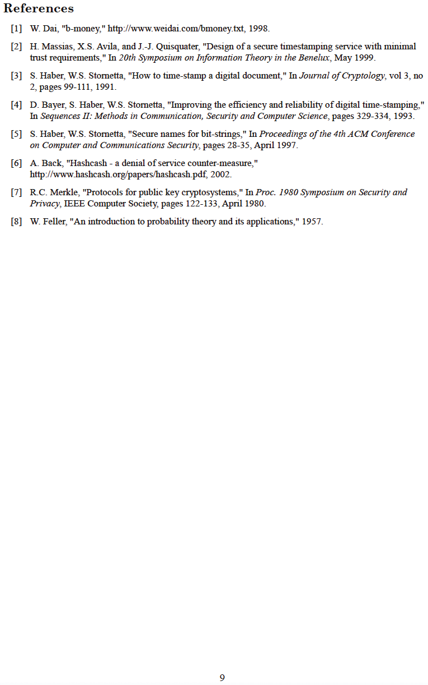

# Ekipeesa kya Bitcoin
Kikozesebwa omu nsi yoona ahari metzdowd.com
2008-10-31

**Ekyahandiikirwe Satoshi Nakamoto**

Omuntu ogu ashakire kuba atarikumanywa, ogu yaherize kuganira
n'abantu abarikukora aha bitcointalk.org
aha bareeba 2010-12-10.

Akurugaaho, akikiriza Bitcoin kuba etandika y'amazima omuri
enyonyozi. Buli omwe ogurikugikoraho ni omwebemerize omu muringo
gwona <-> ahurikiriirwe obushoboorozi bw'okucungura abantu
kuruga omu nkororo y'entaatsiko, esente ezirikukoresibwa
kandi omwanya gw'okwegaita aha, obuteesigwa,
obushoroorozi obutariho, oburikuremesa okucwekyereza, esente ezirikuburwa, omuntu aha muntu,
omukono aha mukono, esente ezitaine bujwekyera n'omukura gw'okufuta, eki nikihuriira ebiragiro ebirikukura kuruga omu
ebifi bya fiat

**Itwe toona turi Satoshi**
>*Ebiro 03/Jan/2009 Omwebembezi atariho bukuru
obw'okuhwera amabanka omurundi gwakabiri*

~ Ekyahandiikirwe ky'omutwe gw'ebyaamaariza kuruga omu The Times of London,
ekyashuubwiirwe omu Bitcoin Genesis block eya Satoshi
Nakamoto aha 2009-01-03

---

---

---

---

---

---

---

---

---

---

## Bitcoin Genesis Block ~ Raw Hex Version 2009-01-03

kandi nikyo kiko,

obwire obusya,

bukatandika

---
