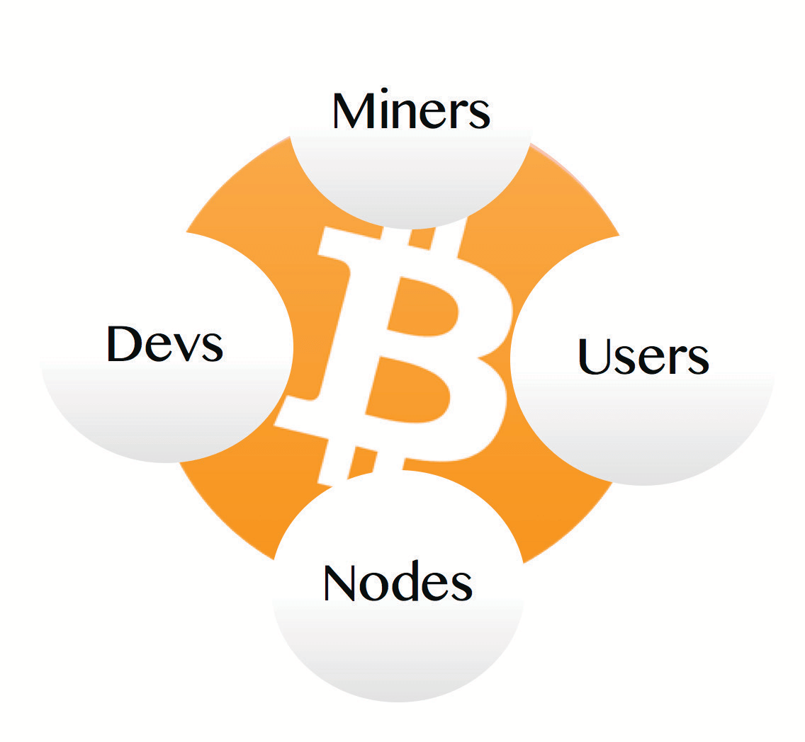

# BITCOIN EKORA NIRIKUKORA ETA?

Amateeka kutari Abagomi

tik-tok/
/ekika ekirikwija
* Bitcoin ekoresa obuhame bw'omurimo, obwihisho bw'enshonga eya public-key
hamu n'omutwaro gw'abantu aha murongo, kwetengyereza hamu n'okuhameza
ebisasuro omu kitabo ekikuru eky'ensi yoona, ekya butongwa, ekya online ekitarimu omuntu omwe orikikurira.

>**Cryptography** (ebara) /krɪpˈtɑːɡrəfi
>
>*: okuhindura ebikumbo hamu n'okukurayo obutumwa
>omu rurimi rw'ekyama rundi obwihisho
>: okuteeka amakuru omu kompyuta hamu n'okugarukamu
>amakuru*

~ Merriam Webster Dictionary

>**Hashing** (ekikorwa) /ˈhæʃɪŋ/
>
>*: omuringo gw'okugyema
>: omulingo gw'okukoresa algorithm y'ekibalangulo ahari
>data kutunga omuguruko gw'omubazi (a hash digest)
>ogurikwegyereza data egi.*

~ crsc.nist.gov

>**Ijuka:**
>
>Ensi ya bitcoin erimu >>
>
>**bitcoin:** ekintu ky'ebishuba **eky'omutaano**
>
>**Bitcoin:** **omutwaro gw'okusasura** ogw'abacukuzi hamu n'ebicweka

1 bitcoin = 100,000,000 satoshis (sats)

**(Nogura sats, ekitundu kya bitcoin)**

---

>*Nitushoborora eicupa ry'ebishuba nk'omunyololo
y'emikono y'ebishuba. Baine eicupa buli omwe
nahindura
eicupa ahari omwe arikukurataho arikuta omukono gw'ebishuba
ahash ya transaction eyahwereire hamu n'
ekikonjo ky'omuntu arikukuratira kandi nayongyera
ebi aha muheru gw'eicupa. Orikusasura asobora
kuhameza emikono kuhameza omunyololo
y'obaine.*

~ Satoshi Nakamoto
Bitcoin White Paper, Pt.2, 2008
Narikushoborora omulingo transaction ya bitcoin erikukora
omu kitabo ekikuru ekitarimu omuntu orikikurira

---
## ENSI YA BITCOIN..
**egiziremu Abacukuzi, Ebicweka, Abakoresa, Abakugukiise**

boona nibakora omu bweihano,

kandi omurundi gumwe nibayambanta,

kugarura omwoyo ekyo kiri

BITCOIN!

---
## ABACUKUZI
* **Ebicweka by'omutaano** (kompyuta ezirikwetwa ASICS) **ezirikucukura
'ebika'** ebiba ekitundu kya bitcoin
blockchain.
* Obwo nibakora, **bahameza transactions ezihameziibwe
ezikozesiibwe abakoresa, bagaba bitcoins mpya** kandi **bagumya
omutwaro gwona.**

## ABAKORESA
* **Iwe na nyowe. Twena. Itwe abantu.**
* Nitwikiriza kandi nitusiima omuguruko gwa
ebintu n'emirimo, nitucuruzana: nituha
kandi tutunga bitcoin, rundi nitugitereka kukoresa nyima, nk'oku kirikwetengyesa.

## EBICWEKA
* **Ebicweka n'empyuta ezirikukurura
software ya bitcoin.**
* **Hariho enkumi n'enkumi z'ebicweka** ezirikukora
omutwaro ogurikwegwera, ogw'ensi yoona, ogw'obwekyenga **ogurikuhameza transactions** (obwo nikuremesa
okukoresa omutaano gw'omutaano, kandi nikukwasa kugumya
omutwaro).

## ABAKUGUKIISE (DEVS)
* **Abahandiiki, abapulogurama & abahandiiki b'ebishuba** abarikukora
**kureeberera hamu n'okukuza omutwaro, kurungyiiriza obucureezi,
ebyama hamu n'obusingye bw'omukoresa, hamu n'okuhindura ebikumbo** omu
rurimi hamu n'ebirori by'amaiso ebi itwe abandi tusobora kwetegyereza hamu n'okukoresa

---

## TRANSACTION YA BITCOIN:
Ali nayenda kutumira Benji bitcoin:

>1. Ali **yajura ekikopo kya bitcoin** aha simu ye kandi
>**nacwaka 'Tumayo'.**
>2. Benji **yajura ekikopo kye** kandi **nacwaka 'Tunga'.**
>3. **Kuba bari hamwe:** Ali akwata akakumiro ka QR aha
>ekikopo aha simu ya Benji.
>4. **Kuba batari hamwe:** Ali acopya kandi ateeka
>endagiriro Benji amutumiraho, omu kibanja ky'endagiriro omu
>ekikopo kye.
>5. Ali **yateekamu omutaano gw'okutuma,** kandi acwaka **'Tumayo'.**
>6. **Eby'okubanza bikeheireho,** Benji ararebe omutaano
>ogurindiire omu kikopo kye.
>7. **Kuba kikatumwa omuri Lightning** kirahemeziibwa
>hagati omu kanya, kandi ni bucweezi.
>8. **Kuba kikatumwa 'onchain'** (aha Bitcoin mainchain),
>kirimu omutaano muto, kandi kukira kutwara haihi
>eminuta 10 kuhameziibwa. Kisobora kutwara obwiire burikukira,
>nikirikugendera aha magara g'omutwaro.

---

## TRANSACTION YA BITCOIN OMU NDIIRO:
(Ebirikushobororwa eby'ebigambo **eby'aha mugongo** nibikuratira)

>1. Ali atumire sats ezo ahari Benji, okusasura
>**transaction** **nikyahandikwa** ahari omutwaro.
>2. Transaction eyo ehameziibwa **ebicweka**
>ebirikukora Ali aine bitcoin y'okutuma, hamu n'
>okuba etarikukoresebwa kare (kuremesa
>okukoresa omutaano gw'omutaano) .
>3. Ku kirahemeziibwe ekicweka, kirindiira omu **mempool**
>hamu n'ebicweka by'abantu abandi.
>4. Transactions omu mempool zyongyerwamu
>eka omu **blockchain** ku **omucukuzi** arabaire azaire >**nonce**
>erikukoma omulingo **difficulty algorithm.**
>5. Buli **eka** eine **timestamp.**
>6. Eki nikikora **obw'emanzi,** kandi nikikwasa kurinda
>okuringyiiriza algorithm y'obugumu kw'okuba
>oburikugomiibwa.
>7. Buli eka neremerera okuhameziibwa kumwe kw'
>transactions ezirikurimu.
>8. Nk'oku ebika birikwongyerwa, omuringo buli minuta ikumi,
>obw'emanzi bwa blockchain nibweyongyera.

---

## EKIRUGIRIZO KY'EBIGAMBO

---
>* **TRANSACTION ~ Kutuma/kutunga bitcoin**
---
* Okuhindura omuguruko omu muringo gwa satoshis, kuruga
omwe arikwetenga bitcoin okugyenda ahari ondiijo.

---
>* **EKICWEKA ~ 'Eitabi' ly'omutwaro gwa bitcoin
'banka'. Buli omwe asobora kukorolesa ekicweka.**
---

* Ebicweka n'empyuta ezirikukurura
software ya bitcoin.
* Ebicweka, hamwe n'abacukuzi, abakoresa hamu n'
abahugukiise, nibakora abantu omurongo aha murongo Bitcoin
omutwaro.
* Tunuura **ekicweka kikuru nk'eitabo eririmu
emigaro y'enkingo z'ebyama buli omwe.**
* Nibagambana, kandi bahika ahari okwetenga (bakirizane) hamwe
omundiijo arikwikiriza hamu n'okuhameza
transactions kuruga omu bicweka ebindi, hamwe n'ebika
kuruga omu bacukuzi, kandi nukwo nibabiha ahari
ebicweka ebindi.
* Ebicweka nibikorolesebwa ekihari ky'enkumi n'enkumi
z'abanyabururu okurunga ensi yoona.
* Ekicweka kikuru nikyo ekyahameziize omulingo gw'obwebusibwaho
Bitcoin blockchain yoona, kuruga omu
Genesis Block ekyacukuriibwe Satoshi omu mwaka gwa 2009.
* Enkumi n'enkumi z'ebicweka ezirikukora, kandi okukunda, omutwaro gwona
nigukuzibwa.
* Hariho **ebicweka bikuru ebirikukoma aha 19,000 ebirikugyendwamu hati
omunsi yoona, & ebindi bingi ebitarikugyendwamu.**
* Ebicweka byona ebirikwejumba niby'omulingo gumwe.

---

---
>* **OKUHANDIIKA ~ Okuleka omutwaro kumanya ngu
nintumira omuntu bitcoin.**
---

* Ku orikucwaka 'Tumayo', ekikopo kyawe nikita omukono aha transaction n'enkingo yawe y'ebyama kandi nahandika,
nirikuleka ebicweka byoona kumanya obugomi bwawe
kuhindura omuguruko nambere basobora kuhameza
transaction

---
>* **MEMPOOL ~ Ekibanja ky'okurindiira kya transaction**
---

* Eki nikyo 'ekibanja ky'okurindiira' ahu transactions ezihameziibwe zitumirwa kuba zitoorwemu omucukuzi kandi
zyongyerwamu eka.

---
>* **EKA ~ 'Eka' omu itabo rya bitcoin**
---

* Eitabo lya bitcoin erikugabanisibwa nirikukorwa 'ebika' by'ebishuba.
* Buli eka erimu transactions za bitcoin ezihameziibwe
ezirikuleka eitabo ry'ensi yoona kuba ririkumalirra kandi ririkukora.
Kandi zirimukukwata nonce, obwire-okuta hamu n'
okukora kw'eka eyahwereire, ebyo byona
nibitaho omugisha aha bw'emanzi bwa bitcoin
blockchain.

---
>* **BLOCKCHAIN ~ Eitabo lyona rya bitcoin**
---

* Bitcoin blockchain, erikumanywa nk'
timechain, n'eitabo eririkugabanisibwa eririmu
buli eka, kandi buli transaction ya bitcoin eyakozesiibwe
kuruga obu eka ya Genesis yacukuriibwe
Satoshi omu mwaka gwa 2009.

---

---
>* **OMUCUKUZI ~ Ekicweka ky'omutaano ekyo hamwe nikuhameza
transactions kandi negaba bitcoins mpya**
---

* Abacukuzi ba Bitcoin n'empyuta z'omutaano. Nibaterera
amaani mingi g'empyuta (hashrate) omu
eky'okuburana ky'ebishuba kwenda omubazi ogurikukoma
algorithm y'obugumu eyo hati, obwo 'nikucukura'
'eka' (ekicweka ky'eitabo).
* Eka eyacukuriibwe netekwamu obwire kandi neyongyerwa aha
blockchain (AKA timechain).

---
>* **DIFFICULTY ALGORITHM ~ Omulingo gw'omutaano, ogurikukora
ogurikukwasa kuleka abantu okugaba bitcoin mpya
nikirikugumaho.**
---

* Eki kikaba kimwe aha bigambo bya Satoshi eby'amaani kukwasa
kurinda okugaba bitcoin y'omwigo kuruga okurugana,
nk'oku empyuta ezikuzire birikukuzibwa.
* Ku abacukuzi barikwingira omu murongo, omubazi (nonce) omu 'eky'okuburana' nagwa hasi, kandi obwo nobukuru kukora.
* Ku abacukuzi batarikwingira omu murongo, nikyorobiha.
* Algorithm **neihindura buli ebika 2016
(haihi buli sande ibiri),** kugumya omulingo gw'okugaba, ahu eka emwe neicukurwa
omulingo buli minuta ikumi.

---
>* **NONCE ~ Omubazi w'obwekyenga 32-bit**
---

* Omubazi w'obwekyenga 32-bit abacukuzi abarikwongyera aha
muheru gw'orutonde rw'ebikumbo oruhameziibwe, kwenda
kukoma obugumu okucukura eka.
* Ku omucukuzi arazaire nonce erikureetera
kwenda obukuumiro bw'obukuumiro bw'aha chini,
bazaire eka kandi batunga okwongyera
ekiyenda aha blockchain kandi batunga omugasho gw'eka ya bitcoin.
---

---
>* **TIMESTAMP ~ Nekwata obwire**
---

* Buli eka eyacukuriibwe eine obwire bwongyeirwemu.
* Eki nikiba nikyongyera obucureezi, obw'emanzi kandi nokukwasa
kwongyera obuhabwe

---
>* **OBW'EMANZI ~ Titurikubaasa kuhindurwa.**
---

* Eki nikimanyisa ngu blockchain 'eyetereirwe omu ibaare ry'ebishuba'.

---
>* **OBW'AHAME BW'OMURIMO (PoW) ~ Obuhame bw'ebikumbo
omulimo ogukoraire kukoma algorithm.**
---

* Abacukuzi nibakoresa algorithm ya PoW kworeka ngu baine
bakoresize amaani mingi g'eby'emicwe ahabw'amashanzi
(omulimo), kutunga okwetenga omu mulingo ogurikwegwera, kandi kuremesa abakora ababi
okucwerera omutwaro.

---
>* **EKIKONJO CY'OBUNTU OBW'ENTEERANO (P2P) ~ Omutwaro ogurikwegwera
ogutarimu abakengyereza**
---

* Ebicweka bikuru (abo) nibakurira omutwaro gwabo
omurongo aha murongo ahabwa okuhameza transaction kandi n'okuhameza.
* Omu mulingo ogu gw'omutwaro, buli kicweka nikisobora
kuha kandi/kuronda data omu bo.
* Tiharimu abarikurinda omu mutwaro gwa P2P.

---
>* **LIGHTNING NETWORK ~ Omutwaro ogwombekirwe aha bitcoin ogurikuretera kutuma rundi okutunga
sats bwangu bwangu kandi haihi obucweezi.**
---

* Lightning n'omulingo gw'obukuru bwa Layer 2. Eki nikimanyisa
nugu neha omulingo gwa bitcoin kwegyerera, negiha
omugisha kwetengyereza transaction za miriyooni buli
sekonda (TPS).

---
>* **EKIKOPYO ~ 'Ekikopiyo' kine ekikopo eky'obwihisho
okugyenda ahari bitcoin yawe.**
---

* Kisobora kuba aha simu, aha kompyuta rundi aha
eky'okubara ekikye ekikye (ekirungi).
* Ekikopiyo kya bitcoin kukira kwetwa
aha ekikopiyo. Bitcoin yawe etarikusiga
blockchain, eitabo ry'ebishuba.
* Ku orikwenda kutuma rundi kukoresa bitcoin yawe,
ekikopiyo nikita omukono kandi nakihandika transaction omu
omutwaro, nambere kisobora kuhameziibwa kandi
kyongyerwamu eka aha blockchain.

---
>* **ABAKUGUKIISE ~ Abapulogurama ba kompyuta**
---

* Abakungu/abapulogurama abarikureeberera omutwaro, bakurungyiiriza obucureezi, balinda amataama, bahayo
kukurura ebyetengo (ahabwa engyenda mpya rundi emitwarize), bakoragana
kukurura ebyetengo, ba audit ebikumbo.

---

---
>* **EKIKONJO KY'OBUNTU ~ Nk'aha namba y'emigaro ya banka
kuhabwe abantu bitcoin.**
---

* Nosobora kugiha abantu bakutumiire bitcoin,
nk'oku orikuha namba yawe y'emigaro ahari
omuntu nambere basobora kukutuma fiat

---
>* **EKIKONJO KY'EBYAMA ~ Okugumya, okugyenda hamu n'okutuma bitcoin, nk'omugingo gw'eka y'amagara.**
---

* Ekikonjo kya bitcoin eky'ebyama n'omunyololo gw'ebyama gw'emibazi
hamu n'enkokoto ezirikukureetera kutuma/kukoresa
bitcoin yawe.
* Iwe wenka noina. ** **Ni kikuru muno
kukigumya muno kandi obucureezi, nk'oku buli omwe
atunga ekikopiyo asobora kukoresa bitcoin yawe.** **

---
>* **EITAHO ERIGABANISIBWA ~ Eitaho eririndwiirwe buli
oyo orikwenda kukwasa kureeberera.**
---

* Omu kiikaro ky'eitaaho eririkugomiibwa aha mugongo-enkuru eririkutarikubonekwa ahari abantu, nk'eryo banka erikureeberera, Bitcoin neyerekana, neyeguza, negabana
eitaaho eririkubonekwa ahari buli omwe, obwire bwona.
* Endagiizo n'eminyololo y'enkokoto n'emibazi,
etarimu mazina agatahiirweho.
* Nambere amannya gakuuza, nikiba kisoboka kukuratura transactions, nokukira kuguma kuba bitcoin yaguzibwe kuruga
ekikomyo ekirikugomiibwa ekya KYC.
* Omutwaro gwa Bitcoin tigurikwesiga kandi buli omwe asobora
kugucwekyereza obwire bwona, kukira banka ahu omuntu asemereire
kwesiga ngu eitaaho nirigumizibwa ahabw'obwesigwa.

---

## EBIRIKUKIRA AHA KUCUKURA
 Whatsminer M50S

 Antminer S21 Pro

 Bitaxe 401 Supra

* **Abacukuzi nibahayo amaani g'empyuta AKA hashrate,
kwaahura obw'amashanzi omu mutwaro,** kwongyera ebika aha
Bitcoin blockchain.
* Empyuta ezi nirikukurura eshaaha 24 aha izooba, kukira kuguma omu eby'okuzaana,
aha nkumi.
* **Nibakurikiza ekikomyo ky'okuburana. Ku kimwe aha
bo barikumanya omubazi** (nonce) ogurikugaba aha
hash erikukoma obugumu obwo hati, **bakatunga
kwongyera ekika ekirikwiija aha timechain.**
* **Byoona ebya heeru n'obuhame-bw'omurimo (PoW) oburikwetengyesa aha
obugyenyi bwa bitcoins empya.**

---

## OMUGASHO GW'EKA YA BITCOIN
**= Omugasho + Emigasho**

>* **Ahabwa omurimo gwabo, abacukuzi nibatunga:**
> * **Omugasho, omu mulingo gw'ebitcoin ebipya ebirikugabwa.**
> * **Haiguru, emigasho kuruga omu transactions ezihameziibwe
>eziyongyerwemu ekika ekyo**

* **Ku orikutuma bitcoin ahari omuntu, transaction eyo
nerimu omugasho** kandi nesemereire kuhameziibwa omucukuzi,
hanyuma kyongyerwamu eka.
* **Omugasho gw'eka ya bitcoin** nigucwekyerezibwa omu kitundu buli myaka ena
* **Hati eri 3.125 bitcoin** buli eka erikucukurwa.
* **'Ekiro ky'okucwekyereza' ekirikwiija nikiza kuba omu mwaka gwa 2028,** ha okwebembera
omugasho gw'eka niguta omu butunu ahari 1.5625 bitcoin buli
eka eyacukuriibwe.
* Nk'oku kirukumanyisa obwaire, **eki nikigumya okugaba.**
* **Omu mwaka gwa 2140, ekitundu ky'aha muheru kya bitcoin nikiza kuba nikicukuriibwa.**
* Enyima ya obwo, abacukuzi nibatunga emigasho kuruga omu transactions ezirikuhameza omu buli eka.

>*Omu myaka mike ku omugasho guta kuto,
omugasho gw'okutuma nigugwa kuba
omugasho omukuru gw'ebicweka (abacukuzi).*

~ Satoshi Nakamoto
Bitcointalk.org, 2010-02-14

>* **Abacukuzi nibaba nibetengyesa kuhameza transactions,
obwo nibakuratira omutwaro gwikirizaniize kandi nigucureezi.**

* Obwaire omuntu asemereire kumanya ngu hariho obuhangwa
oburikujumbwamu, kandi omugasho tigurikugyenda aha
abacukuzi ba maka, n'omulingo ogw'amaani kukwasa kugumya kandi
kureka omutwaro gutagarukana.
* Abacukuzi banyikara myaka mike. Hariho haakati Antminer S9, ezirikukura
ekyahwereire emyaka 6.
* Ku abacukuzi barikugwa **basobora kutoorwa
hamu n'okuzibya kandi bakagarukaho.**
* **Tonnsi ez'okusanga zigyenda omu maisho,** hamu n'
abantu nibakoresa obugingo oburikukira kuruga omu bacukuzi ahakuba
kurekura amaka gaabo, sauna, greenhouses, hot tubs,
jerky ekumeirwe hamu n'ebijuma, emikoro erikurekurwa, emitwe erikukara kandi
nabingi!

---
