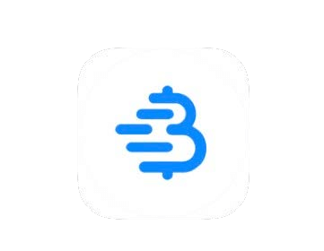

# OKU BITCOIN ETA

>**Okubitcoin:** (ekikolwa) /tuːˈbɪtkɔɪn/
Ninyoweereza okugira ‘okubitcoin’ ekikolwa,
ekikwata omuhendo gwona ogw’okwetaba
omu nkora y’ebyamagara eya bitcoin/Bitcoin.

* Gye, hati yaaba iwe, twine amatsiko ;) wamaze kwegamira, kandi oreete okuba banki yaawe, okwetaba omu sente z’obusingye ez’ensi yoona ez’okubanza,
eka haza ekiicweka kirungi!

---

## OKUBA BANKI YAAWE
* Eki nikyo ekihinduka ekitahurika omu kuba omugabe omu by’entaama, kandi, nikibaasa kutwara obwire
kukwata buzima, mazima okurikira omumulingo ogurikubasa.
* Obwengye n’okwegamba nikwetagisa
kwetegyereza oku bikukorwa omu mulingo oguteekaniziibwe
ogurikubasa.
* Omu mutima ogw’okukwata ekitabo eki ‘ekitabo kya bitcoin ekirikukirayo kwangu
ekyahandiikwa’, ninda kukora omutwe gw’okutandika, reero ngaba ebintu by’okukoresa aha muheru
kw’okutaahirira omunda ebirikukira eki kitabo.

>**HODL:** (ekikolwa) /ho’dill/

: okukwata ahari bitcoin yaawe

: okuteguza

-Kuruga aha muhandiiko gwa 2013 bitcointalk.org, omuhandiiki
naraganira kuba atamiire, yakubise kubi ‘KWATA’

-bitcointalk.org/index.php?topic=375643.0

* Kwonka omutindo nigukura, harimu omuhendo mwingi
omu bukadde bw’abahodiri b’ensi yoona.

---

## OKUTUNGA BITCOIN
* **Bitcoin eyingira isente z’ebintu omuringo gw’abacukuzi baguzya ezimwe
aha bitcoin ezibahairwe nk’empeera,** kubaasa kushashura
aha mitwarize yaabo.
* **Noobaasa kutunga bitcoin orikugura aha kasharamuro k’obucuruzi, orikugyenda okireeba nk’empeera y’ebintu
obaasa kugaba, nk’ekiconco, rundi okucukura
iyo.** (Ekikomo ky’aha muheru, tikirekomendwa, n’okugigura
kuruga aha kacwamba akajugaine).
* Waagiireeba, nooba noogyeera amakyai egihisho
oku okyenderera okugyendera bitcoin yaawe.
> * **Ijuka:** Bitcoin kenyini teeruga omuri
 omutindo gw’obwire.

* Noobaasa kutunga bitcoin ebirema, rundi
n’okuhwera ID (KYC - Manyi Omuguzi Waawe)

* KYC neyetaagisa omutwe gw’amateeka kureetera AML (amateeka g’okukwatanisa isente) obuyigura kuruga aha kacwamba.

>* Okugura bitcoin etari KYC **nekukuumira obugabe bwawe
omu bwire oburikwija.**

---

## Etari KYC >> Obwire obutari bw’amazima
**Omulingo gw’okutunga Bitcoin etari KYC (Eteri ID):**

Ekirikurekomendwa

>1. Fura wallet ya bitcoin-yoona (leeba oruhande 102).
>2. Toora omulingo (leeba ahansi).
>3. Gura, gyenda rundi ocukure bitcoin.
>4. Gyenda n’ebya bitcoin yaawe omu wallet yaawe.
>5. HODL, rundi oshendye obugyende ogyendese.

* **Gyigura kuruga aha Robosats, Bisq, HodlHodl, Peach Bitcoin.**
* **Gyigura kuruga aha bitcoin ATM** - Teeka omutima aha ky’ogyende ogyende, nk’oku
ezimu ziraganiire ID. Ezindi zigira eriziina n’
omubaro (noobaasa kukoresa omubaro gw’esimu ogw’obwire).
* **Gura Azteco voucher** - Gyenda aha azte.co aharikurugirira.
* **Yegyeera omulimo ogukora** - Shaba oheebwe bitcoin.
Gaba okucwa omuhendo gwawe.
* **Gyigura omu bantu aha bitcoin meet-up.**
* **Ocukure iyo** - Nekwanguha okucukura omu ka, rundi
noobaasa kwegata aha kasharamuro k’abacukuzi, kwonka reero DYOR okuguma
otari KYC. Ocean Pool n’omulingo murungi.

---

## KYC >> Okuhwera ID Kuraganiire

**Omulingo gw’okugura Bitcoin eya KYC (n’ID):**

Tikurikurekomendwa

>1. Fura wallet ya bitcoin-yoona (leeba oruhande 102).
>2. Toora kacwamba ka bitcoin-yoona.
>3. Kora akaundu & ogyende ogyendese omulingo gw’okushashura.
>4. Hwere ebiraganiirwe bya KYC.
>5. Gura bitcoin.
>6. **Gyenda n’ebya bitcoin yaawe omu wallet yaawe.**
>7. HODL rundi oshendye obugyende ogyendese.

* **Teeka omutima ngu bitcoin yaawe negyenda kuguma
egyenderaniiziibwe n’obuntu bwawe** wayigura omu mulingo ogu, ngu okagira
okugira akacweka ebizima aha mikora egi.
* Waagendera omu mulingo ogu, ndekurekomenda okushanga
***kacwamba ka bitcoin-yoona***
* ***Teeka omutima kacwamba nikakuleka okugyenda na
ebya bitcoin yaawe omu wallet yaawe!***
* **Kacwamba neeraganire aha mateeka okukwihwera ‘KYC’.**
* Nibenda kutwara **eriziina ryaawe lyona, obushoroorezi, omubaro gw’obwerinda bw’abantu
email, omubaro gw’esimu kandi kimwe na kimwe ekifaananyi
waakwata ID yaawe.**
* **Hameeza ngu kacwamba kaine omukoro n’email
obukwasirize** aha mukoro gw’abakiriya.

---

* Bareke bakugyemereze kuhereza bitcoin yaawe
kuruga aha akaundu yaawe nabo omu wallet yaawe, ngu
oba weine bitcoin yaawe
= **Kukwata amakyai gaawe.**

>* **Eky’okwetegyereza:** Eki tikyihaho mazima ngu
>wakagura bitcoin kuruga omuli bo.
>* **Emikorere negyenderanizibwa aha mutindo, kandi omuri
>ensi nyingi noogenda oheerwaho omushoro waaba
>oshendya bitcoin yaawe.**

* Waaba nooyenda kugura kuraba omuri Venmo rundi Paypal, teeka
omutima **kugambira okukiriza ngu noobaasa kugyenda na
ebya sats yaawe omu wallet yaawe weine.** Omu
ebyahingire otarikubaasa kukora eki.
* Nk’oku bagira:
> **“Ama Kyai tagaine, Okutaina”** rundi
>
>**“Amakyai gaawe tegarimu, bitcoin yaawe tegarimu”**

* Eki kikumanyisa ngu, ekyogiireyo nk’okukorera ahamutindo
kikakwata amakyai g’ebihisho g’obwa bitcoin yaawe, nigusiigaraho
okubasa kw’entindo yaabo okubemburwa, rundi
bakataahirirwa okugenda omu mulingo oguraganiirwe kandi okahwa
bitcoin yaawe.

>* **Obwire bwona gyenda na bitcoin yaawe omu
wallet yaawe weine waamara kugigura.**

---
## EO 6102
* Omu mwaka gwa 1933 **President Roosevelt akahayo Ekigambiro
6102, ekyaraganire omuntu w’ensi yoona ya US okugarura
bwingi bwa zahabu yaabo okugyizaho eby’obulyo by’ebbanki.**
* Zahabu yakubisiibwe $20.67/oz. Omwaka ogukuratireho,
burugumesita yeyongyereza aha muhendo gwa zahabu $35/oz n’omutindo gwa Zahabu ogwa 1934,
kuhwera eby’obulyo abantu bakaba bahaire
bwabaire bwacweireho hafi kimwe aha kucweera, kuba ngu omuhendo gw’ebyaabo
tegwayeereize n’omuhendo gwa zahabu ogwayehongyereize.

---

* Kyatwaire okuhika 1975, **emyaaka 42 enyima, ngu EO6102 yagira
ekacweke,** ngu abantu bagyezibwe okuguma
bagyende okukwata zzaahabu erikukira 5oz.
* Aha kasharamuro aka, twine akaikuru kakye oku abateezi
nibenda kwija kukorra aha bitcoin nk’oku negyenda kuguma
negyenda yeyongyereza ahamutindo.
* Obwire obu nikwo, habaireho obwihirizo bw’amaisho. Omulingo
okutuusa hati, kigyenderera ngu abantu baingi
nibetegyereza, rundi okikiriza, ngu bitcoin
teerukuseebwa.
* Harimu abanyabufuzi batandika kugamba
omu kukwasiriza bitcoin nk’omucweka gw’entindo yaabo.
Harimu nabandi abaaba batagyezire.
* Kuba omwaka gw’okutoora omu US, 2024 neyenda kuba
eky’obwengye, n’abatoorwa abakuru bashatu aba President
nibakiriiza okuhereza embeera ya bitcoin!
* El Salvador bakagira n’omulingo gw’okushashura omuri 2021.
Negyenda kuba eky’obwengye okureeba ensi eja kwija.

>* **Aha muheru, nikigenda kuba omu by’obwengye bwa buri buteeka okugikwata n’okugyendesa aha kasharamuro
nk’entebeekaniza ahari eby’obulyo ebirikuhindura
ebyaronda byabo b’obulyo.**

---

## OKUTEGANISA BITCOIN OMU BWERINDA

* Waamara kutwara okuhinduka okukuru omu magara kw’okugura okwawe okw’okubanza, noyetaga **kutoora omulingo ogurikukirayo okuteeganisa
okugikumira.**
>* **Okuba banki yaawe n’omulingo murungi ogw’
>okwegambira.**
>* Neeyetaga okutwarwa **omutima**
* ***Kora Okushaba kwaawe - Kora Okushaba kwaawe * ahari
entindo zange aha.**
* **Entindo ya bitcoin negihinduka buli mutindo.**
* Nostr, Twitter na bitcointalk.org n’obusingye
okuguma aha mutwe gw’ebihinduka ebisya.

## REEBA AHA TUSAIITI ZI AHA KUJUNA:
> * BTCSessions.ca okukurata @BTCSessions
>* Bitcoiner.guide okukurata @QnA
>* Armantheparman.com okukurata @ArmanTheParman
>* @SouthernBitcoiner aha YouTube
>* @wickedsmartbitcoin aha YouTube

---

## WALLET Z’OBWA BITCOIN-YOONA
* Bitcoin nekurugaho yateganisiibwe omu byaawe
 * **eweine**
 * **etari kukwatwaho**
 * **wallet ya bitcoin-yoona**

* ‘Wallet’ mazima n’ekiceeko ky’omushoro ekirikukora
ekikoreso ky’okuta omukono. Kiriine amakyai gaawe egihisho egirikukoresa
kuta omukono aha mikore ewaatumira (kukomyoora).

## WALLET EY’EISHO
* **Egi n’app ya wallet ya bitcoin omu laini efurwa omu simu yaawe rundi kompyuta.**
* Neeyenda kukoresibwa aha muhendo muke, buri izooba-ku-izooba
okweshengyereza
## WALLET EKAKATA
* **Egi n’wallet y’aha rubaju.** N’okumanywa nka ekikoreso ky’okuteeka
amakyai gaawe.

>* Kwonka omurimo nigwija, nikirekomendwa
kukoresa wallet ekakatsi waaba okwiireho
$500-1000 omuri bitcoin, nk’oku **ekirikuteekaniza.**

---
* **Gyenda okora DYOR okugeraana aha mikoore n’
obucweke bw’aha wallet ezirekirwe ahansi.**

* **APP ZA WALLET EY’EISHUO** - Eziteri Kukwatwaho
Blue Wallet, Muun Wallet, Mutiny Wallet
Sparrow Wallet, Green Wallet, Phoenix
Wallet, Zeus Wallet, Breez Wallet

* **WALLET Z’OKUTEEKANISA** - Eziteri Kukwatwaho
Cold Card, Trezor, Foundation Passport,
Blockstream Jade, Seed Signer, Bitbox,

>* **OBWIRE BWONA** ogura wallet yaawe ey’okuteekanisa **enyima
kuruga aha muhangi,** ngu ogume oine obwire obutagaruka oine.

---

## ENTEBEEKA YA WALLET
* Kurata @BTCSessions aha YouTube aharikwihayo
okukwasa aha ntebeeka ya wallet, n’obwingi obukuru.

>* Waaba nootebeekanisiza wallet yaawe, guma **oyandika
>engambo ya Seed eya-12 rundi 24-aha rupapura.**
>* ***Kigume kigumire. Ntuura otakwatire ekifaananyi.***
>* **TEEKA ENTEBEEKA YA SEED OMU MURINGO MURUNGI.**
>* **KURUNGA OMU MURINGO MURUNGI!**

* **Kampani nyingi zikora orupapura orw’ebyuma omu
oru noobaasa kuta Engambo yaawe eya seed aharikwihwa
omuliro/amaizi/okuhwera. Kyarekomendwa buzima!**
* Waaba otarikubaasa kugyenda aha wallet yaawe ey’eisho rundi ekakatsi,
noobaasa kugigarura n’engambo ya seed n’okugarura
ebintu byaawe.
* Noobaasa kukora otyo aha wallet yoona ekuraganire omulingo gumwe
Engambo ya seed eya BIP39 (engambo 12/24).
* Okukora omulingo murungi kyaba kiri okuteeka wallet
omulingo gw’entegereezibwa ogwa wallet yaawe n’Engambo yaawe.
>* **IJUKA: Omuntu yoona aine Engambo ya seed
agyenda aha bitcoin yaawe!**

---
## AHA KIGIZO
* Ekigizo waaba **nogura (etari KYC), kuteekanisa, okuteeka
n’okweshengyereza** bitcoin negenda yeyongyereza kandi
omutima, butoosha omuri ebyahingire n’
akaundu ka bbanki kaashangwamu/kagiirwa omukono.
>* Okukuratiza, **ekigizo ky’ebihimbo kyamagara waaba
nooyenda okutunga okwegambira omu laini, n’okwekuuma kuruga aha kureeba obutari bw’obulinganiza n’ebigambo.**

* Ahansi hariho okukorera hamwe ekurikugyizaho ekigizo.
* Kigumiire aha mukoro gw’ekitabo eki okugyenda omunda omuri
buri kimwe ky’ebirikukurata, ngu obwire bwona DYOR, kandi
kurata akaundu nk’oku ndikugambira aha Nostr rundi
Twitter okugyendera.

>*Ekigizo nikyetagisa aha bwebembera aha myaka y’obwengye.
Ekigizo tikiriyo kukisa. Eky’ekigizo kintu
omuntu atarikwenda ensi yoona okukimanya, kwonka ekisa
kintu omuntu atarikwenda omuntu yoona okukimanya.
Ekigizo n’amaani g’okureeta
omwene omu nsi.*

~Eric Hughes, Kuruga ‘Akakomo ka Cypherpunk’
