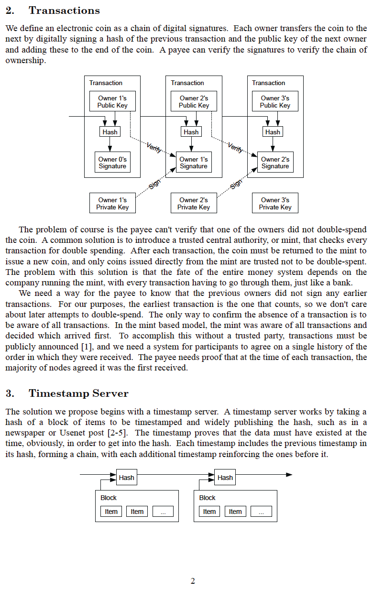
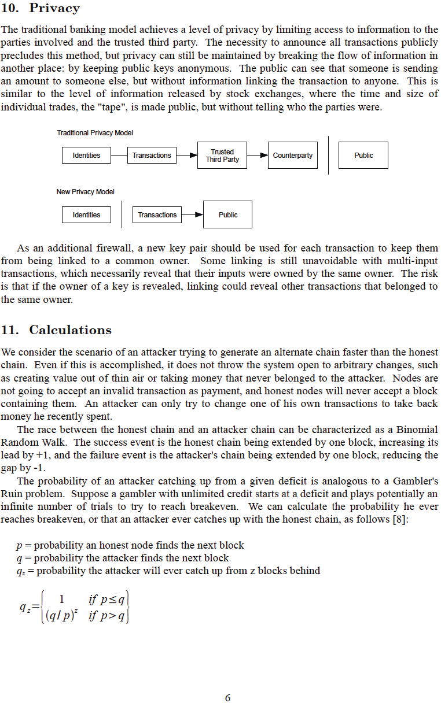

# Белая Книга Биткойна
Представлена миру на metzdowd.com
2008-10-31

**от Сатоши Накамото**

Анонимный шифропанк, который в последний раз общался
с сообществом шифропанков на форуме bitcointalk.org
10.12.2010.

Уйдя, он позволил Биткойну стать настоящим экспериментом в
дикой природе. Каждый, кто работает над ним, является волонтером в некотором
смысле <-> вдохновлен потенциалом освобождения человечества
от оков манипулируемой, основанной на долгах денежной
системы, и вместо этого участвует в глобальной, не требующей доверия,
не требующей разрешений, устойчивой к цензуре, действительно дефицитной, одноранговой,
децентрализованной денежной и денежно-платежной сети, которая вдохновляет возникающий порядок подняться из
пепла фиатных денег

**Мы все Сатоши**
>*The Times 03/Jan/2009 Канцлер на грани
второго спасения банков*

~ Текст заголовка из The Times of London,
выгравированный в генезис-блоке Биткойна Сатоши
Накамото 03.01.2009

---

---

---

---

---

---

---

---

---

---

## Генезис-блок Биткойна ~ Raw Hex Version 2009-01-03

итак,

новая эра,

была высвобождена

---
