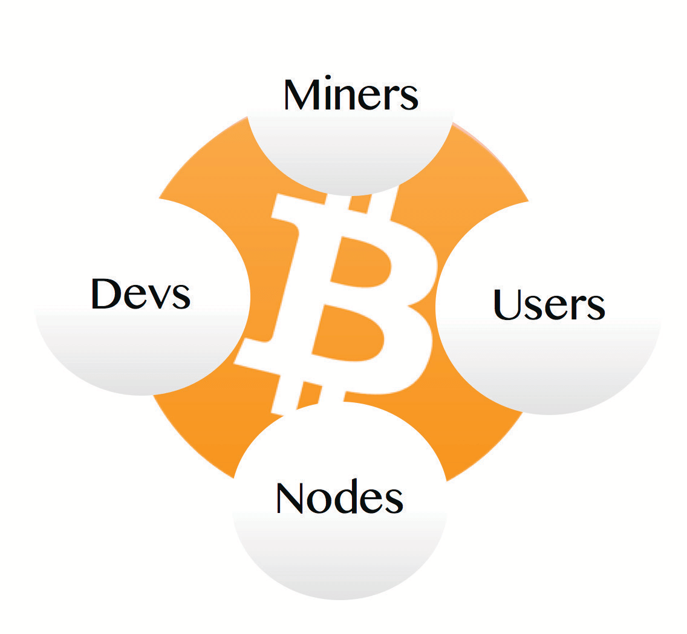

# КАК РАБОТАЕТ Биткойн?

Правила, а не правители

tik-tok/
/следующий блок
* Биткойн использует доказательство работы, криптографию с открытым ключом
и одноранговую сеть для обработки и проверки
платежей в глобальном, распределенном онлайн-реестре.

>**Криптография** (существительное) /krɪpˈtɑːɡrəfi
>
>*: шифрование и расшифровка сообщений
>в секретном коде или шифре
>: компьютеризированное кодирование и
>декодирование информации*

~ Merriam Webster Dictionary

>**Хеширование** (глагол) /ˈhæʃɪŋ/
>
>*: метод шифрования
>: процесс использования математического алгоритма против
>данных для получения числового значения (хеш-дайджеста),
>которое является репрезентативным для этих данных.*

~ crsc.nist.gov

>**Помните:**
>
>Биткойн-экосистема включает в себя >>
>
>**bitcoin:** цифровой **денежный актив**
>
>**Bitcoin:** **платежная сеть** майнеров и узлов

1 bitcoin = 100 000 000 сатоши (sats)

**(Вы можете купить сатоши, часть биткойна)**

---

>*Мы определяем электронную монету как цепочку
цифровых подписей. Каждый владелец передает
монету следующему, цифровой подписывая
хеш предыдущей транзакции и
открытый ключ следующего владельца и добавляя
их в конец монеты. Получатель может
проверить подписи, чтобы проверить цепочку
владения.*

~ Сатоши Накамото
Белая книга Биткойна, Ч.2, 2008
Описание того, как работает биткойн-транзакция
в распределенном реестре

---
## БИТКОЙН-ЭКОСИСТЕМА..
**состоит из Майнеров, Узлов, Пользователей, Разработчиков**

все работают независимо,

и в то же время взаимозависимо,

чтобы оживить то, что есть

БИТКОЙН!

---
## МАЙНЕРЫ
* **Специализированные узлы** (компьютеры, называемые ASICS), **которые
«добывают» блоки**, которые становятся частью биткойн-
блокчейна.
* При этом они **проверяют подтвержденные транзакции,
совершенные пользователями, выпускают новые биткойны** и **защищают
всю сеть.**

## ПОЛЬЗОВАТЕЛИ
* **Вы и я. Все мы.** Люди.
* Признавая и оценивая ценность
предоставляемых товаров и услуг, мы совершаем транзакции: даем
и получаем биткойн, или храним его для использования позже, по
мере необходимости.

## УЗЛЫ
* **Узлы — это компьютеры, на которых запущено программное обеспечение биткойна.**
* **Существуют тысячи узлов**, составляющих
децентрализованную, глобальную, добровольную **сеть, которая
подтверждает транзакции** (тем самым предотвращая
двойное расходование и помогая защитить систему).

## РАЗРАБОТЧИКИ (DEVS)
* **Кодеры, программисты и цифровые авторы**, которые работают
над **поддержанием и масштабированием сети, улучшением безопасности,
конфиденциальности и пользовательского интерфейса, а также переводом кода**
на язык и визуальные эффекты, которые остальные из нас могут понимать и использовать.

---

## БИТКОЙН-ТРАНЗАКЦИЯ:
Али хочет отправить Бенджи немного биткойнов:

>1. Али **открывает приложение биткойн-кошелька** на своем телефоне и
>**нажимает «Отправить».**
>2. Бенджи **открывает свое приложение кошелька** и **нажимает «Получить».**
>3. **Если они вместе:** Али сканирует QR-код в
>приложении кошелька на телефоне Бенджи.
>4. **Если они не вместе:** Али копирует и вставляет
>адрес, который Бенджи присылает ей в текстовом сообщении, в поле адреса в своем
>кошельке.
>5. Али **вводит сумму для отправки** и нажимает **«Отправить».**
>6. **Через несколько секунд** Бенджи увидит сумму
>в ожидании в своем кошельке.
>7. **Если он был отправлен через Lightning**, он будет подтвержден
>почти мгновенно и почти бесплатно.
>8. **Если он был отправлен «ончейн»** (в основной сети Биткойн),
>он включает небольшую плату и обычно занимает около 10
>минут для подтверждения. Это может занять больше времени,
>в зависимости от сетевого трафика.

---

## БИТКОЙН-ТРАНЗАКЦИЯ ПОД КАПОТОМ:
(Определения терминов, выделенных **жирным шрифтом**, приведены ниже)

>1. Когда Али отправляет эти сатоши Бенджи,
>**транзакция** **транслируется** в сеть.
>2. Транзакция проверяется **узлами**, которые
>убеждаются, что у Али действительно есть биткойн для отправки, и
>что он не был потрачен ранее (чтобы предотвратить
>двойное расходование).
>3. После проверки узлом он ждет в **мемпуле**
>с транзакциями других людей.
>4. Транзакции в мемпуле добавляются в
>блок в **блокчейне**, когда **майнер** находит >**одноразовый номер**,
>который удовлетворяет **алгоритму сложности.**
>5. Каждый **блок** имеет **временную метку.**
>6. Это создает **неизменность** и помогает защитить
>корректировку алгоритма сложности от
>манипулирования.
>7. Каждый блок представляет собой одно подтверждение для
>транзакций, включенных в него.
>8. По мере добавления блоков, в среднем каждые десять минут,
>неизменность блокчейна увеличивается.

---

## ГЛОССАРИЙ ТЕРМИНОВ

---
>* **ТРАНЗАКЦИЯ ~ Отправка/получение биткойнов**
---
* Передача стоимости в форме сатоши от
одного держателя биткойнов другому.

---
>* **УЗЕЛ ~ «Ветвь» децентрализованного биткойн-
«банка». Любой может запустить узел.**
---

* Узлы — это компьютеры, на которых запущено программное обеспечение биткойна.
* Узлы, наряду с майнерами, пользователями и
разработчиками, образуют одноранговую сеть Bitcoin.
* Представьте **каждый полный узел как реестр, содержащий
балансы каждого приватного ключа.**
* Они взаимодействуют и достигают консенсуса (соглашаются) друг с другом,
принимая и проверяя транзакции от других узлов, наряду с блоками от майнеров,
а затем передавая их дальше другим узлам.
* Узлы управляются специальной группой из тысяч
добровольцев по всему миру.
* Полный узел — это узел, который независимо
подтвердил весь блокчейн Bitcoin, начиная с
Genesis Block, добытого Сатоши в 2009 году.
* Чем больше активных узлов, тем более распределенной и, следовательно, устойчивой становится вся сеть.
* В **настоящее время существует более 19 000 доступных полных
узлов по всему миру, и гораздо больше недоступных.**
* Все участвующие узлы равны.

---

---
>* **ТРАНСЛЯЦИЯ ~ Сообщение сети о том, что вы
отправляете биткойн кому-то.**
---

* Когда вы нажимаете «Отправить», ваш кошелек подписывает транзакцию вашим личным ключом и транслирует ее,
сообщая всем остальным узлам о вашем намерении
передать ценность, чтобы они могли подтвердить транзакцию.

---
>* **MEMPOOL ~ Комната ожидания транзакций**
---

* Это «комната ожидания», куда отправляются проверенные транзакции, чтобы быть выбранными майнером и
добавленными в блок.

---
>* **БЛОК ~ «Страница» в реестре биткойнов**
---

* Распределенный реестр Биткойна состоит из цифровых «блоков».
* Каждый блок содержит проверенные транзакции биткойнов,
которые поддерживают глобальный реестр точным и актуальным.
Они также содержат одноразовый номер, отметку времени и хеш предыдущего блока,
которые способствуют неизменности биткойн-
блокчейна.

---
>* **БЛОКЧЕЙН ~ Весь реестр биткойнов**
---

* Биткойн-блокчейн, также известный как
цепочка времени, представляет собой распределенный реестр, который содержит
каждый блок и каждую транзакцию биткойнов, когда-либо
совершенную с тех пор, как Сатоши добыл блок Genesis в 2009 году.

---

---
>* **МАЙНЕР ~ Специализированный узел, который одновременно подтверждает
транзакции и выпускает новые биткойны**
---

* Биткойн-майнеры — это специализированные компьютеры. Они
направляют много вычислительной мощности (хешрейта) в
цифровую лотерею, чтобы угадать число, которое будет удовлетворять
текущему алгоритму сложности, тем самым «добывая»
«блок» (часть реестра).
* Добытый блок имеет отметку времени и добавляется в
блокчейн (он же цепочка времени).

---
>* **АЛГОРИТМ СЛОЖНОСТИ ~ Специальная адаптивная
конструкция, которая помогает поддерживать предсказуемость выпуска новых биткойнов.**
---

* Это было одно из гениальных решений Сатоши, чтобы помочь
защитить выпуск биткойнов от превышения лимита,
поскольку разрабатываются более совершенные компьютеры.
* Когда в сеть выходит больше майнеров, целевое число (одноразовый номер) в «лотерее» становится меньше и, следовательно, его труднее найти.
* Когда в сети меньше майнеров, становится легче.
* Алгоритм **автоматически корректируется каждые 2016
блоков** (примерно каждые две недели), чтобы обеспечить предсказуемую скорость поставки, когда один блок добывается
в среднем каждые десять минут.

---
>* **NONCE ~ 32-битное случайное число**
---

* 32-битное случайное число, которое майнеры добавляют в
конец хешированного списка транзакций, чтобы попытаться
удовлетворить целевой показатель сложности для добычи блока.
* Когда майнер находит одноразовый номер, который приводит к
генерации хеша ниже текущего целевого
числа, он добыл блок и может добавить
его в блокчейн и получить вознаграждение за блок биткойнов.
---

---
>* **ВРЕМЕННАЯ МЕТКА ~ Ставит время**
---

* Каждый добытый блок имеет добавленную к нему временную метку.
* Это необходимо для дополнительной безопасности, неизменности и для помощи в
установлении корректировки сложности.

---
>* **НЕИЗМЕННОСТЬ ~ Не может быть изменена.**
---

* Это означает, что блокчейн «закреплен в цифровом камне».

---
>* **ДОКАЗАТЕЛЬСТВО РАБОТЫ (PoW) ~ Криптографическое доказательство
того, что была проделана сложная работа для удовлетворения алгоритма.**
---

* Майнеры используют алгоритм PoW, чтобы доказать, что они
использовали много вычислительной мощности посредством электричества
(работы), чтобы достичь консенсуса децентрализованным образом и чтобы предотвратить
отправку спама в сеть коррумпированными участниками.

---
>* **КРИПТОГРАФИЯ С ОТКРЫТЫМ КЛЮЧОМ ~ Процесс, который
создает цифровые ключи для доступа к вашим биткойнам**
---

* Это система, посредством которой создаются два ключа
с помощью криптографического алгоритма.
* **Один ключ является открытым** — как номер вашего банковского счета, который вы можете дать людям, чтобы они отправили вам биткойн
за товары, подарки или услуги.
* **Другой ключ является приватным** — только у вас есть копия,
и вы используете ее для разблокировки доступа к вашему биткойну,
точно так же, как пароль разблокирует ваш онлайн-банк
счет.
* **Вы должны очень хорошо защитить свой личный ключ,**
поскольку любой, кто имеет к нему доступ, имеет доступ к
вашему биткойну.

---

---
>* **ОДНОРАНГОВАЯ (P2P) СЕТЬ ~ Децентрализованная
сеть без посредников**
---

* Полные узлы (пиры) совместно поддерживают пиринговую сеть для проверки и подтверждения транзакций и блоков.
* В этом типе сети каждый узел может
как предоставлять/запрашивать данные своим/у своих пиров.
* В сети P2P нет привратников.

---
>* **СЕТЬ LIGHTNING ~ Сеть, построенная на биткойне, которая позволяет очень быстро и почти бесплатно отправлять или получать
саты.**
---

* Lightning — это решение масштабирования уровня 2. Это означает, что
он предоставляет способ масштабирования биткойна, давая ему
возможность обрабатывать миллионы транзакций в секунду (TPS).

---
>* **КОШЕЛЕК ~ «Кошелек» содержит криптографические
ключи для доступа к вашему биткойну.**
---

* Он может быть на телефоне, компьютере или на отдельном
маленьком аппаратном устройстве (самом безопасном).
* Биткойн-кошелек точнее было бы назвать
устройством подписи. Ваш биткойн на самом деле никогда не покидает
блокчейн, цифровой реестр.
* Когда вы хотите отправить или потратить свой биткойн,
кошелек подпишет и транслирует транзакцию в
сеть, чтобы ее можно было проверить и
добавить в блок в блокчейне.

---
>* **РАЗРАБОТЧИКИ ~ Программисты**
---

* Шифропанки/программисты, которые обслуживают сеть, улучшают безопасность, проверяют наличие ошибок, отправляют
запросы на включение (для новых обновлений или функций), рассматривают
запросы на включение, проверяют код.

---

---
>* **ОТКРЫТЫЙ КЛЮЧ ~ Как номер банковского счета для
получения биткойнов.**
---

* Вы можете дать его людям, чтобы они отправили вам биткойн,
точно так же, как вы дали бы свой номер счета
кому-то, чтобы он мог отправить вам фиат

---
>* **ЛИЧНЫЙ КЛЮЧ ~ Для защиты, доступа и отправки биткойнов, как ключ от банковской ячейки.**
---

* Биткойн-приватный ключ — это секретная строка чисел
и букв, которая позволяет вам отправлять/тратить ваши
биткойны.
* Только у вас есть копия. ** **Очень важно
хранить его в безопасности, поскольку любой, кто
получит копию, может потратить ваши биткойны.** **

---
>* **РАСПРЕДЕЛЕННЫЙ РЕЕСТР ~ Реестр, который поддерживается
всеми, кто желает помочь его поддерживать.**
---

* Вместо централизованно контролируемого реестра, который
невидим для общественности, как реестр, который ведет банк, Биткойн является прозрачным, открытым, децентрализованным
реестром, видимым для всех и в любое время.
* Адреса представляют собой строки букв и цифр,
без прикрепленных имен.
* Будучи псевдонимным, можно отслеживать транзакции, особенно если биткойн был куплен на
централизованной бирже KYC.
* Сеть Биткойн не требует доверия, и любой может
проверять ее в любое время, в отличие от банка, где нужно
доверять, что реестры ведутся честно.

---

## БОЛЬШЕ О МАЙНИНГЕ
 Whatsminer M50S

 Antminer S21 Pro

 Bitaxe 401 Supra

* **Майнеры выделяют вычислительную мощность, иначе говоря, хешрейт,
через электричество в сеть,** чтобы добавлять блоки в
Биткойн-блокчейн.
* Эти компьютеры работают 24 часа в сутки, обычно в наборах
от нескольких до нескольких сотен или тысяч.
* **Они в основном запускают лотерею. Когда один из
них угадывает число** (одноразовый номер), которое генерирует
хеш, удовлетворяющий текущему целевому показателю сложности, **они
получают возможность добавить следующий блок в цепочку времени.**
* **Все вышеперечисленное является доказательством работы (PoW), необходимым для
рождения новых биткойнов.**

---

## ВОЗНАГРАЖДЕНИЕ ЗА БЛОК БИТКОЙНОВ
**= Субсидия + Комиссии**

>* **За свою работу майнеры получают:**
> * **Субсидию в виде только что выпущенных биткойнов.**
> * **Плюс комиссии от проверенных транзакций,
>включенных в этот блок**

* **Когда вы отправляете биткойн кому-то, эта транзакция
включает комиссию** и должна быть проверена майнером,
а затем включена в блок.
* **Субсидия за блок биткойнов** уменьшается вдвое каждые четыре
года.
* В **настоящее время она составляет 3,125 биткойна** за добытый блок.
* **Следующее «сокращение вдвое» будет в 2028 году,** после чего
вознаграждение за блок упадет до 1,5625 биткойна за
добытый блок.
* Как упоминалось ранее, **это поддерживает стабильность выпуска.**
* **В 2140 году будет добыта последняя часть биткойна.**
* После этого майнеры будут получать только комиссии от транзакций, которые они проверяют в каждом блоке.

>*Через несколько десятилетий, когда вознаграждение станет слишком
малым, плата за транзакцию станет
основной компенсацией для узлов (майнеров).*

~ Сатоши Накамото
Bitcointalk.org, 2010-02-14

>* **Майнеры всегда будут необходимы для проверки транзакций,
тем самым поддерживая сеть в актуальном состоянии и в безопасности.**

* Хотя необходимо помнить, что существуют затраты,
и прибыльность незначительна для домашних
майнеров, это мощный способ помочь обеспечить безопасность и
поддерживать децентрализацию сети.
* Майнеры служат довольно много лет. В настоящее время существует множество
Antminer S9, например, которые работают
более 6 лет.
* Когда майнеры выводятся из эксплуатации, **их можно легко
разобрать и переработать.**
* **Происходит масса увлекательных инноваций,** когда
люди используют избыточное тепло от майнеров для
обогрева своих домов, саун, теплиц, гидромассажных ванн,
сухого вяленого мяса и овощей, обогрева палуб, сушки дров и
многого другого!

---
