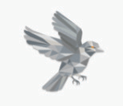

# JINSI YA KUTUMIA BITCOIN

>**Kubitcoini:** (kitenzi) /tuːˈbɪtkɔɪn/
Ninapendekeza hapa kufanya 'kubitcoini' kuwa kitenzi,
ambacho kinajumuisha ukamilifu wa kushiriki
katika mfumo wa ikolojia wa bitcoin/Bitcoin.

* Sawa, sasa kwa kuwa wewe, tunatumai ;) umekuwa 'orangepilled', na uko tayari kuwa benki yako mwenyewe, ukishiriki katika pesa ya kwanza ya uhuru wa kimataifa,
sehemu ya kufurahisha inakuja!

---

## KUWA BENKI YAKO MWENYEWE
* Hapa ndipo mabadiliko makubwa ya kweli katika kuwa na uhuru wa kifedha hupo, na, inaweza kuchukua muda
kuelewa kwa kweli, kwa kweli nini hii inamaanisha.
* **Nia na kujitolea kunahitajika ili
kuelewa jinsi ya kuifanya kwa njia salama iwezekanavyo.**
* Kwa roho ya kuweka kitabu hiki kuwa 'kitabu rahisi zaidi
kuandikwa kuhusu bitcoin', nitatoa
muhtasari hapa, na kisha natoa rasilimali mwishoni
kwako kuzama ndani ambayo huenda mbali zaidi kuliko
wigo wa kitabu hiki cha msingi.

>**HODL:** (kitenzi) /ho’dill/

: kushikilia bitcoin yako

: kutouza

-Kutoka chapisho la 2013 la bitcointalk.org, ambapo mwandishi
akidai kuwa mlevi, aliandika vibaya 'HOLD'

-bitcointalk.org/index.php?topic=375643.0

* Wakati mtandao bado unakua, kuna thamani kubwa
katika mamilioni ya HODL'rs wa kimataifa wa mwisho.

---

## KUPATA BITCOIN
* **Bitcoin inaingia sokoni kupitia wachimbaji wanaouza baadhi ya
bitcoins wanazopokea kama zawadi,** ili kulipia
gharama zao za uendeshaji.
* **Unaweza kupata bitcoin kwa kununua kwenye jukwaa la biashara la rika-kwa-rika
, kwa kuikubali kama malipo ya
bidhaa au huduma unazotoa, kama zawadi, au kwa kuchimba
.** (Njia ya mwisho sana, haipendekezwi, ni kuinunua
kutoka kwa soko lililosajiliwa).
* Unapoipokea, kiufundi unapokea
funguo za kibinafsi za kufikia bitcoin yako.
> * **Kumbuka:** Bitcoin yenyewe haiwahi kuacha
  mnyororo wa muda.

* Unaweza kupata bitcoin ama bila kujulikana, au
kwa uthibitishaji wa kitambulisho (KYC - Mjue Mteja Wako)

* KYC inahitajika kisheria kutimiza AML (sheria za kupambana na utakatishaji fedha) wakati wa kununua kutoka kwa masoko.

>* Kununua bitcoin isiyo ya KYC **inalinda haki yako ya
  faragha katika siku zijazo.**

---

## Isiyo ya KYC >> Bila Kujulikana
**Jinsi ya Kupata Bitcoin Isiyo ya KYC (Hakuna Kitambulisho):**

INAPENDEKEZWA

>1. Pakua programu ya pochi ya bitcoin pekee (tazama uk. 102).
>2. Chagua njia (tazama hapa chini).
>3. Nunua, pokea au chimba bitcoin.
>4. Toa bitcoin yako kwenye pochi yako.
>5. HODL, au tumia na ubadilishe.

* **Inunue kutoka Robosats, Bisq, HodlHodl, Peach Bitcoin.**
* **Inunue kutoka kwa ATM ya bitcoin** - Hakikisha umeangalia, kwani
  baadhi zinahitaji kitambulisho. Nyingine zinauliza tu jina na
  nambari (unaweza kutumia # ya simu ya muda).
* **Nunua vocha ya Azteco** - Tembelea azte.co kwa maeneo.
* **Ipatie kazi unayofanya** - Omba kulipwa kwa bitcoin.
  Toa punguzo la bei yako.
* **Inunue kibinafsi kwenye mkutano wa bitcoin.**
* **Ichimbe** - Inakuwa rahisi kuchimba nyumbani, au
  unaweza kujiunga na kikundi cha uchimbaji madini, lakini basi DYOR ili uendelee
  bila KYC. Ocean Pool ni chaguo nzuri.

---

## KYC >> Uthibitishaji wa Kitambulisho Unahitajika

**Jinsi ya Kununua Bitcoin ya KYC (na Kitambulisho):**

HAIPENDEKEZWI

>1. Pakua programu ya pochi ya bitcoin pekee (tazama uk. 102).
>2. Chagua soko la bitcoin pekee.
>3. Fungua akaunti & unganisha njia ya malipo.
>4. Timiza mahitaji ya KYC.
>5. Nunua bitcoin.
>6. **Toa bitcoin yako kwenye pochi yako mwenyewe.**
>7. HODL au tumia na ubadilishe.

* **Tambua kuwa bitcoin yako itaunganishwa milele na
  kitambulisho chako** ikiwa utainunua kwa njia hii, na hivyo kupoteza
  ujulikanao wa siku zijazo kuhusiana na ununuzi huu.
* Ukichagua njia hii, ninapendekeza kupata
  ***soko la bitcoin pekee*** linaloheshimika
* ***Hakikisha soko hukuruhusu kutoa
  bitcoin yako kwenye pochi yako mwenyewe!***
* **Masoko yanahitajika kisheria 'kukufanyia KYC'.**
* Watachukua **jina lako kamili, anwani, nambari ya usalama wa jamii
  , barua pepe, nambari ya simu na mara nyingi picha yako
  ukiwa umeshikilia kitambulisho chako.**
* **Thibitisha kuwa soko lina usaidizi wa simu na barua pepe
  kwa huduma ya wateja.**

---

* Wafanye wakuelekeze jinsi ya kutuma bitcoin yako
  kutoka kwa akaunti yako nao hadi kwenye pochi yako mwenyewe, ili
  ujitunze bitcoin yako
  = **Ukishikilia funguo zako mwenyewe.**

>* **Kumbuka:** Hii HAIFUTI ukweli kwamba
>ulinunua bitcoin kutoka kwao.
>* **Miamala inaweza kufuatiliwa kwenye mnyororo, na katika
>nchi nyingi unawajibika kulipa ushuru unapotumia
>bitcoin yako.**

* Ikiwa unataka kununua kupitia Venmo au Paypal, hakikisha
  **kwanza thibitisha kuwa bado unaweza kutoa
  sats zako kwenye pochi yako mwenyewe.** Zamani hukuweza kufanya hivyo.
* Kama wanavyosema:
> **"Hakuna funguo, Hakuna jibini"** au
>
> **"Sio funguo zako, Sio bitcoin yako"**

* Hii inamaanisha, mradi huduma kuu inashikilia
  funguo za kibinafsi za bitcoin yako, bado kuna
  uwezekano kwamba jukwaa lao linavamiwa, au kwamba
  wanafanyiwa udhibiti wa kisheria na unapoteza yako
  bitcoin.

>* **Daima toa bitcoin yako kwenye
  pochi yako mwenyewe mara tu unapokuwa
  umeinunua.**

---
## EO 6102
* Mnamo 1933 **Rais Roosevelt alitoa Agizo Kuu
  6102, ambalo lilihitaji kila raia wa Marekani kukabidhi
  dhahabu yao nyingi badala ya noti za benki.**
* Dhahabu ilithaminiwa kwa $20.67/oz. Mwaka uliofuata
  , serikali iliongeza bei ya dhahabu hadi
  $35/oz na Sheria ya Hifadhi ya Dhahabu ya 1934,
  ikishusha thamani noti ambazo watu walikuwa
  wamepokea kwa karibu nusu, kwani thamani ya
  noti zao haikuwahi kupanda na bei iliyoingia ya
  dhahabu.

---

* Ilichukua hadi 1975, **miaka 42 baadaye, kwa EO6102
  kufutwa,** na kwa raia binafsi kuruhusiwa tena
  kushikilia zaidi ya 5oz ya dhahabu.
* Katika hatua hii, tuna wazo kidogo jinsi wadhibiti
  watakavyoitikia bitcoin kadri inavyoendelea
  kupata umaarufu na kupitishwa zaidi.
* Hadi sasa, kumekuwa na mapokezi mchanganyiko. Kwa
  wakati huu hata hivyo, inaonekana kwamba wengi
  wanaelewa, au labda wanakubali tu, kwamba bitcoin
  haiwezi kusimamishwa mwishowe.
* Kuna idadi ya wanasiasa wanaoanza kuzungumza
  kwa kuunga mkono bitcoin kama sehemu ya jukwaa lao.
  Pia kuna wengine dhidi yake.
* Kuwa mwaka wa uchaguzi nchini Marekani, 2024 ni ya
  kuvutia sana, na wagombea wote watatu wakuu wa Urais
  wanakubali michango ya kampeni ya bitcoin!
* El Salvador ilifanya iwe aina ya sarafu halali mnamo 2021.
  Itakuwa ya kuvutia kuona ni nchi gani inayofuata.

>* **Mwishowe, itakuwa katika maslahi ya kila serikali kuikumbatia na kuiongeza kwenye mizania yao
  , kama ua dhidi ya sarafu zao za fiat zinazovimba
  kwa kasi.**

---

## KUHIFADHI BITCOIN KWA USALAMA

* Mara tu unapochukua hatua ya kubadilisha maisha ya kununua bitcoin yako ya kwanza, unahitaji **kuamua jinsi ya kuihifadhi kwa usalama.**
>* **Kuwa benki yako mwenyewe ni aina yenye nguvu ya
>uhuru binafsi.**
>* Inahitaji kuchukuliwa **kwa uzito**
* ***Tafadhali DYOR - Fanya Utafiti Wako Mwenyewe* zaidi ya
mapendekezo yangu ya msingi hapa.**
* **Mfumo wa ikolojia wa bitcoin unabadilika kila dakika.**
* Nostr, Twitter na bitcointalk.org ni nzuri
  maeneo ya kukaa juu ya maendeleo ya hivi karibuni.

## ANGALIA SITI HIZI KWA MAFUNZO:
> * BTCSessions.ca na @BTCSessions
>* Bitcoiner.guide na @QnA
>* Armantheparman.com na @ArmanTheParman
>* @SouthernBitcoiner kwenye YouTube
>* @wickedsmartbitcoin kwenye YouTube

---

## POCHI ZA BITCOIN PEKEE
* Bitcoin inahifadhiwa vyema katika yako mwenyewe
 * **iliyojihifadhi**
 * **isiyo ya ulinzi**
 * **bitcoin pekee** 'pochi'

* 'Pochi' kwa kweli ni kipande cha programu ambayo ni
  kifaa cha kutia sahihi. Ina funguo zako za kibinafsi ambazo
  hutumia kutia sahihi muamala unaotuma (tangaza).

## POCHI MOTO
* **Hii ni programu ya pochi ya bitcoin ya mtandaoni ambayo unapakua kwenye simu au kompyuta yako.**
* Ni bora kutumika kwa kiasi kidogo, kwa siku hadi siku
  matumizi
## POCHI BARIDI YA UHIFADHI
* **Hii ni pochi ya nje ya mtandao.** Pia inajulikana kama maunzi
  pochi
* Ni kifaa tofauti cha maunzi cha kuhifadhi
  funguo zako.

>* Ingawa zote zinafanya kazi vizuri, kwa ujumla inashauriwa
  kutumia pochi baridi mara tu unapokuwa na zaidi ya
  thamani ya $500-1000 ya bitcoin, kwani ni **salama zaidi.**

---
* **Tafadhali DYOR ili kulinganisha vipengele na
  ubadilishanaji kati ya pochi zilizoonyeshwa hapa chini.**

* **PROGRAMU ZA POCHI MOTO** - Isiyo ya Ulinzi
Blue Wallet, Muun Wallet, Mutiny Wallet
Sparrow Wallet, Green Wallet, Phoenix
Wallet, Zeus Wallet, Breez Wallet

* **POCHI BARIDI ZA UHIFADHI** - Isiyo ya Ulinzi
Cold Card, Trezor, Foundation Passport,
Blockstream Jade, Seed Signer, Bitbox,

>* **DAIMA** nunua pochi yako baridi ya kuhifadhi **moja kwa moja
  kutoka kwa mtengenezaji,** ili kuhakikisha kuwa haijafanyiwa
  ghiliba.

---

## KUANDAA POCHI
* Mfuate @BTCSessions kwenye YouTube kwa bora
  mafunzo juu ya uanzishaji wa pochi, na mengi zaidi.

>* Unapoanzisha pochi yako, hakikisha umeandika
>***Maneno ya Mbegu ya maneno 12 au 24 kwenye karatasi.***
>* ***Iweke nje ya mtandao. Kamwe usipige picha ya skrini.***
>* **HIFADHI MANENO YA MBEGU KWA USALAMA SANA.**
>* **KWA USALAMA SANA!**

* **Kampuni nyingi hutengeneza sahani za chuma za mbegu
  ambazo unaweza kuchomwa neno lako la mbegu kwa kinga iliyoongezwa ya
  moto/maji/uharibifu. Inapendekezwa sana!**
* Ikiwa ungepoteza ufikiaji wa pochi yako moto au baridi,
  unaweza kuirejesha na neno la mbegu na kurejesha
  fedha zako.
* Unaweza kufanya hivyo kwenye pochi yoyote inayounga mkono aina sawa
  ya neno la mbegu la BIP39 (maneno 12/24).
* Njia bora itakuwa kuhifadhi
  maelezo ya pochi yako pamoja na mbegu yako.
>* **KUMBUKA: Mtu yeyote aliye na mbegu yako ana
  ufikiaji wa bitcoin yako!**

---
## KUHUSU FARAGHA
* Faragha wakati **wa kununua (siyo KYC), kulinda, kuhifadhi
  na kutumia** bitcoin inazidi kuwa muhimu,
  haswa kwa kuzingatia matukio ya hivi karibuni na
  akaunti za benki zinakamatwa/kugandishwa.
>* Kwa kuongeza, **faragha ya jumla ya kidijitali ni muhimu ikiwa
  unataka kupata uhuru wa mtandaoni, na kujikinga na ufuatiliaji na ulaghai usiofaa.**

* Hapa chini kuna huduma zingine za sasa zinazolenga faragha.
* Ni zaidi ya upeo wa kitabu hiki kwenda ndani kabisa
  katika kila moja ya yafuatayo, kwa hivyo hakika DYOR, na
  fuata akaunti ninazozitaja hapa chini kwenye Nostr au
  Twitter kwa sasisho.

>*Faragha ni muhimu kwa jamii huria katika enzi ya kielektroniki.
  Faragha sio usiri. Jambo la faragha ni kitu ambacho
  mtu hataki ulimwengu wote kujua, lakini jambo la siri ni
  kitu ambacho mtu hataki mtu yeyote kujua. Faragha ni
  uwezo wa kujifunua kwa kuchagua kwa ulimwengu.*

~Eric Hughes, Kutoka 'Ilani ya Cypherpunk'

---