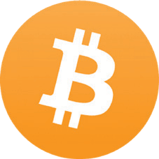

# Kuondoa Hofu, Uoga, Shaka Kuhusu Bitcoin
(Hofu, Uoga, Shaka)

* Hapa chini kuna hoja za kawaida dhidi ya, au hofu
kuhusu, bitcoin.
* Hizi hazina msingi wowote, zikichangiwa na ujinga, au labda uelewa usio kamili.
* Natoa pingamizi fupi kwa kila moja hapa, na mwishoni
utapata viashiria vya rasilimali za kina zaidi
zinazopinga FUD yote.

## BITCOIN INATUMIA NGUVU NYINGI SANA

>*Joto kutoka kwa kompyuta yako halipotei
ikiwa unahitaji kupasha joto nyumba yako… Ni
gharama sawa ikiwa unazalisha joto
na kompyuta yako.*

~ Satoshi Nakamoto 2010-08-09

>*Hapo awali, uzalishaji wa bidhaa kwa sababu tu
ni ghali unaonekana kuwa upotezaji mkubwa. Hata hivyo, bidhaa
ghali isiyoweza kughushiwa huongeza thamani mara kwa mara kwa kuwezesha
uhamishaji wa mali wenye manufaa. Gharama zaidi hurejeshwa
kila wakati muamala unawezekana au kufanywa
bei rahisi. Gharama, hapo awali ilikuwa upotezaji kamili,
inasambazwa juu ya miamala mingi.*

~ Nick Szabo

Cypherpunk

---

* **Nishati 'nyingi' ni pendekezo la thamani ambalo lazima
zingatia jinsi tunavyothamini kusudi la nishati
tumia.**

* **Mtu akizingatia kuwa taa za Krismasi ndani ya
Marekani hutumia umeme mwingi kama mtandao wote wa Bitcoin,** basi labda mtu anaweza kuona kwamba yote ni ya jamaa!

* Kutumia nishati, hata nishati nyingi sana, kulinda
pesa ngumu zaidi, zisizo na udhibiti
ambazo binadamu amewahi kuzijua, inafaa zaidi.

* Katika kulinganisha matumizi ya nishati ya bitcoin na ile inayotumiwa na
mfumo wa urithi, tunahitaji pia kuzingatia 'safu kamili' pande zote mbili:

| Mfumo Ikolojia wa Bitcoin | Mfumo wa Urithi wa Fiat      |
| -------------------- | --------------------------- |
| Wachimbaji wa ASIC    | BIS                         |
| Nodes                | Benki Kuu                   |
| Pochi za Vifaa    | Benki za Kitaifa/Kikanda    |
| Programu za Pochi   | Sekta ya Kijeshi ya Viwanda |
|                      | Vituo vya Data Hifadhi      |
|                      | Uchapishaji wa Kimwili wa Pesa |
|                      | Usambazaji wa Kimwili wa Pesa |
|                      | Programu za Kibenki Mtandaoni |
|                      | Mtandao wa ATM             |

* Kwa kutumia bitcoin, hatimaye tutapunguza nishati
matumizi katika maeneo mengi tofauti, haswa
kwa kutohitaji tena Sekta ya Kijeshi ya Viwanda
kulinda dola ya mafuta

---

* Pia, matumizi makubwa ambayo yanahitajika
kuweka mfumo unaotegemea deni ukiwa salama, utapunguzwa kadiri muda unavyokwenda
kuwa **pesa ngumu kawaida huchochea
matumizi ya busara na akiba** (kwa kuwa akiba yako
itaendelea kushikilia thamani yake, dhana ambayo hatuna
ilifanyika tangu kuwa nje ya kiwango cha dhahabu).
* **Mwisho, na muhimu, uchimbaji wa bitcoin tayari
inapunguza uchafuzi wa mazingira kwa kunasa gesi asilia inayowaka
na kuitumia kuendesha wachimbaji.** Kwa kuwa wachimbaji hutafuta
gharama za chini za umeme, pia kuna uwezekano wa kuwa kubwa zaidi
kiendeshaji kuelekea nishati mbadala ya gharama ya chini, kwani
motisha zinafanana.
* **Uchunguzi wa kina wenye ufahamu juu ya Bitcoin na Nishati** umeandikwa na Daniel Batten kwenye batcoinz.com, Troy
Cross, Jyn Urso, video 'Mashine Hii Huleta Uoto'
na Swan Bitcoin kwenye YouTube, 'Dirty Coin', A
makala ya uchimbaji madini ya bitcoin, na
kipindi bora cha kipindi cha 'Pesa ni Nini'
(WiM161) na B.Quittem, kati ya zingine nyingi.

---

## BITCOIN NI PONZI
* **Bitcoin sio Ponzi:**
 * Wawekezaji wa zamani hawalipwi pesa zozote na wapya
 wawekezaji.
 * Unaponunua bitcoin, hakuna anaye ahidi faida
 juu ya uwekezaji wako.
 * Hakuna uongozi au timu ya matangazo.
 * Hakukuwa na uchimbaji wa awali.
 * **Soma:** 'Kwa Nini Bitcoin Sio Ponzi' na Lyn Alden
kwa zaidi.

## BITCOIN NI NZITO SANA
* Ingawa msingi wa Bitcoin ni polepole, safu ya 2
na safu
**Mtandao wa Umeme uliojengwa juu ya safu ya msingi ni ...
haraka kama umeme!**
* Mtandao wa Bitcoin unaweza kuchakata takriban 7
miamala kwa sekunde (TPS).
* Mtandao wa Visa unadai kuwa inaweza kuchakata hadi 24,000
TPS, ingawa 4,000 TPS inakaribia matumizi halisi.
* **Mtandao wa Umeme, suluhisho la safu ya pili
iliyojengwa juu ya Bitcoin, ina uwezo wa
chakata mamilioni ya shughuli kwa sekunde!**

---

## SERIKALI ZINAWEZA KUPIGA MARUFUKU BITCOIN
* Serikali zingine zimejaribu, kama China, India na
Nigeria kwa mfano. Katika kila kisa, matumizi ya bitcoin
huongezeka haraka na watu wa nchi hiyo
* **Hakuna njia ya serikali 'kupiga marufuku' bitcoin kweli,** kwani kwa asili yake hairuhusiwi na haina udhibiti. Ni msimbo na msimbo ni usemi.
* Ambayo ilisema, serikali zinaweza kufanya iwe ngumu kununua
na uuze na, kwa fiat. Wanaweza pia kuitoza ushuru kama
bidhaa, kama wanafanya huko Amerika.
* **Hatimaye, haitakuwa katika faida yao kujaribu na kupiga marufuku
it, kwa kuwa bitcoin haiwezi kuepukika na wanaanza
kuona hivyo.** Wangekuwa werevu zaidi kuiongeza kwenye
karatasi ya usawa ya nchi yao kama kinga dhidi yao
fedha za fiat zinazo mfumuko wa bei.

>*Serikali zina uwezo wa kukata
vichwa vya mitandao inayodhibitiwa kati
kama Napster, lakini mitandao safi ya P2P
kama Gnutella na Tor zinaonekana kuwa
wanajisimamia wenyewe.*

~ Satoshi Nakamoto

* **Soma:**

Je, Serikali Inaweza Kusimamisha Bitcoin? na Alex Gladstein,
CSO wa Shirika la Haki za Binadamu

Je, Serikali Inaweza Kupiga Marufuku Bitcoin? Mambo Manne Unayohitaji
Kujua na Nick Giambruno

---

## BITCOIN NI TEKNOLOJIA YA ZAMANI
* **Zaidi kama 'teknolojia ya mwisho',** kuhusiana na dijitali
uhaba, ugatuaji na utatuzi wa shida ya matumizi mara mbili na Jenerali wa Byzantine
tatizo. Ikigunduliwa, haiwezi kugunduliwa tena.
* **Mara gurudumu lilipovumbuliwa, halingeweza kuwa
kuzuliwa tena.**
* Itifaki ya TCP/IP ambayo mtandao huendeshwa nayo imekuwa
kiwango cha mitandao yote ya kompyuta tangu
1983. Kuna uwezekano wa kuendelea kuwa kiwango cha a
muda mrefu.
* Mara moja suluhisho-bora, teknolojia ya msingi imegunduliwa ambayo inafanya kazi vyema, inaweza kudumu kwa mamia,
au maelfu ya miaka.

Credit: @DecouvreBitcoin

---

## BITCOIN INATUMIWA NA WATU WAOVU
* **Ndivyo pia dola, na kila sarafu nyingine ya fiat katika
ulimwengu.** Sahihi si sahihi kuhusisha hii
tatizo kwa bitcoin tu.
* **Bitcoin ni chombo, kama kisu, na ni juu ya kila mmoja
mmoja wetu jinsi tunavyoitumia.**
* Inashangaza, ikiwa bitcoin haikuweza kutumiwa na wahalifu,
basi isingekuwa ya upande wowote, isiyo na udhibiti
pesa ulimwengu unahitaji sana.
* **Kumbuka:** Kwa kuwa blockchain ya Bitcoin inasikilizika, ni
kweli chaguo mbaya sana kwa shughuli za uhalifu!

## HESABU YA QUANTUM INAWEZA KUVUNJA BITCOIN
* Ingawa hii inaweza kuwa uwezekano siku moja katika siku zijazo,
**watengenezaji tayari wanafanya kazi kwenye suluhisho la usimbaji fiche wa baada ya quantum**
* Bitcoin ni moja tu ya matumizi mengi ya mtandaoni ambayo hutegemea SHA-256 hashing kwa usalama.
Hata jeshi linaitumia, kwa hivyo kuna motisha kubwa zaidi ya jumuiya ya bitcoin kuendeleza mpya
itifaki za usimbaji fiche.
* Ikiwa SHA-256 itavunjwa, tutakuwa na mengine mengi ya
hangaika zaidi ya bitcoin. Mtandao wote hutumia
kwa usimbaji fiche. Hii ni pamoja na benki zote, usambazaji
minyororo, mifumo ya usafirishaji, mifumo ya afya,
mifumo ya elimu na zaidi.

---

## BITCOIN HAINA THAMANI HALISI
>*"Thamani ya Bitcoin inaendeshwa na uhaba wake unaoweza kutekelezwa"*

*~ Mali za Dijitali za Uaminifu*

* **Uhaba ndio thamani. Pesa zote kwa muda wote zimekuwa
iliyothaminiwa kwa sababu ilikuwa na kiwango fulani cha uhaba.**

* Kwa kuongezea, iliungwa mkono na imani kwamba inge
shikilia thamani yake, hivi kwamba inaweza kuuzwa katika
baadaye kwa kitu kingine cha thamani.
* Mtandao wa Bitcoin unapoendelea kukua, unaungwa mkono na bora
mali za kifedha inajumuisha, athari ya mtandao
inakua kwa kasi
* Athari kubwa ya mtandao, ndivyo thamani zaidi, kama
mali adimu, inatoa. Thamani ni onyesho la mahitaji,
na mahitaji yanapoongezeka, thamani huongezeka.

---

## WATU WENGINE WANA MENGI SANA
* Ni kweli kwamba watu wengine wana mengi zaidi kuliko wengine.
**Katika kutoa itifaki waziwazi, Satoshi aliiruhusu
itembee kwa uhuru, na wale walioelewa uwezo
iliyoshikilia ama ilichimbwa, au ikanunuliwa mapema. Ilikuwa
njia ya haki na ya kikaboni zaidi ya kuwasilisha
kwa ulimwengu.**
* Baada ya muda, ulimwengu ukiwa na hyperbitcoinized, kumaanisha tunaishi kwa kiwango cha bitcoin, wale ambao
kuwa na zaidi kawaida itaitumia ndani ya uchumi

* Ingawa katika hatua fulani mtu hatakuwa tena
kuweza kuinunua na fiat, watu watalipwa kwa zao
fanya kazi kwa bitcoin. Kulipwa kwa pesa nzuri kweli kutafanya
turuhusu kuwa na akiba halisi ambayo haitapunguzwa thamani
baada ya muda kwa mfumuko wa bei
* Wakati kutakuwa na wale walio na utajiri zaidi kila wakati
na wale walio na kidogo, kwa sababu ya idadi kubwa ya sababu,
**kiwango cha bitcoin kitafanya utando kati ya
tabaka za utajiri zinaweza kupitishwa**, kama Aleks Svetsi anasema. Hii
itaruhusu uhamaji wa juu na chini kuwa
mbali, maji zaidi kuliko ilivyo leo
* **Kuzaliwa ndani ya, na kuogelea maisha yetu yote
katika ulimwengu wa fiat, karibu haiwezekani kufikiria, na
elewa kikamilifu athari za kuwa na pesa ambayo
haiwezi kupunguzwa au kudanganywa!**

---
## BITCOIN INABADILIKA SANA
* **Hii ni kawaida wakati wa awamu ya ugunduzi wa bei ya
mali mpya ya fedha.** Hakuna njia nyingine ya
ukuaji utokee wakati ni wa kikaboni na unaojitokeza
(kinyume na juu chini na kudhibitiwa kati.
* Kwa kuongezea, katika hatua hii ya uwepo wa mwanadamu, na
mabadiliko ya kimaendeleo yanayotokea katika nyanja zote, inafanya
kuhisi kwamba kitu kama rEVOLutionary kama bitcoin kitakuwa
kuwa na swings pori.
* Wakati wale wetu walioko chini ya shimo la sungura wanaiona
kama siku zijazo, kwa sasa asilimia ndogo tu ya
idadi ya watu ulimwenguni wanamiliki bitcoin kwa wakati huu. Hii
inaifanya iwe rahisi kwa tete kubwa.
* Inapo komaa, na ongezeko la kupitishwa, tete itapungua, na hatimaye itatulia na
kuwa kitengo cha akaunti.

>*Nina hakika kwamba katika miaka 20 kutakuwa
ama ujazo mkubwa sana wa muamala
au hakuna sauti.*

~ Satoshi Nakamoto 2010-02-14

---

## HUWEZI KUGUSA BITCOIN

* **Hii ni kipengele, sio hitilafu.** Ukweli kwamba bitcoin
si ya kimwili ni mojawapo ya mambo makubwa zaidi yanayochangia kutoshikwa kwake!

## BITCOIN INAWEZA KUHACKIWA

* Katika miaka 15 tangu ilipozinduliwa, haijawahi
imeingiliwa.
* Kumekuwa na udukuzi katika ubadilishanaji hata hivyo, kwa hivyo mimi
pendekeza sana kuhamisha bitcoin yako kwa yako mwenyewe
mkoba wa kujitunza haraka iwezekanavyo.
* Imekadiriwa kuwa kuvunja SHA-256
encryption (ambayo bitcoin hutumia) ndani ya masaa 24, a
kompyuta ya quantum itahitaji 13,000,000 kimwili
qubits. Kwa wakati huu, rekodi ya sasa ya qubit iliyoshikiliwa
na Atom Computing huko California ni qubits 1,180.
* Inadhaniwa sana kuwa usimbaji fiche salama wa quantum
njia itatengenezwa kabla ya kuhitajika.

>*Kuwa chanzo huria kunamaanisha mtu yeyote anaweza
kagua nambari hiyo kwa kujitegemea. Ikiwa ilikuwa
chanzo kilichofungwa, hakuna mtu anayeweza kuthibitisha
usalama. Nadhani ni muhimu kwa a
programu ya asili hii kuwa chanzo huria.*

*~Satoshi Nakamoto 2009-12-10*

---

## ZAIDI JUU YA KUONDOA FUD HAPA:

* Endthefud.org
* Bitcoinmythbusters.org
* Casebitcoin.com - Ukosoaji wa Kawaida
* Safehodl.github.io/failure/
* Lopp.net - Maelezo ya Bitcoin: Dhana potofu

>*Bitcoin ni tofauti kabisa na nyingine yoyote ya kidijitali
mali. Hakuna mali nyingine ya kidijitali inayoweza kuboresha
bitcoin kama bidhaa ya fedha kwa sababu bitcoin ndiyo zaidi
(kuhusiana na mali zingine za dijitali) salama, zilizogatuliwa,
pesa nzuri za dijitali na "uboreshaji" wowote
bila shaka itakabiliwa na biashara.*

~ Ripoti ya Mali za Dijitali za Uaminifu, 'Bitcoin Kwanza', Jan 2022
Chris Kuiper, CFA, Mkurugenzi wa Utafiti
Jack Neureuter, Mchambuzi wa Utafiti

---

## KUHUSU BEI YA BITCOIN
* **Ninaona hodling (kushikilia) bitcoin kama kuwa na muda mrefu
akaunti ya akiba.**
* Bei ya kila siku haijalishi, kwani inatarajiwa kuwa
tete (kwenda juu na chini) kwa miaka kadhaa bado.
* Kama nilivyotaja hapo awali, hii ni kawaida kwa mpya
mali inayofanyiwa ugunduzi wa bei
* Ikiwa mtu anazunguka kwenye chati ya bei ya BTC/USD, wewe
utaona kwamba imeongezeka kwa +31,296% tangu 2009,
wastani hadi ~200% kwa mwaka.
* Mabadiliko ya bei yanaonyesha makala mbalimbali za habari, sasisho za udhibiti, mahitaji ya soko, hofu na msisimko.
Ni roller-coaster!
* **Kadiri unavyosubiri, ndivyo unavyojifunza na kuelewa misingi, na ndivyo unavyotambua
athari kubwa za kuwa na pesa nzuri,
ndivyo bei inavyopungua.**

>**Mwishowe, 'bei' haitajalisha kabisa, kwani bitcoin
itakuwa kitengo cha akaunti.**

* **Kanusho:**
* Weka tu kile 'unaweza kumudu kupoteza', tangu
kuna, bila shaka, hakuna dhamana.
* Fikiria bitcoin unayonunua kama muda mrefu
akaunti ya akiba, na panga kuiacha katika baridi
kuhifadhi kwa kiwango cha chini cha miaka mitano kabla
matumizi.

---

Chanzo asili cha bitcointalkforum.org kwa mojawapo ya
memes za kawaida za bitcoin wakati wote.

---

## KWA SASA, JUU YA USHURU
* **Kanusho:** Hii sio ushauri wa kifedha au ushuru

* Katika msimbo wa ushuru wa Marekani, bitcoin kwa sasa inaonekana kama bidhaa, kwa hivyo kuna athari zinazowezekana za ushuru ikiwa wewe
uza nyuma kwa fiat, au hata ukinunua kitu na
bitcoin yako
* Ikiwa bei ilishuka kabla ya kuiuza/kuitumia, wewe
unaweza kudai hasara
* Ikiwa bei ilipanda, unapaswa kudai a
faida ya mtaji, na ulipe kati ya 10-30% CGT (Ushuru wa Faida ya Mtaji)
* Kiasi kinategemea mambo kadhaa, kama vile
muda gani uliishikilia kabla ya kuuza au kutumia, na
ambayo bracket ya kodi unatua.
* Ikiwa unapanga kuuza au kutumia bitcoin, haswa kubwa
kiasi, unaweza kutaka kufikiria kushauriana na
mtaalamu wa ushuru.
* Ikiwa unanunua tu na kushikilia, kwa sasa huna
matukio yoyote ya ushuru kuhusu bitcoin.
* Na ukinunua non-KYC…

---
