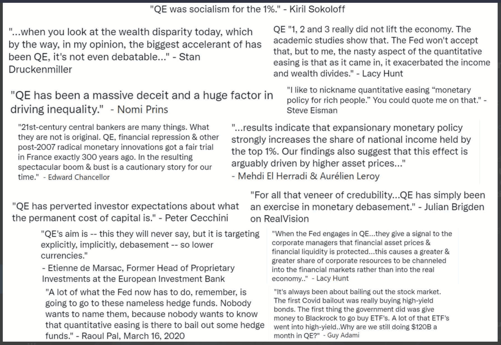

# நமக்கு ஏன் பிட்காயின் தேவை

## நமக்குத் தேவை, ஏனென்றால் பணம் உடைந்துவிட்டது

> *வழக்கமான நாணயத்தின் அடிப்படைப் பிரச்சனை என்னவென்றால், அதைச் செயல்படுத்துவதற்குத் தேவையான நம்பிக்கைதான்.
>மைய வங்கி நாணயத்தின் மதிப்பை குறைக்காது என்று நம்பப்பட வேண்டும்,
>ஆனால் ஃபியட் கரன்சிகளின் வரலாறு அந்த நம்பிக்கையின் மீறல்களால் நிறைந்துள்ளது.
>வங்கிகள் நமது பணத்தை வைத்திருப்பதற்கும், அதை மின்னணு முறையில் மாற்றுவதற்கும் நம்பப்பட வேண்டும்,
>ஆனால் அவை கடன் குமிழிகளின் அலைகளில் அதை வெளியே கடன் கொடுக்கின்றன,
>அரிதாகவே ஒரு பகுதியை இருப்பில் வைக்கின்றன.
>நமது தனிப்பட்ட உரிமையில் நாம் அவர்களை நம்ப வேண்டும்,
>அடையாள திருடர்கள் நமது கணக்குகளை காலி செய்யாமல் அவர்களை நம்ப வேண்டும்.*

~ சடோஷி நாகமோடோ 2009-02-11

* ஃபியட் பண அமைப்பு உடைந்துவிட்டது (எப்போதும் உடைந்துவிட்டது).
* இது நிலையானது அல்ல (எப்போதும் இல்லை).
* அதை சரிசெய்ய வழி இல்லை (எப்போதும் இருக்காது).

---
## (தங்க) தரநிலை இல்லை
* பணம் இன்னும் தங்கத்தால் ஆதரிக்கப்படுகிறது என்று பலர் நம்புகிறார்கள்.
* அது அப்படி இல்லை.
* ஜனாதிபதி நிக்சன் ஒருதலைப்பட்சமாக உலகத்தை தங்க தரத்திலிருந்து நீக்கிய 1971 முதல் இது தங்கத்தால் ஆதரிக்கப்படவில்லை (நிக்சன் அதிர்ச்சி).
* இது செய்த சேதத்தை தெளிவாகப் பெற **wtfhappenedin1971.com** ஐப் பார்க்கவும்.

1971 முதல் நுகர்வோர் விலை குறியீட்டு பணவீக்கத்தைக் (சிவப்பு கோடு) காட்டும் விளக்கப்படம் vs அமெரிக்க டாலரின் வாங்கும் சக்தி (கருப்பு கோடு).

<small>U.S. Bureau of Labor Statistics, retrieved from FRED, Federal Reserve Bank of St. Louis; https://
fred.stlouisfed.org/series/CPIAUCSL, June 9, 2024.</small>

* சுவாரஸ்யமான உண்மை: உலக பொருளாதார மன்றம் 1971 இல் உருவாக்கப்பட்டது.
---

>**ஃபியட்:** (பெயர்ச்சொல்) /ˈfiː.æt/
>
>: ஒரு அதிகாரப்பூர்வ அல்லது தன்னிச்சையான ஆணை : ஆணை
>
>: ஒரு அதிகாரப்பூர்வ முடிவு: கட்டளை
>
>**: மேலும் முயற்சி இல்லாமல் அல்லது செய்வது போல் எதையும் உருவாக்கும் விருப்பத்தின் கட்டளை அல்லது செயல்**

~ merriam-webster.com/dictionary

>**ஃபியட்:** லத்தீன் ஃபியரி «உருவாக்கப்பட வேண்டும், உருவாக வேண்டும்» என்பதிலிருந்து

* ஃபியட் என்பது அரசாங்கம் சொல்வதால் (கட்டளையிடுவதால்) மட்டுமே மதிப்புள்ள பணம்.
* எனவே மக்கள் (நம்ப வேண்டும்) என்று நம்புகிறார்கள்.
>* **ஃபியட்டுக்கு மதிப்பு இருப்பதாக அவர்கள் நம்பாவிட்டாலும், சட்டப்படி அவர்கள் அதை உபயோகிக்கவும், பொருட்கள் மற்றும் சேவைகளுக்கான கட்டணமாக ஏற்றுக்கொள்ளவும் கட்டாயப்படுத்தப்படுகிறார்கள்.**
* **ஃபியட் பணம் காற்றில் இருந்து அச்சிடப்படுகிறது/உருவாக்கப்படுகிறது.**
* இந்த நாட்களில் அனைத்து டாலர்களில் சுமார் 5% ரொக்கமாக அச்சிடப்படுகிறது.
* மற்ற 95% வங்கிகள் கடன் வழங்கும் போது கணினியில் எண்களை உள்ளிடுவதன் மூலம் டிஜிட்டல் முறையில் உருவாக்கப்படுகின்றன

>*100 டாலர் நோட்டை உருவாக்க அமெரிக்க செதுக்கல் மற்றும் அச்சிடுதல் பணியகத்திற்கு சில சென்ட்களே செலவாகும்...*

~ அமெரிக்க பொருளாதார நிபுணர், பேரி ஐச்செங்கிரீன்

---

>***NBC ’60 Minutes’ ஸ்காட் பெல்லி:*** *நீங்கள் வெறுமனே பணத்துடன் அமைப்பை வெள்ளத்தில் மூழ்கடித்தீர்கள் என்று சொல்வது நியாயமா?*
>
>***ஃபெட் சேர் ஜெரோம் போவல்:*** *ஆம். நாங்கள் செய்தோம்.
>அதைப் பற்றி யோசிக்க இது மற்றொரு வழி. நாங்கள் செய்தோம்.*
>
>***பெல்லி:*** *அது எங்கிருந்து வருகிறது?
>நீங்கள் அதை அச்சிடுகிறீர்களா?*
>
>***போவல்:*** *நாங்கள் அதை டிஜிட்டல் முறையில் அச்சிடுகிறோம். எனவே ஒரு மைய வங்கி என்ற முறையில், எங்களுக்கு டிஜிட்டல் முறையில் பணத்தை உருவாக்கும் திறன் உள்ளது. மற்ற அரசு உத்தரவாத பத்திரங்களுக்கு கருவூல மசோதாக்கள் அல்லது பத்திரங்களை வாங்குவதன் மூலம் நாங்கள் அதைச் செய்கிறோம். அது உண்மையில் பண விநியோகத்தை அதிகரிக்கிறது. நாங்கள் உண்மையான நாணயத்தையும் அச்சிட்டு, அதை மத்திய ரிசர்வ் வங்கிகள் மூலம் விநியோகிக்கிறோம்.*

~ CNBC ’60 Minutes’ நேர்காணல், மே 17, 2020
C*vid-19 ஊரடங்கு தொடங்கிய இரண்டு மாதங்களுக்குப் பிறகு

>எங்களிடம் உள்ள இந்த கடன் வழங்கும் திட்டங்களில் நாங்கள் செய்யக்கூடியவற்றுக்கு உண்மையில் வரம்பு இல்லை.

~ ஃபெட் சேர் ஜெரோம் போவல்
மார்ச் 18, 2020 அன்று CBS செய்தி

>ஆம், ஃபெடரல் ரிசர்வ் வங்கியில் வரம்பற்ற பணம் உள்ளது. வங்கி அமைப்பில் போதுமான பணம் இருப்பதை உறுதிப்படுத்த நாங்கள் என்ன செய்ய வேண்டுமோ அதைச் செய்வோம்.

~ நீல் கஷ்கரி, மினியாபோலிஸ் ஃபெட்டின் தலைவர்
மார்ச் 23, 2020, CBS '60 Minutes'

>இங்கே 'நாங்கள்' என்பது ஃபெடரல் ரிசர்வ் அமைப்பிற்குள் FOMC கூட்டங்களின் போது பணவியல் கொள்கையில் மாற்றங்களை வாக்களிக்கும் ஐந்து பேர். 330,000,000 இல் 5. அமெரிக்க பணவியல் கொள்கையை மாற்ற அவ்வளவுதான் தேவை.

~ @MartyBent, TFTC.io நிறுவனர்
ஃபோர்ப்ஸ் கட்டுரை, மார்ச் 18, 2020

---

## பழைய குதிரையின் வாயிலிருந்து

>*வங்கி ஒன்றுமில்லாதவற்றிலிருந்து உருவாக்கும் அனைத்து பணத்திற்கும் வட்டி பயன் உண்டு.*

*~ வில்லியம் பேட்டர்சன், 1694
இங்கிலாந்து வங்கியின் நிறுவனர்*

>*அமெரிக்காவில் உள்ள அனைத்து குழப்பங்களும், குழப்பங்களும், துன்பங்களும், அரசியலமைப்பின் குறைபாடுகளிலிருந்தோ அல்லது கூட்டமைப்பிலிருந்தோ அல்ல, கௌரவம் அல்லது நற்குணமின்மையிலிருந்தோ அல்ல, நாணயம், கடன் மற்றும் சுழற்சியின் தன்மை பற்றிய நேரடியான அறியாமையிலிருந்தே எழுகிறது.*

*~ ஜான் ஆடம்ஸ்
அமெரிக்காவின் 2வது ஜனாதிபதி, 1797-1801*

>*நிற்கும் படைகளை விட வங்கி நிறுவனங்கள் நமது சுதந்திரங்களுக்கு மிகவும் ஆபத்தானவை என்று நான் நம்புகிறேன். ஏற்கனவே அவர்கள் ஒரு பண பிரபுத்துவத்தை எழுப்பியுள்ளனர், அது அரசாங்கத்தை மீறிவிட்டது. வழங்கும் அதிகாரம் வங்கிகளிடமிருந்து எடுக்கப்பட்டு, அது முறையாகச் சொந்தமான மக்களுக்கு மீட்டெடுக்கப்பட வேண்டும்.*

*~ தாமஸ் ஜெபர்சன்
அமெரிக்காவின் 3வது ஜனாதிபதி, 1801-1809*

>*எங்கள் உன்னத செயல்களைப் பற்றி பெருமை பேசும்போது, ஒரு அநீதியான பண அமைப்பின் மூலம் நாம் ஒரு ஒடுக்குமுறை அமைப்பை தேசியமயமாக்கியுள்ளோம் என்ற அசிங்கமான உண்மையை மறைக்க கவனமாக இருந்தோம், அது இன்னும் சுத்திகரிக்கப்பட்டாலும், பழைய அடிமை முறை முறையை விட குறைவான கொடூரமானது அல்ல.*

~ஹொரேஸ் கிரீலி
அமெரிக்க காங்கிரஸ்காரர் 1848-49
தி நியூயார்க் ட்ரிப்யூனின் நிறுவனர்

---

>*எந்த நாட்டில் பணத்தின் அளவைக் கட்டுப்படுத்துபவர், அனைத்து தொழில் மற்றும் வணிகத்தின் முழுமையான மாஸ்டர்... முழு அமைப்பும் ஒன்று அல்லது வேறு வழியில், சில சக்திவாய்ந்த மனிதர்களால் மிக எளிதாகக் கட்டுப்படுத்தப்படுகிறது என்பதை நீங்கள் உணரும்போது, பணவீக்கம் மற்றும் மனச்சோர்வு காலங்கள் எவ்வாறு உருவாகின்றன என்று உங்களுக்குச் சொல்ல வேண்டியதில்லை*

~ ஜேம்ஸ் ஏ. Garfield
அமெரிக்காவின் 20வது ஜனாதிபதி, மார்ச்-செப்.1881
1881 இல் படுகொலை செய்யப்பட்டார்

>*ஒரு குழுவின் கைகளில் கட்டுக்கடங்காமல் இன்று உள்ளது
ஒன்றுமில்லாத டாலர்களை உருவாக்கும் சக்தி.*

~ தாமஸ் டபிள்யூ. லாசன், ஆசிரியர் 'ஃபிரென்ஸிட் ஃபைனான்ஸ்', 1905

>*நான் எந்த சதிகாரனையும் போல் ரகசியமானவன் - உண்மையில், ரகசியமானவன்.
கண்டுபிடிப்பு, எங்களுக்குத் தெரியும், நடக்கவே கூடாது, இல்லையெனில் எங்கள் நேரமும் முயற்சியும் வீணாகிவிடும். எங்கள் குறிப்பிட்ட குழு ஒன்று சேர்ந்து ஒரு வங்கி மசோதாவை எழுதியது அம்பலப்படுத்தப்பட்டால்,
காங்கிரஸ் அதை நிறைவேற்ற எந்த வாய்ப்பும் இல்லை.*

~ ஃபிராங்க் ஏ. வாண்டர்லிப்
நியூயார்க் தேசிய நகர வங்கியின் தலைவர்
(சிட்டி வங்கியின் முன்னோடி)
~ 1910 இல் ஜெகில் தீவில் நடந்த இரகசிய கூட்டத்தைப் பற்றி 1935 இல் எழுதுதல், 1913 இல் ஃபெடரல் ரிசர்வ் சட்டமாக நிறைவேற்றப்பட்ட மசோதாவை வரைவு செய்ய.

>*இந்த (ஃபெடரல் ரிசர்வ்) சட்டம் பூமியில் மிகப்பெரிய நம்பிக்கையை நிறுவுகிறது. ஜனாதிபதி (வுட்ரோ வில்சன்) மசோதாவில் கையெழுத்திடும்போது, பண அதிகாரத்தின் கண்ணுக்கு தெரியாத அரசாங்கம் சட்டப்பூர்வமாக்கப்படும்... இந்த வங்கி மற்றும் நாணய மசோதா மூலம் யுகங்களின் மோசமான சட்டமன்றக் குற்றம் செய்யப்படுகிறது.*

~ சார்லஸ் ஏ. லிண்ட்பர்க், சீர்.
அமெரிக்க காங்கிரஸ்காரர் 1907-1917

---

>*நான் மிகவும் மகிழ்ச்சியற்ற மனிதன். அறியாமல் என் நாட்டை அழித்துவிட்டேன். ஒரு பெரிய தொழில் நாடு அதன் கடன் அமைப்பால் கட்டுப்படுத்தப்படுகிறது. எங்கள் கடன் அமைப்பு குவிந்துள்ளது. தேசத்தின் வளர்ச்சியும், எனவே, எங்கள் அனைத்து நடவடிக்கைகளும் சில மனிதர்களின் கைகளில் உள்ளன. நாகரிக உலகில் மோசமாக ஆளப்பட்டவர்களில் ஒருவராகவும், மிகவும் முழுமையாகக் கட்டுப்படுத்தப்பட்ட மற்றும் ஆதிக்கம் செலுத்தும் அரசாங்கங்களில் ஒன்றாகவும் நாங்கள் வந்துள்ளோம். இனி இலவச கருத்தின் மூலம் அரசாங்கம் இல்லை, இனி பெரும்பான்மையினரின் நம்பிக்கை மற்றும் வாக்களிப்பதன் மூலம் அரசாங்கம் இல்லை, ஆனால் ஒரு சிறிய ஆதிக்கம் செலுத்தும் ஆண்களின் கருத்து மற்றும் வற்புறுத்தலால் ஒரு அரசாங்கம்.*

~ வுட்ரோ வில்சன்
அமெரிக்காவின் 28வது ஜனாதிபதி, 1913-1921
1913 இன் ஃபெடரல் ரிசர்வ் சட்டத்தை நிறைவேற்றிய 6 ஆண்டுகளுக்குப் பிறகு.

>*விஷயத்தின் உண்மையான உண்மை என்னவென்றால், உங்களுக்கும் எனக்கும் தெரியும், பெரிய மையங்களில் ஒரு நிதி உறுப்பு அமெரிக்காவின் அரசாங்கத்தை ஆண்ட்ரூ ஜாக்சன் காலத்திலிருந்து சொந்தமாக வைத்துள்ளது.*

~ ஃபிராங்க்ளின் டி. ரூஸ்வெல்ட்
நவம்பர் 21, 1933 அன்று கர்னல் ஈ. மண்டெல் ஹவுஸுக்கு எழுதிய கடிதத்தில் அமெரிக்காவின் 32வது ஜனாதிபதி

>*அது [மனச்சோர்வு] தற்செயலானது அல்ல.
அது கவனமாக வடிவமைக்கப்பட்ட நிகழ்வு....
சர்வதேச வங்கியாளர்கள் இங்கு ஒரு அவநம்பிக்கையான நிலையை ஏற்படுத்த முயன்றனர், அதனால் அவர்கள் நம் அனைவரையும் ஆட்சியாளர்களாக வெளிப்படுத்தலாம்.*

~ காங்கிரஸ்காரர் லூயிஸ் டி. மெக்ஃபேடன்,
1936 இல் படுகொலை செய்யப்பட்டார்

>வீட்டு வங்கி மற்றும் நாணயக் குழுவின் தலைவர்
*ஒவ்வொரு முறையும் ஒரு வங்கி கடன் கொடுக்கும்போது, புதிய வங்கி கடன் உருவாக்கப்படுகிறது - புதிய வைப்புத்தொகைகள் - புத்தம் புதிய பணம்.*

~ கிரஹாம் எஃப்.டவர்ஸ்
கனடாவின் மத்திய வங்கியின் ஆளுநர், 1934-55

---

>*நமது பண அமைப்பில் கடன்கள் இல்லையென்றால், பணம் இருக்காது*

*~ மரினர் எக்கிள்ஸ்,
1941, ஃபெட்டின் ஆளுநர்*

>*காரணம் மற்றும் தர்க்கத்தின் மூலம், மத்திய அரசாங்கம் அதன் சொந்த பணத்தைப் பயன்படுத்துவதை நியாயப்படுத்தக்கூடிய யாரையும் நான் இன்னும் சந்திக்கவில்லை... மக்கள் இதை மாற்ற வேண்டும் என்று கோரும் நேரம் வரும் என்று நான் நம்புகிறேன். அத்தகைய முட்டாள் தனமான அமைப்பு தொடர அனுமதித்ததற்காக காங்கிரசுடன் தொடர்புடைய உங்களையும் என்னையும் மற்றும் அனைவரையும் அவர்கள் உண்மையில் குற்றம் சாட்டும் நேரம் இந்த நாட்டில் வரும் என்று நான் நம்புகிறேன்.*

~ ரைட் பேட்மேன்
அமெரிக்க காங்கிரஸ்காரர் 1928-1976
தலைவர், வங்கி மற்றும் நாணயக் குழு 1963-1975

>*நீங்களும் நானும் ஒரு காசோலையை எழுதினால், காசோலையை ஈடுசெய்ய நமது கணக்கில் போதுமான நிதி இருக்க வேண்டும், ஆனால் ஃபெடரல் ரிசர்வ் ஒரு காசோலையை எழுதும்போது, அந்த காசோலை எடுக்கப்படும் வங்கி வைப்பு இல்லை. ஃபெடரல் ரிசர்வ் ஒரு காசோலையை எழுதும்போது, அது பணத்தை உருவாக்குகிறது*

~ பாஸ்டனின் ஃபெடரல் ரிசர்வ் வங்கி
'Putting It Simply', 1984

---

## ஃபெடரல் ரிசர்வ்

* ஃபெட் என்பது அமெரிக்காவின் 'சுதந்திரமான' மத்திய வங்கி. இது 1913 இல் ஃபெடரல் ரிசர்வ் சட்டம் நிறைவேற்றப்பட்டதன் மூலம் உருவாக்கப்பட்டது.
* இது ஒரு தனித்துவமான அமைப்பு, பகுதி தனியார் மற்றும் பகுதி அரசு.
* இது அரசாங்கத்திற்குள் அரசியல் ரீதியாக சுயாதீனமான, கட்சி சார்பற்ற நிறுவனமாக இருக்க வேண்டும்.
* ஃபெட் கவர்னர்கள் குழு ஜனாதிபதியால் நியமிக்கப்பட்டு காங்கிரஸால் உறுதி செய்யப்பட்டாலும், **ஃபெட்டின் முடிவுகள் யாராலும் அங்கீகரிக்கப்பட வேண்டியதில்லை.**

**இதில் உள்ளது:**

* ஃபெடரல் ரிசர்வ் ஆளுநர்கள் குழு
* 12 ஃபெடரல் ரிசர்வ் வங்கிகள்
* ஃபெடரல் ஓபன் மார்க்கெட் கமிட்டி (FOMC), இது பணவியல் கொள்கை உருவாக்கும் அமைப்பு ஆகும்.

**ஃபெட்டின் பொறுப்பு:**

* அமெரிக்க பணவியல் கொள்கையை மேற்பார்வையிடுதல், வேலைவாய்ப்பு மற்றும் நிலையான விலைகளை மேம்படுத்துதல்.
* வங்கி மற்றும் நிதி நிறுவனங்களை ஒழுங்குபடுத்துதல் மற்றும் மேற்பார்வையிடுதல்.
* நிதி நிறுவனங்களுக்கு கட்டண சேவைகளை வழங்குதல்.
* நுகர்வோர் பாதுகாப்பு மற்றும் சமூக வளர்ச்சியை மேம்படுத்துதல்.

---

## FED சேர் மீது ஒரு குறிப்பு

* **ஃபெடரல் ரிசர்வ் தலைவர் இதற்கும் தலைவராக இருக்கிறார்:**

* அமெரிக்காவின் திசையை தீர்மானிக்கும் ஃபெடரல் ஓபன் மார்க்கெட் கமிட்டியின் (FOMC) தலைவர்
பணவியல் கொள்கை (உதாரணமாக: QE, வட்டி விகித உயர்வு)
* சர்வதேச நாணய நிதியம், IMF இன் உறுப்பினர்
* சர்வதேச தீர்வுக்கான வங்கியின் உறுப்பினர், BIS (மத்திய வங்கிகளின் வங்கி).
* G-7 இன் அமெரிக்க நிதி அமைச்சர்
* G-20 இன் அமெரிக்க நிதி அமைச்சர்

* ஒரு நபருக்கு **முழு** அதிகாரம்.

---

## பகுதி இருப்பு வங்கி, வட்டி மற்றும் கடன்கள்

* **பகுதி இருப்பு வங்கி:** மார்ச் 2020 வரை, வங்கிகள் 10% இருப்பு வைத்திருக்க வேண்டும், மேலும் 90% கடனாக வழங்க முடியும்.
* **மார்ச் 2020 முதல், இருப்பு எதுவும் தேவையில்லை, வங்கிகள் வரம்பற்ற கடன்களை வழங்க அனுமதிக்கிறது.**

* ஒரு கடன் என்பது கடன் அடிப்படையிலான பணம், மேலும் நீங்கள் கடனுக்கு வட்டி செலுத்த வேண்டும்.

>* **வேடிக்கையான உண்மை 1:** கடனுக்கான வட்டியை செலுத்த பணம் வங்கிகளால் உருவாக்கப்படவில்லை.
>* **வேடிக்கையான உண்மை 2:** அது ஒருபோதும் உருவாக்கப்படவில்லை.
>* **வேடிக்கையான உண்மை 3:** அனைத்து கடன்களையும் + அந்த கடன்களுக்கான வட்டியையும் திருப்பிச் செலுத்த உலகில் போதுமான பணம் இல்லை.
>* **வேடிக்கையான உண்மை 4:** அது ஒருபோதும் இருக்காது!

---

## பெட்ரோ டாலர் பற்றிய ஒரு குறிப்பு
* **1971 வரை டாலர் தங்கத்தால் ஆதரிக்கப்பட்டது என்றும், 1974 முதல் அது எண்ணெயால் ஆதரிக்கப்படுகிறது என்றும் சொல்லலாம், எனவே இயல்பாக, அமெரிக்க இராணுவத்தால் ஆதரிக்கப்படுகிறது.**
* **1974 இல் அமெரிக்காவும் சவுதி அரேபியாவும் எண்ணெயை அமெரிக்க டாலர்களில் விலை நிர்ணயம் செய்ய இருதரப்பு ஒப்பந்தங்களில் நுழைந்தன.**
* அப்போதிருந்து, பெரும்பாலான உலகளாவிய எண்ணெய் விற்பனை அமெரிக்க டாலர்களில் தீர்க்கப்பட்டுள்ளது.
* இது டாலர் உலகின் வலுவான நாணயமாக மாறுவதற்கு பெரிதும் பங்களித்துள்ளது.
* **சாதாரணமாக அது கஷ்டப்பட்ட காலங்களிலும் கூட, அது செயற்கையாக ஆதரிக்கப்பட்டுள்ளது.**
* 2022 இன் பிற்பகுதியிலிருந்து, பல நாடுகள் அமெரிக்க டாலரைத் தவிர மற்ற நாணயங்களில் வர்த்தகம் செய்யத் தொடங்கியுள்ளன
* இது பெட்ரோ டாலரின் முடிவின் தொடக்கமாக இருக்கலாம். அடுத்து என்ன நடக்கிறது என்பதைப் பார்க்க வேண்டும்...

---

## QE (அளவு எளிதாக்குதல்) பற்றி
* **அளவு எளிதாக்குதல் என்பது மத்திய வங்கிகளால் 'பொருளாதாரத்தைத் தூண்டுவதற்கு' பயன்படுத்தப்படும் 'ச மரபுவழி பணவியல் கொள்கையாகக் கருதப்படுகிறது, இதன் மூலம் ஃபெட் அரசாங்கப் பத்திரங்கள் மற்றும் பிற அரசுப் பத்திரங்களை வாங்குகிறது.**
* இது முதன்முதலில் 2001-2006 க்கு இடையில் ஜப்பானால் பயன்படுத்தப்பட்டது. அதைத் தொடர்ந்து, அமெரிக்கா, இங்கிலாந்து மற்றும் யூரோ மண்டலம் 2008 நிதி நெருக்கடியின் போது QE ஐப் பயன்படுத்தின
* அப்போதிருந்து, அமெரிக்காவில் QE நிரல் இல்லாத ஒரே நேரம் 2014-2019 க்கு இடையில் இருந்தது.
* கீழே காணப்படுவது போல், விமர்சகர்கள் **QE ஏற்கனவே பணக்காரர்களுக்கு மட்டுமே அதிக அளவில் பயனளிக்கிறது** என்று வாதிடுகின்றனர்

*உதவி: ட்விட்டரில் @RudyHavenstein*

---

## சுழற்சிகள்

* **இயற்கை அனைத்திலும், சுழற்சிகள், இயற்கையான ஏற்ற இறக்கங்கள், விரிவாக்கங்கள் மற்றும் சுருக்கங்கள் உள்ளன.**

* இது ஒட்டுமொத்தமாக, காலப்போக்கில், முழு ஒன்றோடொன்று இணைக்கப்பட்ட அமைப்பின் சமநிலை மற்றும் நிலையான தன்மைக்கு பங்களிக்கிறது, பூமியில் உள்ள அனைத்து உயிர்களுக்கும்.
* **கடன் அடிப்படையிலான, ஃபியட் நாணய அமைப்பு இயற்கை சுழற்சிகளின் ஞானத்தை புறக்கணிக்கிறது,** அதற்கு பதிலாக, கடன்களை தொடர்ந்து செலுத்துவதற்காக, இணையற்ற மற்றும் தணிப்பில்லாத வளர்ச்சியின் மீது அடிப்படையாகக் கொண்டது மற்றும் அதன் உயிர்வாழ்விற்கு 100% சார்ந்துள்ளது.
* இயற்கையில், இது புற்றுநோய்.
* 'பொருளாதாரத்தில்', இந்த இயற்கைக்கு மாறான பாதை அரசாங்கம் தோல்வியுற்ற வங்கிகள் மற்றும் பெரிய நிறுவனங்களுக்கு உதவிக் கொண்டிருக்கிறது, அவற்றைக் கைவிட்டு, புதியதாகவும், ஆரோக்கியமாகவும் ஏதாவது ஒன்றை மறுசுழற்சி செய்வதற்கு பதிலாக.
* **தோல்வியுற்ற நிறுவனங்களுக்கு உதவி செய்வதன் குறுகிய பார்வை முழு பொருளாதாரத்தையும் ஆபத்தில் ஆழ்த்துகிறது.** சாராம்சத்தில், அது பாதையின் கீழ் கேனை உதைக்கிறது, மேலும் தவிர்க்க முடியாத கொந்தளிப்பு, இயற்கையான சுழற்சிகள் விளையாட அனுமதிக்கப்பட்டிருந்தால் இருப்பதை விட மிக மிக தீவிரமாக இருக்கும்.
* **சடோஷி நாகமோடோவுக்கும், அவருக்குப் பின்னரும் வந்த சைபர்பங்க்குகளுக்கும் நாம் கடன்பட்டுள்ளோம்,** புதிய கரைகளுக்கு நம்மைக் கொண்டு செல்ல ஒரு லைஃப் படகை வழங்கக்கூடிய பார்வை, தொலைநோக்கு, உறுதிப்பாடு மற்றும் திறன் ஆகியவற்றைக் கொண்டிருப்பதற்காக.

---

* இது ஒரு பரிசு என்பதை நாம் உணர்ந்தவுடன், முழு மனதுடனும், தெளிவான மனதுடனும் பயணத்தை மேற்கொண்டு, சமாதானத்தின் பணத்துடன் ஒரு புதிய உலகத்தை உருவாக்க நாம் கப்பலில் ஏற வேண்டும்.
>* **பிட்காயின் பணத்தை சரிசெய்கிறது, மற்றவற்றை சரிசெய்வது நம் கையில் உள்ளது. மேலும், பணம் சரி செய்யப்பட்டிருப்பதன் மூலம், பல விஷயங்கள் இயல்பாகவே சரி செய்யப்படும்**

* முக்கியமானது என்னவென்றால், பெரிய அளவிலான, அரசாங்கத்தால் தொடங்கப்பட்ட, இயக்கப் போர் இனி லாபகரமாகவோ அல்லது மக்களின் ஆதரவு இல்லாமல் சாத்தியமில்லாமலோ போகும்.
* கூடுதலாக, இயற்கையாகவே நுகர்வு குறைவாக இருக்கும், அதே போல் உண்மையான மதிப்பு பொருட்கள் மற்றும் சேவைகள், இலவச சந்தைகள், உண்மையான சேமிப்பு மற்றும் வீட்டுவசதி மற்றும் ரியல் எஸ்டேட் பணமதிப்பிழப்பு ஆகியவற்றிற்கு மாறுதல் இருக்கும், அவை முதலில் பணமாக்கப்படக்கூடாது.
* **பார்க்கவும்:** பிட்காயின் இதை சரிசெய்கிறது, பக்கம் 32
---

## நமக்குத் தேவை, ஏனென்றால் பணவீக்கம் திருட்டு

1913 இல் ஃபெடரல் ரிசர்வ் உருவாக்கப்பட்டதிலிருந்து டாலரின் வாங்கும் சக்தி குறைந்து வருவதைக் காட்டும் 2024 FRED விளக்கப்படம். 1913 முதல் பணவீக்கத்தின் திரட்டப்பட்ட விகிதம் சுமார் 3.067% ஆகும். உலகெங்கிலும் உள்ள அனைத்து மத்திய வங்கி ஃபியட் நாணயங்களும் இதே போன்ற வீழ்ச்சி விகிதத்தைப் பின்பற்றுகின்றன.

* **காற்றில் இருந்து எவ்வளவு அதிகமாக பணம் உருவாக்கப்படுகிறதோ, அவ்வளவு அதிகமாக அனைத்து பணமும் மதிப்பு/வாங்கும் சக்தியை இழக்கிறது.**
* இது **பணவீக்கம்** என்று அழைக்கப்படுகிறது.
* பணவீக்கம் **நேர திருட்டு,** உண்மையில். உங்கள் நேரத்தின் மதிப்பு பணவீக்கம், மதிப்பிழப்பு மற்றும் கையாளப்பட்ட நாணயத்தில் சேமிக்கப்படும்போது திருடப்படுகிறது.
* பணவீக்கம் ஒரு **மறைக்கப்பட்ட வரி** ஆகும்.

---

* இந்த நேர திருட்டு மற்றும் வரி மற்ற அனைத்து நாடுகளின் ஃபியட் நாணயங்களையும் பாதித்துள்ளது, ஏனெனில் அவை அனைத்தும் 1944 இல் பிரெட்டன் வுட்ஸ் ஒப்பந்தத்தின்படி அமெரிக்க டாலருடன் இணைக்கப்பட்டுள்ளன, ஏனெனில் இது உலக இருப்பு நாணயமாகும்.
* **அமெரிக்காவில், 2% ஆண்டு பணவீக்க விகிதம் ஃபெடரல் ரிசர்வ் கட்டளையில் எழுதப்பட்டுள்ளது.**
* இதன் பொருள் ஒவ்வொரு ஆண்டும் அதே $20 நோட்டு மூலம் **நீங்கள் 2% குறைவாக வாங்க முடியும் என்பதற்கு உத்தரவாதம் அளிக்கப்படுகிறது.**
* **மார்ச் 2024 இல், ஆண்டு பணவீக்க விகிதம் 3.5% ஆக இருந்தது,** (2% ஐ விட அதிகமாக, அதாவது மார்ச் 2023 க்கும் மார்ச் 2024 க்கும் இடையில் உங்கள் வாங்கும் சக்தியில் 3.5% இழந்துவிட்டீர்கள்.
* வேறுவிதமாகக் கூறினால், இதன் பொருள் சராசரியாக, பொருட்களின் விலை 3.5% அதிகரித்துள்ளது
* **1980 களின் முற்பகுதி வரை பணவீக்கம் துல்லியமாக அளவிடப்பட்டிருந்தால், அது உண்மையில் 2024 இல் 10% க்கு அருகில் இருக்கும்.**
* வகையின் அடிப்படையில் பார்க்கும்போது, கடந்த ஆண்டில் பல வகைகளில் பணவீக்கம் 3.5% ஐ விட மிக மோசமாக உள்ளது என்பதைக் காணலாம்.
* ஒருவரின் வாடகை, மளிகைக் கடை ரசீதுகள், எரிவாயு விலைகள், ஒருவர் வாங்கும் கிட்டத்தட்ட எல்லாவற்றையும் பார்க்கும்போது, ஒவ்வொரு துறையிலும் பணவீக்கம் கொந்தளிப்பாக உள்ளது என்பது மிகவும் தெளிவாகிறது.

---
**கடந்த 50 ஆண்டுகளில் அமெரிக்காவில் சராசரி பணவீக்கம்:**

|  சராசரி விலை   |   1971  |   2021  |   % அதிகரிப்பு  |
| --- | --- | --- | --- |
|  சம்பளம்   |    $9,400 |    $59,400 |    532% |
|  வீடு  |    $23,400 |    $513,000 |    2,092% |
|    ஒரு கேலன் எரிவாயு | $0.36    |   $4.17 |  1,058%   |
|    புதிய கார் |  $3,400   |   $47,000  |    1,282% |
|   கல்லூரி பட்டம்   |  $1,400   |   $26,000  |  1,757%   |
|   கூடை மளிகைப் பொருட்கள்  |$20     |  $210  |    950% |
|  மின்சாரம்/kWh   |  $0.02    |   $0.15  |   650%  |

>**உண்மைக் கதை:**
~ ஒரு வீடு 1976 இல் $58,000 க்கு வாங்கப்பட்டது.
~ 'அதிகாரப்பூர்வ' பணவீக்கத்தை கணக்கிடும்போது, இது 2022 டாலர்களில் $279,000 ஆக இருக்கும்.
~ 2022 இல் அதே வீட்டின் மதிப்பு $2.09 மில்லியன்.
~ அதைப் பற்றி யோசித்துப் பாருங்கள்...

>*ஃபியட் நாணயம் தவறான தகவல்.
10 டாலர் நோட்டு என்ன தகவலைத் தருகிறது?
10 என்பது ஒரு பின்னம், தொகுதி எண்,
பகுதி எண் காணவில்லை.
எதில் 10?
தெரிந்த மற்றும் நிலையான
பகுதி எண் இல்லாமல் 10 எதுவும் சொல்லவில்லை.*

~ @bitlany

---

* **பணவீக்கம் அதிகரிக்கும் போது, உங்கள் சேமிப்பு (உங்களுக்கு சேமிப்பு இருந்தால்), மதிப்பைக் குறைக்கிறது.**
* காலப்போக்கில், அவை **அதிக** மதிப்பை இழக்கின்றன
>*இன்று நீங்கள் $100/மாதம் சேமிக்கத் தொடங்கினால், கிடைக்கும் சிறந்த வட்டி விகிதமான 0.05% உடன்:
> * n 30 ஆண்டுகளில் நீங்கள் **$84,019** சேமித்திருப்பீர்கள்.
>* FED இன் கட்டாய 2% பணவீக்கத்திற்கு சரிசெய்யப்பட்டால்
>* 30 ஆண்டுகளில் உங்கள் சேமிப்பு வெறும் **$46,384** வாங்கும் சக்தியைக் கொண்டிருக்கும்.
>* இன்றைய பணவீக்கமான 3.5%க்கு சரிசெய்தால்:
>* உங்கள் $84,019 மதிப்புள்ள சேமிப்பு 30 ஆண்டுகளில் வெறும் **$11,037** வாங்கும் சக்தியைக் கொண்டிருக்கும்!

* **இதன் விளைவாக உங்கள் வேலையில் சுமார் ஆறு அல்லது ஏழு மணி நேரம் திருடப்பட்டுள்ளது = *நேர திருட்டு.***

---
**இதைப் பார்க்க மற்றொரு வழி பின்வருமாறு:**
* **1971** இல், ஒரு வீட்டின் விலை = ஒரு சராசரி ஆண்டு சம்பளத்தை விட **2.5** மடங்கு அதிகம்.
* **2024** இல், ஒரு வீட்டின் விலை = ஒரு சராசரி ஆண்டு சம்பளத்தை விட **8.6** மடங்கு அதிகம்.
* **1971** இல், ஒரு புதிய காரின் விலை சராசரி சம்பளத்தில் **1/3** ஆக இருந்தது
* **2024** இல், ஒரு புதிய காரின் விலை சராசரி சம்பளத்தில் **3/4** க்கும் அதிகமாகும்.

பணவீக்கம்
உங்களுக்குச் சாதகமாக
வேலை செய்யவில்லை என்பது இப்போது தெளிவாக இருக்கும் என்று நான் நம்புகிறேன்.

**குறிப்பு:** இந்த எண்கள் அனைத்தும் சராசரிகள் மற்றும் பல காரணிகளின் அடிப்படையில் மாறக்கூடியவை. விஷயம் அப்படியே உள்ளது, பணவீக்கம் ஒரு மறைக்கப்பட்ட வரி மற்றும் நமது உண்மையான உழைப்பு மற்றும் உற்பத்தியின் மீது நேர திருட்டு

>* **கடினமான பணம் இதை சரிசெய்கிறது.**
>* **பிட்காயின் என்பது கடினமான பணம்**
---

## மையமாக கட்டுப்படுத்தப்படும், கையாளப்படும், கடன் அடிப்படையிலான பொருளாதாரத்தை நாம் மாற்ற வேண்டும்

>*பணத்தை அரசாங்கத்தின் கைகளில் இருந்து எடுக்கும் வரை மீண்டும் ஒரு நல்ல பணம் இருக்காது என்று நான் நம்பவில்லை, அதாவது, நாம் அரசாங்கத்தின் கைகளில் இருந்து வன்முறையாக எடுக்க முடியாது, அவர்கள் நிறுத்த முடியாத ஒன்றை அறிமுகப்படுத்துவதுதான் நாம் செய்யக்கூடியது.*

~ ஃபிரெட்ரிக் ஹயக், 1984
ஆஸ்திரிய பொருளாதார நிபுணர், தத்துவஞானி மற்றும் எழுத்தாளர், 1899-1992

மார்ச் 2020 இல் $4 டிரில்லியனிலிருந்து ஜூன் 2024 இல் $18 டிரில்லியனுக்கும் அதிகமான அதிவேக M1 பண விநியோக அதிகரிப்பைக் காட்டும் வரைபடம்.

* **இங்கே உங்கள் மனதை அசைக்கவும்:** https://usdebtclock.org/
---
* **இருப்பதில் உள்ள அனைத்து அமெரிக்க டாலர்களில் 45% ஏப்ரல் 2020-ஜனவரி 2022 க்கு இடையில் அச்சிடப்பட்டது!**
* காற்றில் இருந்து அச்சிடப்பட்டது, நினைவிருக்கிறதா?
* ஃபியட் பணம் அரசால் மையமாக கட்டுப்படுத்தப்படுகிறது, மேலும் வழங்கல் எளிதில் கையாளப்படுகிறது.
* **அமெரிக்க தேசிய கடன் $1 டிரில்லியனை எட்ட 205 ஆண்டுகள் ஆனது. (1776 > 1981)**
* அமெரிக்க தேசிய கடன் **$34 டிரில்லியனை எட்ட இன்னும் 33 ஆண்டுகள்** மட்டுமே ஆனது! (1981 > 2024)

அமெரிக்காவில் மொத்த பொது கடன் 1970-2024 ஐக் காட்டும் FRED வரைபடம்.

>*சர்வதேச நிதி நிறுவனத்தால் அளவிடப்பட்ட உலகளாவிய கடன் இப்போது $303 டிரில்லியன் ஆகும். இது கடன் அடிப்படையிலான ஃபியட்டில் இருக்கும் நமது கிரகம். மூலம், உலகளாவிய GDP வெறும் $84 டிரில்லியன் மட்டுமே.*

*~ நிக் பாட்டியா, 'லேயர்ட் மணி' ஆசிரியர், 2021*

---

* **குறிப்புக்காக**

| **உங்களிடம் இருந்தால்:** | **நீங்கள் $1/நொடி செலவிடலாம்** |                |
| ------------ | ----------------------- | -------------- |
| **$1 மில்லியன்**   | அல்லது 11 நாட்கள்              | = 11 நாட்கள்    |
| **$1 பில்லியன்**   | 11,680 நாட்களுக்கு         | = 32 ஆண்டுகள்   |
| **$1 டிரில்லியன்**  | 11,680,000 நாட்களுக்கு     | = 32000 ஆண்டுகள் |

* அதிகத்தை அச்சிடுவது எப்போது, என்ன வட்டி விகிதத்தை வசூலிப்பது என்பதை தீர்மானிக்கும் அதிகாரம் உள்ளவர்களின் கருணையில் நாம் அனைவரும் இருக்கிறோம்.
* **ஃபெட் வட்டி விகிதத்தை உயர்த்தினால், வீடு அல்லது காருக்கான கடன் திடீரென அதிக விலை உயர்ந்ததாக மாறும், இது செலவினங்களைக் குறைத்து, தேக்க நிலைக்கு வழிவகுக்கும்**

* **அவர்கள் விகிதத்தை செயற்கையாகக் குறைவாக வைத்திருந்தால், நாம் மனச்சோர்வுக் காலத்திற்குள் நுழைகிறோம்**

>* **மத்திய வங்கி நிதி 'வானிலை' ஐ உருவாக்க அனுமதிப்பது, எது மதிப்புள்ளது, எது இல்லை என்பதை சந்தை தீர்மானிக்கும் சுதந்திரத்தை நம்மிடமிருந்து எடுத்துக்கொள்கிறது.**

* கூடுதலாக, **அவர்கள் வங்கிகளையும் கார்ப்பரேஷன்களையும் காப்பாற்றும்போது, அவர்கள் செயற்கையாக பொருளாதாரத்தை ஆதரிக்கிறார்கள்.** சீட்டுக் கட்டு வீடு விழுவதற்கு சிறிது காலமே ஆகும்.
* மத்திய வங்கி வைத்திருப்பதற்கான அசல் வாதம், பொருளாதாரம் தடுமாறும் போது கடன் வழங்குபவர் கடைசியாக தேவைப்பட வேண்டும் என்பதே.

---
* **இது மத்திய வங்கியாக முதல் ரிசார்ட்டின் ஆட்சியாளராக மாறியுள்ளது, இணையற்ற, தேர்ந்தெடுக்கப்படாத, இறுதியில் சர்வாதிகார அதிகாரத்துடன்.**

> *பிட்காயினைத் தவிர அனைத்து பணமும் அரசியல்மயமானது.
ஃபியட் நாணயங்கள், வங்கி கருவிகள், ஃபின்டெக் வரவுகள்,
மற்ற கிரிப்டோகரன்சிகள் மற்றும் தங்கம் கூட அரசாங்கங்கள்,
நிறுவனங்கள் அல்லது சிறிய குழுக்களால் கட்டுப்படுத்தப்படுகின்றன.
எதிர்காலத்திற்குச் செல்லும்போது விதிவிலக்கு இருப்பது மிகவும் பயனுள்ளதாக இருக்கும்.*

*~ அலெக்ஸ் கிளாட்ஸ்டீன் @gladstein
மனித உரிமைகள் அறக்கட்டளையின் தலைமை வியூக அதிகாரி*

>*பிட்காயின் 8 பில்லியன் மக்களை ஒன்றிணைக்கிறது, நூறு மில்லியன் நிறுவனங்களை ஒன்றிணைக்கிறது, அரசியல் அதிகார வரம்புகளில் உலகை ஒத்திசைக்கிறது, மேலும் இது முழு நிதி அமைப்புக்கும் பகுத்தறிவை மீட்டெடுக்கிறது, மேலும் இது முழு மனித இனத்திற்கும் சுதந்திரத்தையும் சொத்து உரிமைகளையும் மீட்டெடுக்கிறது*

*~ மைக்கேல் சேலர்
CEO மைக்ரோஸ்ட்ராடஜி*

---

## வங்கிக் கணக்கு இல்லாதவர்களுக்கு வங்கிச் சேவை தேவை

>*பலவீனமான நாணயங்களைக் கொண்ட 20 நாடுகளில் 953 மில்லியன் மக்களுக்கு, பிட்காயின் கருவூல சொத்தை விட பெரியது. அவர்களுக்கு, அது வெள்ளத்திலிருந்து தப்பிக்க மறைகுறியாக்கப்பட்ட ஆற்றலின் பேழை போன்றது.*

*~ மைக்கேல் சேலர்
மைக்ரோஸ்ட்ராடஜியின் CEO*

* **2024 ஆம் ஆண்டு நிலவரப்படி, உலகில் சுமார் 25% பெரியவர்கள் வங்கிக் கணக்கு இல்லாமல் இருக்கிறார்கள், சுமார் 1.4 பில்லியன் மக்கள்!**

>* **இதன் பொருள் அவர்களுக்கு வங்கிச் சேவைகள் எதுவும் கிடைக்கவில்லை
>மேலும் ATM, டெபிட் கார்டு, கிரெடிட் கார்டு அல்லது
>காசோலைகளைப் பயன்படுத்த முடியாது.**
>* **கூடுதலாக, ஒரு தொழிலைத் தொடங்கவோ, கார் அல்லது வீடு வாங்கவோ அவர்களுக்குக் கடன்கள் கிடைக்காது.**

* **பணம் அனுப்புவதும் பெறுவதும் அல்லது காசோலைகளை மாற்றுவதும் விலை உயர்ந்தது.**

* அவர்கள் வெஸ்டர்ன் யூனியன் போன்ற பணம் பரிமாற்றம் மற்றும் காசோலை மாற்றுதல் சேவைகளைப் பயன்படுத்த வேண்டும், அவை அதிக கட்டணம் வசூலிக்கின்றன மற்றும் செயலாக்க நேரம் எடுக்கும்.

* மற்ற நாடுகளில் உள்ள தங்கள் குடும்பங்களுக்குப் பணம் அனுப்பும் மக்களுக்கு (பரிமாற்றங்கள்) இது குறிப்பாக விலை உயர்ந்தது, இது வங்கியில் 10% அல்லது 12% வரை செலவாகும்

---
* பணம் அனுப்பும் இடத்திலிருந்து **தொலைவில் வசிக்கும் பணம் அனுப்புபவர்கள் பணம் பெறுவது விலை உயர்ந்ததும் நேரத்தை எடுத்துக்கொள்வதும் ஆகும்,** ஏனெனில் அவர்கள் போக்குவரத்து கட்டணம் செலுத்த வேண்டும் மற்றும் பணம் பரிமாற்ற அலுவலகத்திற்குச் செல்ல வேண்டும், பெரும்பாலும் அவர்கள் வசிக்கும் இடத்திலிருந்து வெகு தொலைவில், அவர்களின் குடும்ப உறுப்பினர் அனுப்பிய பணத்தைப் பெற.

* இந்த அலுவலகங்களுக்குச் செல்வது அவர்களுக்குப் பாதுகாப்பாக இல்லை.
* மின்னல் நெட்வொர்க் மூலம் பிட்காயின் இந்த சிக்கல்களுக்கு உடனடி தீர்வை இப்போது வழங்குகிறது!

***#பிட்காயின் இதை சரிசெய்கிறது***
>*மக்களுக்கு அதிகாரம் அளிக்கும் ஒரு தொழில்நுட்பம்
எப்போதாவது நிறுத்தப்பட்டதா?*

*~ ஜெஃப் பூத்
ஆசிரியர்: நாளையின் விலை*

---

## கொடுங்கோன்மை மற்றும் நாணய வீழ்ச்சியிலிருந்து தப்பிக்க மக்களுக்கு உதவ வேண்டும்

* கடந்த சில ஆண்டுகளாக நாம் பார்த்தபடி, அரசாங்கங்கள் தங்களுக்கு உடன்பாடில்லாதவர்களின் வங்கிக் கணக்குகளை முடக்க முடியும்.

>* **இதன் மூலம், வங்கியில் உங்கள் பணம் ஒரு ஐஓயூவை விட வேறில்லை, அதை எப்போது வேண்டுமானாலும் உங்களிடமிருந்து திருட முடியும் என்பதைக் காட்டுகிறது.**

* கூடுதலாக, வெனிசுலா (283%), சூடான் (63%), லெபனான் (212%), சிரியா (79%), அர்ஜென்டினா (161%), ஜிம்பாப்வே (47%), துருக்கி (64%) மற்றும் பல நாடுகளில் 2024 இல் நாம் தற்போது பார்க்கிற பணவீக்கம் கொந்தளிப்பாக இருக்கும்போது, மக்களின் வாழ்க்கைச் சேமிப்பு சில சமயங்களில் ஒரே இரவில் ஆவியாகிவிடும், அதைச் செய்ய எதுவும் இல்லை.
* மேலே உள்ள எதையும் அனுபவிக்கும் மக்களுக்கு, **பிட்காயின் ஒரு உண்மையான, உடனடி தீர்வாகிறது, இல்லையெனில் தாங்க முடியாத பிரச்சனை.**
* **பல இடங்களில் கொடுங்கோன்மை மற்றும் பணவீக்கம் அதிகரித்து வருவதைக் கருத்தில் கொண்டு, இப்போது பிட்காயினைப் பெறுவதன் மூலம் அதற்கு எதிராக ஹெட்ஜ் செய்வது புத்திசாலித்தனமாக இருக்கும்.**
---
## CBDC களைத் தவிர்க்க வேண்டும்
* **மத்திய வங்கிகள் CBDC களை உருவாக்கத் தொடங்குகின்றன, மத்திய வங்கி டிஜிட்டல் நாணயங்கள்** என்று நீங்கள் கேள்விப்பட்டிருக்கலாம்.
மே 2020 இல், 35 நாடுகள் இந்த விருப்பத்தை ஆராய்ந்து கொண்டிருந்தன.
* மார்ச் 2022 இல், 87 நாடுகள் தீவிரமாகப் பார்க்கின்றன அல்லது ஏற்கனவே ஒரு பைலட் CBDC ஐத் தொடங்கின
* ஜூன் 2024 இல் இந்த எழுத்தின்படி, உலகளாவிய GDP இன் 98% ஐ பிரதிநிதித்துவப்படுத்தும் 134 நாடுகள் ஆராய்ச்சி, மேம்பாடு, பைலட் அல்லது வெளியீட்டு கட்டத்தில் உள்ளன.
www.atlanticcouncil.org/cbdctracker/

>**CBDC கள் உங்கள் ஆன்லைன் வங்கி கணக்கில் நீங்கள் பார்க்கும் எலக்ட்ரானிக் பணத்தைப் போலவே இருக்கும், அவை இயல்பாகவே டிஜிட்டல் ஆக இருப்பதால், அவை நிரல்படுத்தக்கூடியவை மற்றும் 100% கட்டுப்படுத்த