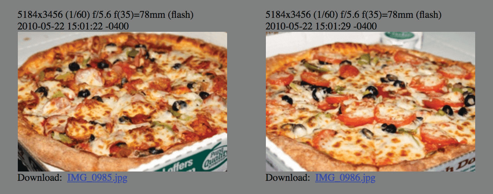

# சடோஷியின் எண்கள் 369 கடிகாரம்

**பிட்காயின் ஒரு மணி நேரத்திற்கு 6 தொகுதிகளை வெட்டி எடுக்கும் வகையில் வடிவமைக்கப்பட்டுள்ளது >> ஒரு தொகுதி ஒவ்வொரு ~10 நிமிடங்களுக்கும் சராசரியாக.**

* ஒரு நாளில் 24 மணி நேரம்

2+4=**6**

* இது ஒரு நாளைக்கு 144 தொகுதிகளாகும்

1+4+4=**9**

* வருடத்திற்கு 52560 தொகுதிகள்

5+2+5+6+0=18

1+8=**9**

* லீப் வருடத்திற்கு 52704 தொகுதிகள்

5+2+7+0+4=18

1+8=**9**

* 21 மில்லியன் நாணயங்கள்:

2 + 1 + 0 + 0 + 0 + 0 + 0 + 0 = **3**

* 33 சரிபாதியாகுதல்:

3 + 3 =**6**

* ஒவ்வொரு 2016 தொகுதிகளுக்கும் சிரமம் சரிசெய்கிறது:

2 + 0 + 1 + 6 = **9**

~ @level39 இன் ட்வீட்டின் அடிப்படையில்

* தொகுதி வெகுமதி சரிபாதியாகுதல் ஒவ்வொன்றும் நடக்கும்
210,000வது தொகுதி (தோராயமாக ஒவ்வொரு நான்கு வருடங்களுக்கு)
2 + 1 + 0 + 0 + 0 + 0 = **3**

---

>*“3, 6 மற்றும் 9 இன் மகத்துவத்தை நீங்கள் அறிந்திருந்தால், உங்களிடம்
பிரபஞ்சத்திற்கான திறவுகோல் இருக்கும்.”
~ நிகோலா டெஸ்லா*

## தொகுதி வெகுமதி = வழங்கலின் %

* தொகுதி மானியம் (சமீபத்தில் வெட்டி எடுக்கப்பட்ட ஒவ்வொரு தொகுதிக்கும் வெகுமதியாகக் வழங்கப்படும் பிட்காயின்களின் எண்ணிக்கை) பிரதிபலிக்கிறது **மொத்த வழங்கலின் சதவீதம்** அந்த சகாப்தத்தில் வெட்டி எடுக்கப்படும்

* உதாரணமாக, தற்போதைய தொகுதி வெகுமதி
2024-2028 க்கு இடையில் **3.125** பிட்காயின்.

* இதே நான்கு வருடங்களில், 21 மில்லியன் பிட்காயின்களில் **3.125**% வெட்டி எடுக்கப்படும்.

உதவி: @bitcoinfool

---

## வெகுமதி சகாப்தங்கள்

* ஒவ்வொரு நான்கு வருடங்களுக்கும், ஒவ்வொருக்கும் பிட்காயின் மானியம் சரிபாதியாகக் குறையும். **ஒரு வெகுமதி சகாப்தம் என்பது அந்த நான்கு வருட காலமாகும்.**

* **வெகுமதி சகாப்தம் 1:** 2009-2012 **தொகுதி மானியம்:** 50 பிட்காயின்
= (50 பிட்காயின்கள் * 210,000 தொகுதிகள்) = 10,500,000 பிட்காயின்

1+0+5+0+0+0+0+0 = **6**

* **வெகுமதி சகாப்தம் 2:** 2012-2016 **தொகுதி மானியம்:** 25 பிட்காயின்
= (25 * 210,000) = 5,250,000 பிட்காயின்

5+2+5+0+0+0+0 = 12

1+2 = **3**

* **வெகுமதி சகாப்தம் 3:** 2016-2020 **தொகுதி மானியம்:** 12.5 பிட்காயின்
= (12.5 * 210,000) = 2,625,000 பிட்காயின்

2+6+2+5+0+0+0 = 15

1+5 = **6**

* **வெகுமதி சகாப்தம் 4:** 2020-2024 **தொகுதி மானியம்:** 6.25 பிட்காயின்
= (6.25 * 210,000) = 1,312,500 பிட்காயின்

1+3+1+2+5+0+0 = 12

1+2 = **3**

* **வெகுமதி சகாப்தம் 5:** 2024-2028 **தொகுதி மானியம்:** 3.125 பிட்காயின்
= (3.125 * 210,000) = 656,250 பிட்காயின்

6+5+6+2+5+0 = 24

2+4 = **6**

* **வெகுமதி சகாப்தம் 7: 2032-2036 தொகுதி மானியம்:** 0.78125 btc
= (0.78125*210,000) = 164,062.5 பிட்காயின்

1+6+4+0+6+2+5 = 24

2+4 = **6**

**... மேலும் 2140 வரை**

---

## சடோஷியின் பிறந்த நாள்

* ***ஏப்ரல் 5, 1975*** என்பது சடோஷி தனது பிறந்த நாளாகக் கூறிய தேதி.
* இது உண்மையிலேயே அவரது உண்மையான பிறந்த தேதியா என்று நம்மால் தெரிந்து கொள்ள முடியாவிட்டாலும், இது மிகவும் சுவாரஸ்யமானது.
* ***ஏப்ரல் 5ஆம் தேதி*** (1933) அமெரிக்க அதிபர் பிராங்க்ளின் டி. ரூஸ்வெல்ட் நிர்வாக ஆணை 6102 இல் கையெழுத்திட்ட நாள்.
“தங்க நாணயம், தங்கக் கட்டி மற்றும் தங்கச் சான்றிதழ்களைக் கண்டம் முழுவதும் பதுக்குவதைத் தடை செய்தது.”
* ***1975*** என்பது EO 6102 ரத்து செய்யப்பட்ட ஆண்டு மற்றும் அமெரிக்க குடிமக்கள் மீண்டும் 5oz க்கும் அதிகமான தங்கத்தை வைத்திருக்க அனுமதிக்கப்பட்டனர்.

## ஒரு எண் பல்லுறுப்பு 6102-2016

* ***6102*** என்பது மேலே குறிப்பிட்ட நிர்வாக ஆணையின் எண்ணிக்கை.
* ***2016*** என்பது ஒவ்வொரு சிரமம் சரிசெய்தலின்போதும் வெட்டி எடுக்கப்பட்ட தொகுதிகளின் எண்ணிக்கை (தோராயமாக 2 வாரங்கள்).

>* மேலே உள்ள இரண்டு எடுத்துக்காட்டுகளிலும், ஒருவர் அனுமானிக்கலாம்
அரசாங்கத்தின் அத்துமீறலால் ஏற்பட்ட சேதத்தை மாற்றியமைக்க சடோஷி எண்களைப் பயன்படுத்தினார்.

---

## பிட்காயின் பீட்சா தினம்

* மே 22 பிட்காயின் பீட்சா தினமாக அறியப்படுகிறது. அன்றுதான் லாஸ்லோ ஹானியெக்ஸ் என்ற நபர் பிட்காயின்டாக்கால்ஃபாரம்.org இல் தான் 10,000 பிட்காயினை பீட்சாவிற்கு வெற்றிகரமாக வர்த்தகம் செய்ததாக அறிவித்தார்! அப்போதைய விலை $40 ஆக இருந்தது.
* இன்றைய விலையில், இது ~$610,000,000 ஆக இருக்கும்.
* இது பிட்காயினுக்கு ஒரு மைல்கல்லாக இருந்தது, ஏனெனில் இது ஒரு நல்ல பொருள் அல்லது சேவைக்காக யாராவது பிட்காயினை வர்த்தகம் செய்த முதல் தெரிந்த சம்பவம் இதுவாகும். நாம் எவ்வளவு தூரம் வந்துவிட்டோம்!

---

## முக்கிய நாட்களின் பிட்காயின் நாட்காட்டி

**2008-08-18** ~ **பிட்காயின்.org டொமைன் பெயர் பதிவு செய்யப்பட்டது.**

**2008-10-31** ~ **பிட்காயின் வெள்ளை அறிக்கை தினம்:** "பிட்காயின்: பியர்-டு-பியர் எலக்ட்ரானிக் பண அமைப்பு" என்ற தலைப்பிலான வெள்ளை அறிக்கை, சதொஷி நகமோட்டோ என்ற அனாமதேய கிரிப்டோகிராஃபரால் மெட்ஸ்டோவ்ட்.காமில், கிரிப்டோகிராபி அஞ்சல் பட்டியலில் வெளியிடப்பட்டது.

**2009-01-03** ~ **பிட்காயினின் பிறந்த நாள்:** சடோஷி ஜெனிசிஸ் தொகுதியை வெட்டியெடுத்தபோது பிட்காயின் நெட்வொர்க் தொடங்கப்பட்டது.

**2009-01-12** ~ **முதல் பிட்காயின் பரிவர்த்தனை** நடந்தது, ஹால் ஃபின்னி சடோஷியிடமிருந்து சோதனை அனுப்பிய பத்து பிட்காயின்களைப் பெற்றார்.

**2009-10-05** ~ **முதல் பிட்காயின் பரிமாற்றத்தின் பிறப்பு,** ஒரு நாணயத்திற்கு $0.00764 என்ற பட்டியலிடப்பட்ட சந்தை விலையுடன் தி நியூ லிபர்ட்டி ஸ்டாண்டர்ட் (NLS).

**2009-10-12** ~ "எனது மின்னஞ்சல் காப்புப்பிரதிகளில் இருந்து **USD பரிவர்த்தனைக்கு முதல் தெரிந்த பிட்காயினைக் கண்டேன்**. 2009-10-12 அன்று 5,050 BTC ஐ $5.02 க்கு விற்றேன்." - பிட்காயின்டாக்கால்ஃபாரம் நிறுவனர் மார்ட்டி மால்மி, முதல் பரிமாற்றத்தைத் தொடங்கிய NewLibertyStandard க்கு பிட்காயினை விற்றார்.

**2010-05-22** ~ **பிட்காயின் பீட்சா தினம்:** ஒரு நல்ல பொருள் அல்லது சேவையை வாங்க பிட்காயின் பயன்படுத்தப்பட்ட முதல் தெரிந்த நிகழ்வு, லாஸ்லோ ஹானியெக்ஸ் இரண்டு பாப்பா ஜான்ஸ் பீட்சாக்களுக்கு 10,000 பிட்காயின் செலுத்தினார்!

**2010-12-12** ~ பிட்காயின்டாக்கால்ஃபாரம் மன்றத்தில் சடோஷி இட்ட **கடைசி நேரம்**.

**2011-02-11** ~ **பிட்காயின் அமெரிக்க டாலருக்கு நிகராக** முதன்முறையாக அடைகிறது.

**2011-06-14** ~ **விக்கி லீக்ஸ்** பிட்காயினில் நன்கொடைகளை ஏற்கத் தொடங்குகிறது.

**2017-03-03** ~ **பிட்காயின் ஒரு அவுன்ஸ் தங்கத்துடன் சமநிலையை** அடைகிறது.

**2021-08-21** ~ Knut Svanholm இன் மீம் மூலம் பரிந்துரைக்கப்பட்ட **முதல் ஆண்டு பிட்காயின் முடிவிலி தினம்**:
எல்லாம் 21 மில்லியனால் வகுக்கப்பட்டது.

**2021-09-07** ~ எல் சால்வடார் பிட்காயினை சட்டப்பூர்வ டெண்டராக்கிய முதல் நாடு ஆனது.

---