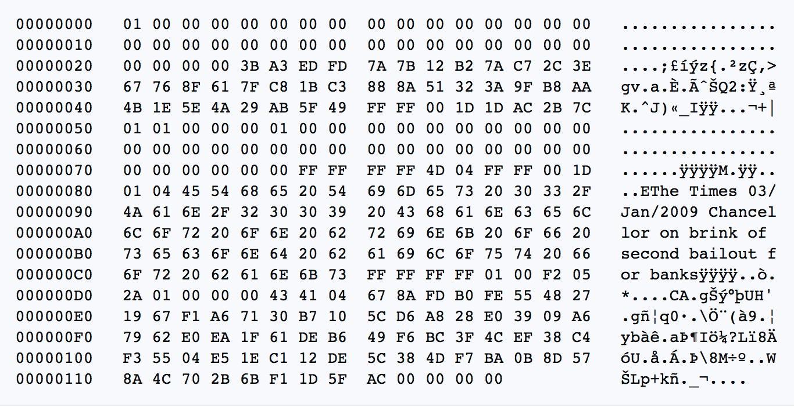

# பிட்காயின் வெள்ளை அறிக்கை
metzdowd.com இல் உலகிற்கு வழங்கப்பட்டது
2008-10-31

**சதோஷி நகமோட்டோவால்**

ஒரு புனைபெயருள்ள சைஃபர்பங்க், அவர் கடைசியாக
பிட்காயின்டாக்.org மன்றத்தில் உள்ள சைஃபர்பங்க் சமூகத்துடன்
2010-12-10 அன்று தொடர்பு கொண்டார்.

அவர் வெளியேறியதன் மூலம், பிட்காயினை ஒரு உண்மையான காட்டுச் சோதனையாக இருக்க அனுமதித்தார். இதில் பணிபுரியும் ஒவ்வொருவரும் ஒரு வகையில் தன்னார்வலர்கள் <-> மனிதகுலத்தை கையாளப்பட்ட, கடன் அடிப்படையிலான பண முறையின் விலங்குகளிலிருந்து விடுவிக்கும் திறனால் ஈர்க்கப்பட்டு, அதற்கு பதிலாக, ஒரு உலகளாவிய, நம்பிக்கையற்ற, அனுமதியற்ற, தணிக்கை-எதிர்ப்பு, உண்மையாக பற்றாக்குறையான, சக-சக, பரவலாக்கப்பட்ட பணம் மற்றும் பண செலுத்தும் நெட்வொர்க்கில் பங்கேற்கிறார்கள், அது ஃபியாட் சாம்பலில் இருந்து எழும் ஒரு வெளிவரும் ஒழுங்கை ஊக்குவிக்கிறது

**நாங்கள் அனைவரும் சதோஷி**
>*தி டைம்ஸ் 03/ஜனவரி/2009 அதிபர் விளிம்பில்
வங்கிகளுக்கான இரண்டாவது பிணை எடுப்பு*

~ லண்டன் டைம்ஸின் ஒரு தலைப்புச் செய்தி,
சதோஷி நகமோட்டோவால் 2009-01-03 அன்று பிட்காயின் ஜெனசிஸ் தொகுதியில் பொறிக்கப்பட்டது

---

---

---

---

---

---

---

---

---

---

## பிட்காயின் ஜெனசிஸ் தொகுதி ~ மூல ஹெக்ஸ் பதிப்பு 2009-01-03

மேலும்,

ஒரு புதிய சகாப்தம்,

கட்டவிழ்த்து விடப்பட்டது

---
