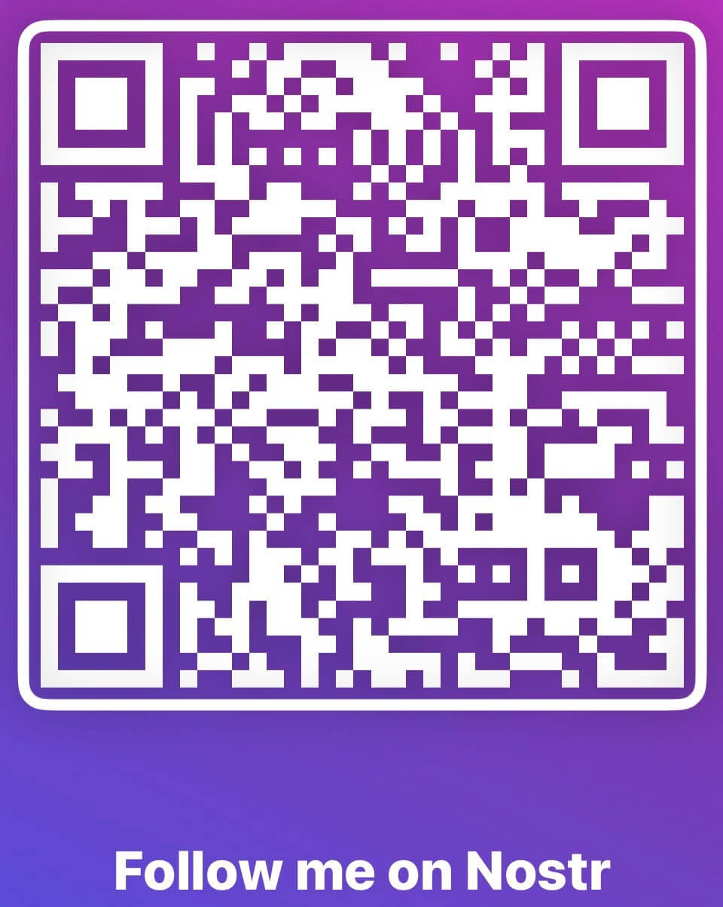

# NOSTR

## NOSTR & ரிலேக்களால் அனுப்பப்படும் மற்ற விஷயங்கள்

>*ஒருவர் அதற்கு எதிராகச் சட்டங்களை இயற்றலாம், ஆனால் பேச்சு சுதந்திரம், தனியுரிமையை விட அதிகமாக, ஒரு திறந்த சமூகத்திற்கு அடிப்படையானது; எந்தவொரு பேச்சையும் கட்டுப்படுத்த நாங்கள் முயலவில்லை.*

~ எரிக் ஹியூஸ், சைபர்பங்க் அறிக்கை, 1993

## NOSTR என்றால் என்ன

>*TL;DR: nostr என்பது ட்விட்டர், டெலிகிராம் மற்றும் பிற விஷயங்களை மாற்றியமைக்கும் ஆற்றலைக் கொண்ட ஒரு நெறிமுறை.*

~ @dergigi

>*பரிவர்த்தனையின் சுதந்திரத்திற்கு பிட்காயின் எப்படியோ, அதுபோல் தொடர்புகொள்ளும் சுதந்திரத்திற்கு nostr.*

~ கீசா @SimplestBitcoinBook

* **Nostr என்பது தணிக்கை-எதிர்ப்பு, உலகளாவிய, இயங்கக்கூடிய நெட்வொர்க்குகளுக்கான எளிய, பரவலாக்கப்பட்ட நெறிமுறை ஆகும்.**
* Nostr ஒரு நம்பகமான மைய சேவையகத்தை நம்பியிருக்கவில்லை.
* இது பிட்காயின், HTTP அல்லது TCP-IP போன்ற இலவச மற்றும் திறந்த மூல (FOSS) மென்பொருள் நெறிமுறையாகும், இது யார் வேண்டுமானாலும் nostr இல் கட்டமைக்க அனுமதிக்கிறது.
* **இணைய இணைப்பு உள்ள எவருடனும், எங்கு வேண்டுமானாலும் தொடர்புகொள்வதற்கான எங்கள் சுதந்திரத்தை இது எவ்வாறு தக்க வைத்துக் கொள்கிறது** .

>*(இது) தன்னிறைவான அடையாள அடுக்கைக் கொண்ட ஒரு தகவல்தொடர்பு நெறிமுறை... மேலும் nostr அதை விட அதிகம்.*

~ @dergigi

---

## NOSTR நமக்கு ஏன் தேவை

தற்போதைய தகவல் தொடர்பு அமைப்புகள் மற்றும் சமூக ஊடக தளங்கள் மையப்படுத்தப்பட்டவை என்பதால் நமக்கு nostr தேவை.

**இது சிக்கலானது, ஏனெனில் இந்த அமைப்புகள்:**

* உங்கள் பேச்சை தணிக்கை செய்யும் அதிகாரம் உள்ளது.
* அரசால் ஒழுங்குமுறை தாக்குதல்களுக்கு ஆளாகின்றன.
* உங்கள் கணக்கை இடைநிறுத்த அல்லது நீக்க தேர்ந்தெடுக்கலாம் அல்லது கூறப்படலாம்.
* ஹேக் செய்யப்படலாம், இதனால் உங்கள் தரவை சமரசம் செய்யலாம்.
* நீங்கள் பார்க்க விரும்பும் தகவல்களை உங்களுக்கு வழங்க வழிமுறைகளைப் பயன்படுத்துகின்றன.
* அவர்கள் மீதான உங்கள் அனுபவத்தின் ஒவ்வொரு அம்சத்தையும் கையாளுகின்றன.
* உங்கள் எல்லா செயல்பாடுகளையும் கண்காணிக்கின்றன.
* உங்கள் தரவை அறுவடை செய்து விற்கின்றன.
* விளம்பரங்களுடன் உங்கள் ஊட்டத்தை நிரப்ப உங்கள் தரவைப் பயன்படுத்துகின்றன.

---

## NOSTR எப்படி வேலை செய்கிறது

* **Nostr இல் இரண்டு பகுதிகள் உள்ளன:** கிளையண்டுகள் மற்றும் ரிலேக்கள்.
* **கிளையண்ட் என்பது ஒரு இடைமுகம்** (app அல்லது website), இது nostr நெறிமுறையில் இயங்குகிறது.
* **உங்களுக்கும் நீங்கள் பின்பற்றும் நபர்களுக்கும் நீங்கள் இடும் குறிப்புகளை இங்கே காணலாம்** (ட்விட்டர் என்பது மற்றவர்களின் குறிப்புகளை இடுகையிடவும் படிக்கவும் ஒரு இடைமுகம் போல, ட்விட்டர் மையப்படுத்தப்பட்டது & இது இடுகைகளைத் தணிக்கை செய்கிறது.)
* **ரிலே என்பது ஒரு சேவையகம் மற்றும் ஒரு தரவுத்தளம்.** யார் வேண்டுமானாலும் ஒரு ரிலேவை இயக்கலாம், அது nostr ஐ பரவலாக்குகிறது.
* **உங்கள் குறிப்புகள் அனுப்பப்பட்டு, சேமிக்கப்பட்டு, கிளையண்டுகளால் மீட்டெடுக்கப்படும் இடம் இதுதான்**.
* பல ரிலேக்கள் உள்ளன, மேலும் நீங்கள் எந்தவற்றுடன் இணைக்க வேண்டும் என்பதைத் தேர்வுசெய்யலாம். சில இலவசம் மற்றும் சில கட்டணத்துடன் கூடியவை.
* நீங்கள் ஒரு செய்தியை இடுகையிடும்போது, அது நீங்கள் இணைக்கப்பட்ட ரிலேக்களுக்கு ஒளிபரப்பப்படுகிறது.
* கிளையண்டுகள் தாங்கள் இணைக்கப்பட்டுள்ள ரிலேக்களைக் கேட்கின்றன, பின்னர் அந்த ரிலேக்களால் ஹோஸ்ட் செய்யப்படும் செய்திகளை நிரப்புகின்றன.

~ @BTCillustrated

---

>*யார் வேண்டுமானாலும் ஒரு ரிலேவை இயக்கலாம். ரிலே மிகவும் எளிமையானது மற்றும் மந்தமானது. சில நபர்களிடமிருந்து இடுகைகளை ஏற்று மற்றவர்களுக்கு அனுப்புவதைத் தவிர வேறு எதுவும் செய்யாது. ரிலேக்களை நம்ப வேண்டிய அவசியமில்லை. கையொப்பங்கள் கிளையண்ட் பக்கத்தில் சரிபார்க்கப்படுகின்றன.*

~ @fiatjaf, 2019-11-02 fiatjaf.com/nostr.html

* உங்கள் nostr கிளையண்டைத் திறக்கும்போது, உங்களாலும் நீங்கள் பின்பற்றுபவர்களாலும் இடுகையிடப்பட்ட அனைத்து குறிப்புகளையும் காலவரிசைப்படி பார்ப்பீர்கள்.
* எதைக் காட்டுவது, எதை உங்களிடமிருந்து மறைப்பது அல்லது உங்கள் பதிவுகளைத் தணிக்கை செய்வது என்பதைத் தீர்மானிக்கும் **வழிமுறைகள்** எதுவும் இல்லை.
* பிட்காயின் போலவே, **nostr பொது/தனிப்பட்ட விசை ஜோடிகளைப் பயன்படுத்துகிறது.**
* **PUBLIC KEY** = npub, ஒரு பயனர்பெயர் போன்றவை
* **PRIVATE KEY** = nsec, கடவுச்சொல் போன்றவை

>* **குறிப்பு:** உங்கள் தனிப்பட்ட விசை தொலைந்து போனால் மீட்டமைக்க முடியாது, எனவே நீங்கள் **அதை நன்றாகப் பாதுகாக்க வேண்டும்!**
>* உங்கள் தனிப்பட்ட விசையை நீங்கள் கசியவிட்டால், யார் வைத்திருக்கிறார்களோ அவர்களுக்கு உங்கள் nostr கணக்கிற்கான அணுகல் உள்ளது, மேலும் **தனிப்பட்ட அணுகலைப் பெற எந்த வழியும் இல்லை.**

---

* NIP-05 ஐப் பயன்படுத்தி படிக்கக்கூடிய பயனர்பெயரை உருவாக்கலாம். **உதாரணமாக:**
* **எனது பொது விசை அல்லது npub இது:**
<small>npub1dpna3xwwddnhhzg9ycpvlcz2ze0jdwm2rf3eqd2lf9leaewtq7tqhw0ef2</small>

* **எனது NIP-05 Nostr முகவரி:**

SimplestBitcoinBook@nostrplebs.com

* அவர்களின் மூலம் **nostr இல் நபர்களைத் தேடலாம்**:
* npub
* அவர்கள் வைத்திருந்தால் NIP-05 (எக்கா nostr முகவரி)
* NIP-05 இலிருந்து பயனர்பெயர் -> @SimplestBitcoinBook

* **NIP-05 அடையாளங்காட்டியை இங்கே பெறுங்கள்:**
* nostrplebs.com
* verified-nostr.com
* getalby.com
* அல்லது உங்கள் சொந்த டொமைனுடன் ஒன்றை அமைக்கவும்

* உங்களிடம் உங்கள் nostr விசை ஜோடி கிடைத்ததும், அதே விசைகளுடன் எந்த nostr கிளையண்டிலும் உள்நுழையலாம், மேலும் நீங்கள் **அனைத்து கிளையண்டுகளிலும் உங்கள் அடையாளத்தையும் பின்தொடர்பவர்கள்/பின்பற்றும் பட்டியல்களையும் தக்க வைத்துக் கொள்வீர்கள்** .
* இது பழைய சமூக ஊடகங்களிலிருந்து வேறுபடுகிறது, அங்கு ஒவ்வொரு தளத்திற்கும் தனி கணக்கு, பயனர்பெயர் மற்றும் கடவுச்சொல் தேவை, மேலும் ஒவ்வொன்றிலும் வெவ்வேறு உள்ளடக்கம், பின்தொடர்பவர்கள் உள்ளனர்.
>*அடிப்படை மட்டத்தில், Nostr என்பது ஒரு தகவல் தொடர்பு நெறிமுறை, இது உங்கள் எல்லா பயன்பாடுகளையும் ஒன்றாக இணைக்கும் சமூக பசையாக செயல்படுகிறது.*

~ derekross@nostrplebs.com

---

# NOSTR செய்வது எப்படி

>1. பதிவிறக்கம் செய்ய ஒரு **கிளையண்ட்** பயன்பாட்டைத் தேர்ந்தெடுக்கவும். (நீங்கள் எந்த ஒன்றைத் தேர்ந்தெடுத்தாலும் பரவாயில்லை, உங்கள் விசை ஜோடியை உருவாக்கியவுடன் அவற்றை அனைத்தையும் முயற்சி செய்யலாம்.)
>2. **பிரபலமான கிளையண்ட் எடுத்துக்காட்டுகள்:**
>* iOS இல் Damus
>* Android இல் Amethyst
>* iOS/Android/டெஸ்க்டாப்பில் Primal
>3. **ஒரு பயனர்பெயரை உருவாக்கவும்.** வேறு எந்த தகவலும் தேவையில்லை.
>4. **பயன்பாடு கணக்கை உருவாக்கும்.**
>5. **நீங்கள் விரும்பினால் சுயவிவரப் படம் மற்றும் பேனரைச் சேர்க்கலாம்.**
>6. **குறைந்தது ஒரு ஆர்வத்தைத் தேர்ந்தெடுத்தவுடன் உங்கள் கணக்கு தானாகவே சில ரிலேக்களுடன் இணைக்கப்படும்** (எ.கா: பிட்காயின், கலை, மனித உரிமைகள், விளையாட்டு, இசை போன்றவை)
>7. கிளையண்டைப் பொறுத்து, இது தானாகவே அதே ஆர்வமுள்ள சில கணக்குகளைப் பின்தொடரும் அல்லது சிலவற்றைத் தேர்ந்தெடுக்க உங்களை அனுமதிக்கும்.
>8. **பின்னர் நீங்கள் ரிலேக்கள் மற்றும் கணக்குகளைச் சேர்க்கலாம் அல்லது அகற்றலாம்.**

~ @BTCillustrated

---

## முக்கிய மேலாண்மை
* உங்கள் விசைகள் உருவாக்கப்பட்டதும், **கையொப்ப நீட்டிப்பை** நிறுவ வேண்டிய நேரம் இது.
* nostr நெறிமுறையில் இயங்கும் இணையதளத்தில் உள்நுழைய விரும்பும்போது, அது உங்கள் nsec அல்லது தனிப்பட்ட விசையை கேட்கும்.
* இணையதளங்கள் தரவைக் கசியவிடக்கூடும் என்பதால் **நேரடியாக உள்ளிட வேண்டாம்**
* **அதற்கு பதிலாக, எப்போதும் கையொப்ப நீட்டிப்பைப் பயன்படுத்தவும்.**
* இது உங்கள் தனிப்பட்ட விசையைச் சேமிக்கும் ஒரு கருவியாகும், மேலும் உங்கள் சார்பாக குறிப்புகள் போன்ற நிகழ்வுகளில் கையொப்பமிட நீங்கள் அதை அங்கீகரிக்கிறீர்கள். கவலைப்பட வேண்டாம், இது நீங்கள் நினைப்பதை விட எளிமையானது!
* **பிரபலமான கையொப்ப நீட்டிப்புகள்:**
* Nostore (iOS Safari)
* Amber (Android)
* Nsec App (Mobile/Desktop)
* Alby (டெஸ்க்டாப்)
* Nos2X (டெஸ்க்டாப்)
* Nostr Connect (டெஸ்க்டாப்)

## ZAPS
* Zapping என்பது nostr இல் நாம் பிட்காயின் செய்வது எப்படி! ஒரு V4V (Value4Value) பொருளாதாரத்தை உருவாக்குதல், குறிப்பு மூலம் குறிப்பு, zap மூலம் zap.
* உங்கள் nostr கணக்கில் Bitcoin Lightning wallet ஐ இணைப்பதன் மூலம் நீங்கள் பாராட்டும் குறிப்புகள் அல்லது உள்ளடக்கத்திற்கான சாட்களை (எக்கா zapகள்) அனுப்பலாம் மற்றும் பெறலாம்.
* இதைச் செய்ய பல வழிகள் உள்ளன. நீங்கள் தேர்ந்தெடுக்கும் கிளையண்ட் உங்களுக்கு வழிகாட்டவில்லை என்றால், #asknostr குறிச்சொல்லுடன் nostr இல் கேளுங்கள், யாராவது உங்களுக்கு வழிகாட்டுவார்கள். Nostrichகள் நட்பானவை

---

## NOSTR வளங்கள்
கீழே nostr மற்றும் அதன் அதிசயங்கள் பற்றிய சிறந்த, எளிதில் ஜீரணிக்கக்கூடிய வழிகாட்டிகளைக் கொண்ட இணையதளங்களின் பட்டியல் உள்ளது!

* nostr-resources.com by @derGigi
* nostr.com by @fiatjaf
* nostr.net by @aljaz
* nostr.how by @JeffG
* usenostr.org by @pluja
* benwehrman.com/nostr-guide by @benwehrman
* nostrapps.com by @Karnage

## ஏன் நெருப்புக் கோழி?

**The Nostrich Origin Story**

by Walker@primal.net

**டிசம்பர் 16, 2022:**

நான் ChatGPT3 ஐக் கண்டுபிடித்தேன்,
இயல்பாகவே, அதைக் கேட்டேன்
"#nostr பற்றி ஒரு நகைச்சுவை எழுத முடியுமா?"
ChatGPT3 பதிலளித்தது:
கே: ஒரு மூக்குத்தி நெருப்புக் கோழியை நீங்கள் என்னவென்று அழைப்பீர்கள்?
ப: ஒரு nosTrich!
நகைச்சுவை பெரியதாக இல்லை, ஆனால் நீங்கள் ஒரு போட்டை குறை கூற முடியாது. எதுவாக இருந்தாலும், nostr க்கான காட்சி அடையாளத்தின் யோசனையை நான் விரும்பினேன், மேலும் நெருப்புக் கோழிகள் சிறந்த பறவைகள். அதனால் நான் Midjourney க்குச் சென்று #Nostrich ஐ உருவாக்கினேன்

**டிசம்பர் 20, 2022:**

@jb55 "Nostrich" ஐ அதிகாரப்பூர்வ Nostr சின்னம் மற்றும் லோகோவாக முன்மொழிந்தார்.
மூன்று நிமிடங்களுக்குப் பிறகு, @jack Nostrich படத்தை ட்வீட் செய்கிறார்.
மீதி, அவர்கள் சொல்வது போல், வரலாறு.

~ @Walker

---

## NOSTR கிளையண்டுகள்/பயன்பாடுகள்

இவற்றைத் தேட **nostrapps.com** ஐப் பார்வையிடவும், மேலும் இலவச, திறந்த மூல nostr நெறிமுறையில் உருவாக்கப்பட்ட பல அற்புதமான பயன்பாடுகள். அவை அனைத்திலும் உள்நுழைய உங்கள் கையொப்ப நீட்டிப்பைப் பயன்படுத்தவும்!

* **Nostr Nests** - அரட்டை, ஜாமிங், மைக்ரோ-மாநாடுகள், நேரடி போட்காஸ்ட்களுக்கான ஆடியோ இடம்.
* **Plebian Market** - பிட்காயின் & மின்னலால் இயங்கும் இணையத்தின் தன்னிறைவான சந்தை.
* **Npub.pro** - nostr அடிப்படையிலான இணையதளத்தை நீங்களே உருவாக்குங்கள்.
* **Corny Chat** - நேரடி ஆடியோ இடங்கள்.
* **Wavlake** - மதிப்புக்கு மதிப்பு வழங்க Bitcoin's Lightning Network ஐப் பயன்படுத்தும் ஒரு இசை ஸ்ட்ரீமிங் தளம்.
* **Zap.stream** - உங்கள் நேரடி ஸ்ட்ரீமை ஹோஸ்ட் செய்து sat zap களைப் பெறுங்கள்.
* **Flare** - வீடியோ உள்ளடக்கத்தைப் பார்க்க, பதிவேற்ற மற்றும் தொடர்பு கொள்ள ஒரு கிளையண்ட்.
* **Blowater** - டெலிகிராம்/ஸ்லாக்/டிஸ்கார்டை மாற்ற கட்டப்பட்டது.
* **Stemstr** - இசை கலைஞர்கள் இணைவதற்கும், ஒத்துழைப்பதற்கும், அற்புதமான இசையைப் பகிர்ந்து கொள்வதற்கும் ஒரு சமூக அனுபவம்.
* **Nostr.build** - படம், வீடியோ & மீடியா பதிவேற்றி & ஹோஸ்ட்.
* Hivetalk - நிகழ்நேர, முற்றிலும் தனிப்பட்ட வீடியோ அழைப்புகள் மற்றும் கூட்டங்கள், ஜூமை மாற்றுகிறது.
* **Zap.cooking** - Nostr மீது ரெசிபிகளைப் பகிரவும்.
* **Flockstr** - நிகழ்வுகள் மற்றும் சந்திப்பு திட்டமிடல்.
* **Memestr** - Nostr மீது மீம்ஸைப் பார்த்து உருவாக்கவும்
* **Quotestr** - Nostr குறிப்பை ஒரு பட மேற்கோளாக ஆக்குங்கள்.

---

## எங்களுடன் இணையுங்கள்
* Nostr இன்னும் மிகவும் இளமையாக உள்ளது. பிட்காயினைப் போலவே, ஆனால் மிகவும் இளையது, இது ஒரு அடிமட்ட, குழப்பமான, உலகளாவிய, தரைமட்டத்திலிருந்து வரும் சோதனை.
* பரவலாக்கப்பட்ட, தணிக்கை-எதிர்ப்பு, திறந்த மூல தகவல் தொடர்பு நெறிமுறையில் நீங்கள் மதிப்பை கண்டால், அதைப் பயன்படுத்துவதிலும், அதை மேம்படுத்துவதிலும், உருவாக்குநர்களுக்கு கருத்துக்களை வழங்குவதிலும், இந்த பேச்சு சுதந்திர கருவியை வளர்க்க உதவ நீங்கள் அழைக்கப்பட்டதாக உணரும் எந்த வழியிலும் பங்கேற்க எங்களுடன் சேருங்கள்.
* பேச்சு சுதந்திரத்தையும் உலகளாவிய தகவல் தொடர்பையும் பாதுகாக்க கட்டப்பட்ட ஒரு வளர்ந்து வரும் தொழில்நுட்பத்தில் ஈடுபடுவது ஒரு அற்புதமான அனுபவம்.
* எஞ்சியிருக்கும் இறையாண்மை ஆன்மாக்களுடன் டைவ் செய்து கற்றுக்கொள்ளுங்கள், உள்ளார்ந்த குழப்பத்தை ஏற்றுக்கொள்வதன் மூலம் அழகை உருவாக்கவும், எங்கள் பேரக்குழந்தைகளுக்கு பிரகாசமான எதிர்காலத்தை உருவாக்கவும்!

*எல்லாவற்றையும் விட முக்கியமானது என்னவென்றால், nostr என்பது அடிப்படையில் அவற்றுக்கிடையே எந்த தொடர்பும் இல்லாத மிகக் குறைவான சேவையகங்களின் தொகுப்பு என்பதை நாம் மனதில் கொள்ள வேண்டும், ... மற்றவர்களுடன் இணைந்திருப்பதற்கும் உள்ளடக்கத்தைக் கண்டுபிடிப்பதற்கும் பலவிதமான ஹேக்கிஷ் முயற்சிகள் மூலம் உரையாற்றப்பட வேண்டும். Nostr பயன்பாடுகளை எழுதவும் Nostr ஐப் பயன்படுத்தவும் ஒருவர் உள்ளார்ந்த குழப்பத்தை ஏற்றுக்கொள்ள வேண்டும்.*

*~ @fiatjaf இலிருந்து:*

*'Nostr இல் அடிப்படை சமூக வலைப்பின்னலுக்கான உள்ளடக்க கண்டுபிடிப்பு மற்றும் ரிலே பயன்பாட்டிற்கான ஒரு பார்வை'*

---

சதோஷி, ஃபியாட்ஜாஃப், கடந்த கால, நிகழ்கால மற்றும் எதிர்கால சைபர்பங்க்குகள், Nostr fam, BT சுழல், நச்சு மேக்சிஸ், நச்சு அல்லாத மேக்சிஸ், மீம்-லார்ட்ஸ் மற்றும் -லேடீஸ், விசுவாசிகள், சினிக்ஸ், சீயர்கள்...
மற்றும் எப்போதும்,
என் அன்புக்குரிய குடும்பம், நண்பர்கள்,
எங்கள் அனைவரின் மூலம் சுவாசிக்கும் ஒருவர்,
எப்போதும் என்னை கடந்து பார்ப்பதற்காக,
பிட்காயினை விடவும் மதிப்புமிக்கது

இந்த புத்தகத்தின் இலவச PDF மற்றும் மொழிபெயர்ப்புகள்
இங்கே கிடைக்கின்றன: thesimplestbitcoinbook.net

nostr இல் என்னை பின்தொடரவும்:

கருத்துகள், கேள்விகள், புதுப்பிப்புகள், பின்னூட்டம்:

thesimplestbitcoinbook@proton.me

சரியான நேரத்தில் அதைச் செய்வேன் என்று உறுதியளிக்க முடியாது ...

எங்காவது ஒரு மலையில் வெறுங்காலுடன் இருக்கலாம்

சாட்களை அடுக்கவும்

வலுவாக இருங்கள்

உண்மையாக இருங்கள்

இறுதியில், காதல்

851522
