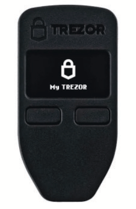

# ЯК БІТКОЇНИТИ

>**Біткоїнити:** (дієслово) /tuːˈbɪtkɔɪn/
Цим пропоную зробити «біткоїнити» дієсловом,
що охоплює всю повноту участі
в екосистемі біткоїна/Bitcoin.

* Гаразд, тепер, коли ви, сподіваюся ;) були "помаранчеві", і готові стати власним банком, беручи участь у перших у світі глобальних грошах свободи,
ось і настає найцікавіше!

---

## СТАНЬ ВЛАСНИМ БАНКОМ
* Саме тут лежить справді епічний зсув у напрямку фінансової самостійності, і це може зайняти час, щоб
дійсно, по-справжньому осягнути, що це означає.
* Потрібні певні **намір і відданість, щоб
зрозуміти, як зробити це якомога безпечніше.**
* У дусі того, щоб ця книга залишалася «найпростішою
книгою про біткоїни, коли-небудь написаною», я
наведу тут план, а потім запропоную ресурси в кінці,
щоб ви могли зануритися в глибину, яка значно перевищує
розмір цього посібника.

>**HODL:** (дієслово) /ho’dill/

: тримати свої біткоїни

: не продавати

-З допису на bitcointalk.org 2013 року, де автор,
який зізнався, що п'яний, неправильно написав «HOLD»

-bitcointalk.org/index.php?topic=375643.0

* Поки мережа ще росте, є велика цінність у мільйонах
глобальних ходлерів останньої надії.

---

## ПРИДБАННЯ БІТКОЇНІВ
* **Біткоїн виходить на ринок, коли майнери продають частину
біткоїнів, які вони отримують як винагороду,** щоб оплатити
свої операційні витрати.
* **Ви можете придбати біткоїн, купивши на одноранговій
торговій платформі, прийнявши його як оплату за
товари чи послуги, які ви пропонуєте, як подарунок або видобувши
його.** (Купівля на зареєстрованій біржі є крайнім заходом, не рекомендується).
* Коли ви його отримуєте, ви технічно отримуєте
приватні ключі для доступу до свого біткоїна.
> * **Пам'ятайте:** Сам біткоїн ніколи не залишає
ланцюжок часу.

* Ви можете придбати біткоїн анонімно або
з перевіркою особи (KYC - знай свого клієнта).

* KYC вимагається законом для виконання AML (законів про боротьбу з відмиванням грошей) при купівлі на біржах.

>* Купівля біткоїна без KYC **зберігає ваше право на
конфіденційність у майбутньому.**

---

## Non-KYC >> Анонімно
**Як отримати біткоїни без KYC (без ID):**

РЕКОМЕНДОВАНО

>1. Завантажте програму гаманця лише для біткоїнів (див. стор. 102).
>2. Оберіть метод (див. нижче).
>3. Купіть, отримайте або видобудьте біткоїн.
>4. Виведіть свій біткоїн на свій гаманець.
>5. HODL або витратьте і замініть.

* **Купуйте його на Robosats, Bisq, HodlHodl, Peach Bitcoin.**
* **Купуйте його в біткоїн-банкоматі** - обов'язково перевірте, оскільки
деякі вимагають ID. Інші просто запитують ім'я та
номер (можна використати тимчасовий номер телефону).
* **Купуйте ваучер Azteco** - відвідайте azte.co, щоб дізнатися про місцезнаходження.
* **Заробляйте його за роботу, яку ви виконуєте** - попросіть, щоб вам платили в біткоїнах.
Запропонуйте знизити вашу ціну.
* **Купуйте його особисто на зустрічі біткоїнерів.**
* **Видобувайте його** - стає легше видобувати вдома, або
ви можете приєднатися до майнінгового пулу, але тоді проведіть власне дослідження, щоб залишатися
без KYC. Ocean Pool - чудовий варіант.

---

## KYC >> Потрібна перевірка ID

**Як купити біткоїн з KYC (з ID):**

НЕ РЕКОМЕНДОВАНО

>1. Завантажте програму гаманця лише для біткоїнів (див. стор. 102).
>2. Оберіть біржу лише для біткоїнів.
>3. Створіть обліковий запис і підключіть спосіб оплати.
>4. Виконайте вимоги KYC.
>5. Купіть біткоїн.
>6. **Виведіть свій біткоїн на свій власний гаманець.**
>7. HODL або витратьте і замініть.

* **Майте на увазі, що ваш біткоїн буде назавжди пов'язаний з
вашою особистістю,** якщо ви купите його таким чином, таким чином втративши
майбутню псевдонімність щодо цих покупок.
* Якщо ви обираєте цей метод, я рекомендую знайти
авторитетну ***біржу лише для біткоїнів***.
* ***Переконайтеся, що біржа дозволяє виводити ваш
біткоїн на власний гаманець!***
* **Біржі зобов'язані за законом «KYC» вас.**
* Вони візьмуть **ваше повне ім'я, адресу, номер соціального страхування,
адресу електронної пошти, номер телефону і часто фотографію
вас, що тримаєте своє посвідчення особи.**
* **Переконайтеся, що біржа має підтримку як телефоном, так і електронною поштою
для обслуговування клієнтів.**

---

* Попросіть їх провести вас через відправлення вашого біткоїна
з вашого облікового запису на їхньому сайті на ваш власний гаманець, щоб
ви самостійно зберігали свій біткоїн
= **Тримаєте свої власні ключі.**

>* **Примітка:** Це НЕ стирає той факт, що ви
>купили біткоїн у них.
>* **Транзакції можна відстежити в ланцюжку, і в
>багатьох країнах ви несете відповідальність за сплату податків під час
>витрачання свого біткоїна.**

* Якщо ви хочете купувати через Venmo або Paypal, обов'язково
**спочатку переконайтеся, що ви все ще можете вивести
свої сатоші на свій власний гаманець, що самостійно розміщується.** У минулому
ви не могли цього зробити.
* Як вони кажуть:
> **«Немає ключів, немає сиру»** або
>
>**«Не твої ключі, не твій біткоїн»**

* Що це означає, так це те, що поки централізований сервіс
тримає приватні ключі до вашого біткоїна, залишається
можливість того, що їхню платформу зламають, або що
вони піддадуться регуляторному захопленню, і ви втратите свій
біткоїн.

>* **Завжди виводьте свій біткоїн на свій власний
гаманець, що самостійно розміщується, одразу після того, як ви його
купили.**

---
## EO 6102
* У 1933 році **президент Рузвельт видав Указ
6102, який вимагав від кожного громадянина США здати
більшість свого золота в обмін на банкноти.**
* Золото оцінювалося в 20,67 доларів США/унція. Наступного
року уряд збільшив ціну на золото до
35 доларів США/унція згідно з Законом про золотий резерв 1934 року,
фактично знецінивши банкноти, які люди отримали
майже наполовину, оскільки вартість їхніх
банкнот ніколи не зростала разом із роздутою ціною на золото.

---

* Знадобилося до 1975 року, **42 роки потому, щоб EO6102 було
скасовано,** і щоб приватним громадянам знову
дозволили мати більше 5 унцій золота.
* На даному етапі ми мало уявляємо, як регулятори
відреагують на біткоїн, оскільки він продовжує
набирати популярність і ширше поширення.
* Поки що прийом був неоднозначним. На даний
момент, однак, здається, що багато хто
розуміє, або, можливо, просто приймає, що біткоїн
неможливо зупинити.
* Є кілька політиків, які починають висловлюватися
на підтримку біткоїна як частини своєї платформи.
Є також деякі проти нього.
* Оскільки 2024 рік є роком виборів у США, він є дуже
цікавим, оскільки всі троє основних кандидатів у президенти
приймають пожертви на біткоїн для своєї кампанії!
* Сальвадор зробив його формою законного платіжного засобу в 2021 році.
Цікаво буде подивитися, яка країна буде наступною.

>* **Зрештою, було б в інтересах кожного уряду підтримати його та додати до свого балансу,
як хеджування від їхніх стрімко зростаючих
фіатних валют.**

---

## БЕЗПЕЧНЕ ЗБЕРІГАННЯ БІТКОЇНІВ

* Після того, як ви зробили крок, який змінив життя, купивши свій перший біткоїн, вам потрібно **вирішити, як його безпечно
зберігати.**
>* **Бути власним банком - це потужна форма
>самовладання.**
>* До цього потрібно ставитися **серйозно**.
* ***Будь ласка, проведіть власне дослідження * за межами
моїх основних рекомендацій тут.**
* **Екосистема біткоїна розвивається щохвилини.**
* Nostr, Twitter і bitcointalk.org - хороші
місця, щоб бути в курсі останніх розробок.

## ПЕРЕВІРТЕ ЦІ САЙТИ З ПІДРУЧНИКАМИ:
> * BTCSessions.ca від @BTCSessions
>* Bitcoiner.guide від @QnA
>* Armantheparman.com від @ArmanTheParman
>* @SouthernBitcoiner на YouTube
>* @wickedsmartbitcoin на YouTube

---

## ГАМАНЦІ ЛИШЕ ДЛЯ БІТКОЇНІВ
* Біткоїн найкраще зберігати у власному
 * **самостійно розміщеному**
 * **некастодіальному**
 * **лише для біткоїнів** «гаманці»

* «Гаманець» насправді є програмним забезпеченням, яке є
пристроєм для підпису. Він містить ваші приватні ключі, які він
використовує для підпису транзакції, яку ви відправляєте (транслюєте).

## ГАРЯЧИЙ ГАМАНЕЦЬ
* **Це онлайн-додаток біткоїн-гаманця, який ви завантажуєте на свій телефон або комп'ютер.**
* Найкраще використовувати для менших сум, для повсякденних
витрат.
## ХОЛОДНИЙ ГАМАНЕЦЬ ДЛЯ ЗБЕРІГАННЯ
* **Це офлайн-гаманець.** Також відомий як апаратний
гаманець.
* Це окремий апаратний пристрій, на якому можна зберігати
свої ключі.

>* Хоча обидва працюють добре, зазвичай рекомендується
використовувати холодний гаманець, коли у вас є більше
500-1000 доларів США в біткоїнах, оскільки він **більш безпечний.**

---
* **Будь ласка, проведіть власне дослідження, щоб порівняти функції та
компроміси між гаманцями, показаними нижче.**

* **ДОДАТКИ ГАРЯЧИХ ГАМАНЦІВ** - Некастодіальні
Blue Wallet, Muun Wallet, Mutiny Wallet
Sparrow Wallet, Green Wallet, Phoenix
Wallet, Zeus Wallet, Breez Wallet

* **ХОЛОДНІ ГАМАНЦІ ДЛЯ ЗБЕРІГАННЯ** - Некастодіальні
Cold Card, Trezor, Foundation Passport,
Blockstream Jade, Seed Signer, Bitbox,

>* **ЗАВЖДИ** купуйте свій холодний гаманець для зберігання **безпосередньо
у виробника,** щоб бути впевненим, що в нього не було
втручань.

---

## НАЛАШТУВАННЯ ГАМАНЦЯ
* Слідкуйте за @BTCSessions на YouTube, щоб отримати чудові
підручники з налаштування гаманця та багато іншого.

>* Під час налаштування гаманця обов'язково ***запишіть
>фразу-пароль з 12 або 24 слів на папері.***
>* ***Тримайте її в режимі офлайн. Ніколи не робіть її знімок екрана.***
>* **ЗБЕРІГАЙТЕ ФРАЗУ-ПАРОЛЬ ДУЖЕ БЕЗПЕЧНО.**
>* **ДУЖЕ, ДУЖЕ БЕЗПЕЧНО!**

* **Багато компаній виготовляють металеві пластини для паролів, в
які можна вбити свою фразу-пароль для додаткового
захисту від вогню/води/пошкоджень. Настійно рекомендую!**
* Якщо ви втратите доступ до свого гарячого або холодного гаманця,
ви можете відновити його за допомогою фрази-пароля та відновити
свої кошти.
* Ви можете зробити це на будь-якому гаманці, який підтримує той самий
тип фрази-пароля BIP39 (12/24 слова).
* Найкращою практикою було б зберігати
дескриптор гаманця на додаток до пароля.
>* **ПАМ'ЯТАЙТЕ: Будь-хто, хто має ваш пароль, має
доступ до вашого біткоїна!**

---
## ПРО КОНФІДЕНЦІЙНІСТЬ
* Конфіденційність при **купівлі (без KYC), захисті, зберіганні
та витрачанні** біткоїна стає все більш і більш
важливою, особливо у світлі останніх подій із
захопленням/заморожуванням банківських рахунків.
>* Крім того, **загальна цифрова конфіденційність має вирішальне значення, якщо ви
хочете отримати онлайн-самоврядування та захистити себе від надмірного стеження та шахрайства.**

* Нижче наведено деякі поточні послуги, орієнтовані на конфіденційність.
* Вихід за межі цієї книги, щоб глибоко заглибитися в
кожну з наступних, тому абсолютно проведіть власне дослідження та
слідкуйте за обліковими записами, які я згадую нижче, у Nostr або
Twitter, щоб отримувати оновлення.

>*Конфіденційність необхідна для відкритого суспільства в електронну
епоху. Конфіденційність - це не секретність. Особиста справа - це те, що
ніхто не хоче, щоб весь світ знав, але таємна
справа - це те, чого ніхто не хоче, щоб хтось знав.
Конфіденційність - це здатність вибірково розкривати
себе світу.*

~Ерік Хьюз, з «Маніфесту кіберпанка»

---
