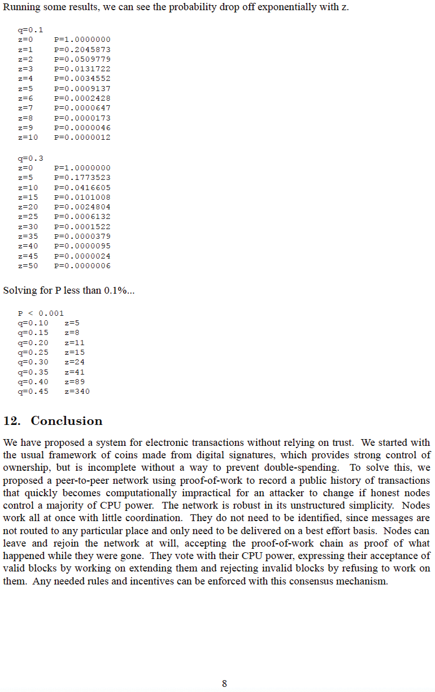

# Iphepha EliMhlophe leBitcoin
Lenziwe ukuba lifumaneke kwihlabathi kwi metzdowd.com
2008-10-31

**ngu Satoshi Nakamoto**

I-cypherpunk engaziwa ngegama, ogqibel’ ukunxibelelana
noluntu lwe-cypherpunk kwiforum ye-bitcointalk.org
ngomhla ka-2010-12-10.

Ngokushiya, uvumele iBitcoin ukuba ibe luvavanyo lokwenyani
endle. Wonke umntu osebenza kuyo uvolontiya ngandlel’ ithile
<-> ephefumlelwe ngamandla okukhulula uluntu
kwimingxuma yenkqubo yemali esekwe kutyalo-mali eluqilima,
endaweni yoko, athathe inxaxheba kwinethiwekhi yentlawulo yemali yehlabathi, engathembekiyo,
engavunyelwanga, echasene nocenziso, enqabileyo ngokwenene, yontanga-kontanga, egunyazisiweyo,
epholileyo kunye nenethiwekhi yentlawulo yemali, ethi iphembelele umyalelo ovelayo ukuba uphumelele phakathi
kothuthu lwemali-mboleko

**Sonke singuSatoshi**
>*The Times 03/Jan/2009 Umgqabazeleli usengozini
yesibini yokuhlawulela iibhanki*

~ Umbhalo womxholo ophambili weThe Times yaseLondon,
uqingqiweyo kwiBloko yeGenesis yeBitcoin nguSatoshi
Nakamoto ngomhla ka-2009-01-03

---

---

---

---

---

---

---

---

---

---

## IBloko yeGenesis yeBitcoin ~ Inguqulelo yeHex ekrwada 2009-01-03

kwaye ke,

ixesha elitsha,

lakhululwa

---
