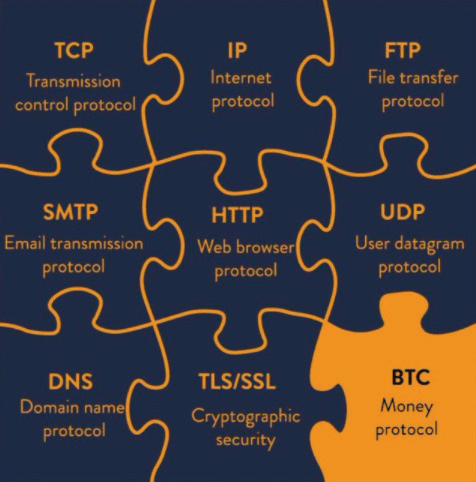

# Ukuchitha i-Bitcoin Fud
(Uloyiko, Ukungaqiniseki, Amathandabuzo)

* Apha ngezantsi kukho iingxoxo eziqhelekileyo ezichasene ne, okanye uloyiko
malunga, ne bitcoin.
* Ezi zikhulu kakhulu azinamsoco, zibangelwa kukungazi, okanye mhlawumbi ukungaqondi ngokupheleleyo.
* Ndibonelela ngezichaso ezimfutshane koku ngakunye apha, kwaye ekupheleni
uya kufumana izikhombisi kwimithombo eneenkcukacha ngakumbi
ichitha yonke iFUD.

## IBHITCOIN ISEBENZISA AMANDLAAMANZI AMANZIAMANZI

>*Ubushushu obuvela kwikhompyutha yakho abuchithwa
ukuba ufuna ukufudumeza ikhaya lakho... Kunjalo
indleko elinganayo ukuba uvelisa ubushushu
ngekhompyutha yakho.*

~ Satoshi Nakamoto 2010-08-09

>*Ekuqaleni, ukuveliswa kwempahla nje ngenxa yokuba
ibiza kakhulu ibonakala ichitha ixesha. Nangona kunjalo, into exabisa kakhulu
kwempahla ephindaphindwayo yongeza ixabiso ngokwenza ukutshintshwa kobutyebi
obenziweyo. Okuninzi kwiindleko zibuyiswa
ngalo lonke ixesha kuthengiselwana kunokwenzeka okanye kwenziwe
kungabizi kakhulu. Iindleko, ekuqaleni ziyinkunkuma epheleleyo, zehliswa ngoku
thelekiswa kwaye kuhlawulwe ngothengiselwano oluninzi.*

~ Nick Szabo

Cypherpunk

---

* **'Amandla amaninzi' yingxoxo yexabiso ekufuneka
ithathele ingqalelo ukuba silixabisa njani injongo yokusetyenziswa kwamandla.**

* **Xa umntu eqwalasela ukuba izibane zeKrisimesi e
US zisebenzisa umbane ongaphezulu kunothungelwano lweBitcoin luphela,** ngoko ke mhlawumbi umntu angabona ukuba yonke into iyazihlanganisa!

* Ukusebenzisa amandla, kunye nobuninzi bamandla, ukukhusela
imali eyona inzima, neyona ingangeniyo kulawulo
uluntu olwake lwazi, lungaphezulu kokuyifaneleyo.

* Ekuthelekiseni ukusetyenziswa kwamandla ebitcoin naleyo isetyenziswa yi
inkqubo yelifa, kufuneka siqwalasele 'isteki esipheleleyo' kumacala omabini:

| Indalo yeBitcoin | Inkqubo Yelifa yeFiat |
| --------------- | ---------------------- |
| Abavukuzi be-ASIC | BIS |
| Ama-Nodes | Iibhanki eziPhakathi |
| IiWallet zeHardware | Iibhanki zeSizwe/zeNgingqi |
| IiApps zeSoftware Wallet | Umkhosi weShishini eziMveliso |
| | IiZiko zeDatha eziGcina Ugcino |
| | Ushicilelo Lwemali ebonakalayo |
| | Ukuhanjiswa Kwemali ebonakalayo |
| | IiApps zeBhanki ekwi-Intanethi |
| | Nothungelwano lweeATM |

* Ngokusebenzisa i-bitcoin, siya kuthi ekugqibeleni sinciphise amandla
ukusetyenziswa kwiindawo ezininzi, ngakumbi
ngokungasayidingi iMilitary Industrial
Complex ukukhusela idola yepetroli

---

* Kwakhona, ukuthenga okungalawulekiyo okuyimfuneko ukuze
gcina inkqubo esekwe kutyalo-mali iphila, iya kuthi ekuhambeni kwexesha
ithintelwe, njengoko **imali enzima ngokwendalo ikhuthaza
ukuchitha ngobulumko nokonga** (kuba imali oyongileyo
iya kulixabisa ngokwenene ixabiso layo, ingcamango esingenayo
ukufumana amava ukusukela oko saphuma kumgangatho wegolide).
* **Okokugqibela, kwaye okubalulekileyo, ukumbiwa kwebitcoin sele
ukunciphisa ungcoliseko ngokubamba irhasi yendalo evuthayo
kwaye uyisebenzise ukuxhasa abavukuzi.** Kuba abavukuzi bafuna
iindleko zombane ezisezantsi, kukwalindeleke ukuba ibe yeyona inkulu
umqhubi oya kumandla ahlaziyekayo exabiso eliphantsi, ukusukela
imivuzo iyalingana.
* **Ukutsibela okunzulu okunenkcazelo ngeBitcoin kunye naMandla** kubhaliwe
nguDaniel Batten kwi batcoinz.com, Troy
Cross, Jyn Urso, ividiyo ethi ‘Le Machine Greens’
nguSwan Bitcoin kwiYouTube, 'Ingqekembe Engcolileyo', A
uxwebhu lwemigodi ye-bitcoin, kunye
isiqendu esibalaseleyo somboniso othi ‘Yintoni Imali’
(WiM161) kunye noB.Quittem, phakathi kwabanye abaninzi.

---

## IBHITCOIN YI-PONZI
* **I-Bitcoin ayiyo iPonzi:**
 * Abatyali-mali abaqolileyo abahlawulwa nayiphi na imali ngabatsha
 abatyali-mali.
 * Xa uthenga i-bitcoin, akukho mntu uthembisa inzuzo
 kutyalo-mali lwakho.
 * Akukho bukhokeli okanye iqela lokuphakamisa.
 * Akukho mgodi wangaphambili.
 * **Funda:** 'Kutheni iBitcoin inge yiPonzi' nguLyn Alden
ukuba ufuna okungaphezulu.

## IBHITCOIN ICETHE KAKHULU
* Nangona umaleko osisiseko weBitcoin ucotha, umaleko we-2
nd **I-Lightning Network eyakhelwe phezu komaleko osisiseko...
ikhawuleza njengombane!**
* Uthungelwano lweBitcoin lungalungisa malunga ne-7
uthengiselwano ngomzuzwana (TPS).
* Inethiwekhi yeVisa ithi inokulungisa ukuya kuma-24,000
I-TPS, nangona i-4,000 TPS isondele kusetyenziso lokwenyani.
* **I-Lightning Network, isisombululo somaleko wesibini
eyakhelwe kwiBitcoin, inamandla okwenza njalo
lungisa izigidi zothengiselwano ngomzuzwana!**

---

## OORHULUMENTE BANOKUYITHINTELA IBHITCOIN
* Abanye oorhulumente bazamile, njenge China, India kunye
INigeria umzekelo. Kwimeko nganye, ukusetyenziswa kwe-bitcoin
iyakhula ngokukhawuleza ngabantu belo lizwe
* **Akukho ndlela yokuba oorhulumente bangayithintela ngokwenene i-bitcoin,** njengoko iyiyo ngemvelo ukuba ivumeleke kwaye inganyangeki kulawulo. Yikhowudi kwaye ikhowudi sisithethi.
* Oko kukuthi, oorhulumente banokwenza kube nzima ukuthenga
nokuthengisa, nokungena kwi-fiat. Banokuyirhafisa njengoko
impahla, njengoko besenza e-US.
* **Ekugqibeleni, ayisayi kuba yinzuzo yabo ukuzama ukuyithintela
yona, ukusukela oko i-bitcoin ingenakuphepheka kwaye bayaqala
ukubona oko.** Baya kuba zizilumko kakhulu ukuyongeza
kwi-balance sheet yelizwe labo njengokhuseleko oluchasene nabo
imali ye-fiat ekhulayo.

>*Oorhulumente balungele ukunqumla
iintloko zothungelwano olulawulwa embindini
njengeNapster, kodwa iinethiwekhi zeP2P ezimsulwa
njengeGnutella kunye neTor zibonakala zinazo
ubambelele.*

~ Satoshi Nakamoto

* **Funda:**

Ingaba uRhulumente Angayimisa iBitcoin? nguAlex Gladstein,
I-CSO ye-Human Rights Foundation

Ingaba uRhulumente Angayithintela iBitcoin? Izinto ezine Uyakudinga
Ukuyazi nguNick Giambruno

---

## IBHITCOIN YITECH ENDALA
* **Ngakumbi 'itekhnoloji yokugqibela',** malunga nedijithali
ukunqongophala, ukwahlukana kommandla kunye nokusombulula ingxaki yokuchitha kabini kunye neyeBhishophu
ingxaki. Nje ukuba ifunyenwe, ayinakufunyanwa kwakhona.
* **Nje ukuba ivili lenziwe, alinakuba njalo
iphinde yenziwe.**
* I-TCP/IP protocol internet esebenza ngayo ibiyiyo
umgangatho kuzo zonke inethiwekhi yekhompyuter ukusukela
1983. Kusenokwenzeka ukuba iyaqhubeka ukuba ngumgangatho we-a
ixesha elide.
* Nje ukuba isisombululo esigqibeleleyo, itekhnoloji yomaleko osisiseko ifunyenwe esebenza ngokufanelekileyo, inokuhlala amakhulu,
okanye amawaka eminyaka.

Ityala: @DecouvreBitcoin

---

## IBHITCOIN IYASETSHENZISWA ZIZIGEBENGU
* **Kunjalo nedola, nayo yonke enye imali ye-fiat ehlabathini.** Kuyaphosa nje ukuthi le nto ingena
ingxaki kwi-bitcoin kuphela.
* **I-Bitcoin sisixhobo, njengommese, kwaye kuxhomekeke kwisihlandlo ngasinye
thina ukuba siyisebenzisa njani.**
* Okubangel 'umdla kukuba, ukuba i-bitcoin ibingekhona ukuba isetyenziswe zizaphuli-mthetho,
ngoko ayiyi kuba yimali engathathi cala, engangeni kulawulo
ihlabathi liyidinga kakhulu.
* **Qaphela:** Ukusukela oko i-Bitcoin blockchain ihlolwe, kunjalo
enyanisweni lukhetho olubi kakhulu kwimisebenzi yolwaphulo-mthetho!

## I-QUANTUM COMPUTING INGAYIQHAQHA I-BITCOIN
* Nangona oku kusenokwenzeka ngenye imini kwixesha elizayo,
**abaphuhlisi sele bebesebenzela izisombululo ze-postquantum encryption**
* I-Bitcoin yinto enye kuphela kwizicelo ezininzi ze-intanethi ezixhomekeke kwi-SHA-256 hashing yokhuseleko.
Nokuba umkhosi uyayisebenzisa, ngoko ke kukho umvuzo omkhulu ongaphezu koluntu lwe-bitcoin ukuphuhlisa entsha
iiprotocol zokubhala.
* Ukuba i-SHA-256 iyaphulwa, siya kuba nokunye okuninzi
ukuxhalaba ngaphandle kwe-bitcoin. Yonke i-intanethi iyayisebenzisa
yona ukufihla. Oku kuquka zonke iibhanki, ukubonelela
amaketanga, iinkqubo zothutho, iinkqubo zokhathalelo lwempilo,
iinkqubo zemfundo nokunye.

---

## IBHITCOIN AYINAXABISO LOKWENENE
>*“Ixabiso leBitcoin liqhutywa kukusilela kwayo okuqinisekiswayo”*

*~ Fidelity Digital Assets*

* **Ukuxabiseka yixabiso. Yonke imali ngaphezulu kwalo lonke ixesha ibe njalo
ixatyisiwe kuba inesilinganiso sokunqongophala.**

* Ukongeza, yayixhaswa yinkolelo yokuba ingangena
banjwe ixabiso layo, ukuze ithengiswe kwi
ixesha elizayo ngento enexabiso.
* Njengoko inethiwekhi yeBitcoin ikhula, ixhaswe yipropati engcono
iipropati zemali eziquka, isiphumo sothungelwano
iyakhula ngokukhawuleza
* Ukukhula kwesiphumo sothungelwano, kokukhona ixabiso liyilo, njengoko a
impahla enqabileyo, inikezela. Ixabiso libonakalisa imfuno,
kwaye njengoko imfuno iyanda, ixabiso liyanda.

---

## ABANYE ABANTU BANOBUNINZI
* Yinyani ukuba abanye abantu banokungaphezulu kunabanye.
**Ngokukhulula iprotocol ngokuvulekileyo, uSatoshi wayivumela ukuba
ukungena ngokukhululekileyo, kwaye abo bayiqondayo amandla
okanye bayibambe ngayo bayityala, okanye bathenge kwasekuqaleni. Yayiyi
eyona ndlela ilungileyo nendalo yokuyibonisa
kwihlabathi.**
* Ekuhambeni kwexesha, xa ihlabathi liyi-hyperbitcoinized, oko kuthetha ukuba siphila kumgangatho we-bitcoin, abo
unokungaphezulu uya kuyichitha ngokwendalo kuqoqosho

* Nangona kwixesha elithile umntu angasayi kuba njalo
ukukwazi ukuyithenga nge-fiat, abantu baya kuhlawulelwa
sebenza nge bitcoin. Ukuhlawulwa ngemali ekhuselekileyo ngokwenene kuya
kuba sivumele ukuba sibe nemali yokonga yokwenyani engayi kuthotywa
ekuhambeni kwexesha ngokunyuka kwamaxabiso
* Nangona kusoloko kukho abo banobutyebi obungaphezulu
kunye nabo banokuncinci, ngenxa yenani elikhulu lezinto,
**umgangatho we-bitcoin uya kwenza ulwahlulo phakathi
amaklasi obutyebi ayangena**, njengoko uAleks Svetsi esithi. Oku
iya kuvumela kokubini ukunyuka kunye nokuhla kokuhamba ukuba kube
kude, kude kakhulu ngokuguquguquka kunanamhlanje
* **Ukuzalwa kwi, kunye nokudada ubomi bethu bonke
kwihlabathi le-fiat, phantse akunakwenzeka ukuyicinga, kwaye
ukuqonda ngokupheleleyo iziphumo zokuba nemali
ayinakuthotywa okanye ilawulwe!**

---
## IBHITCOIN IYAGUQUGUQUKA KAKHULU
* **Oku kuqhelekile ngexesha lokufunyanwa kwamaxabiso
impahla entsha yemali.** Ayikho enye indlela yokuba
ukukhula ukuba kwenzeke xa kunjalo ngendalo kwaye kuvela
(ngokuchasene noko kungasentla phantsi kwaye kulawulwa embindini.
* Ukongeza, kweli nqanaba lobukho bomntu, kunye
utshintsho olukhulu olwenzeka kuwo onke amacandelo, luyavakala
ukuba into eguqula ngolo hlobo njenge-bitcoin iya
ibe nokuguquguquka okubi.
* Nangona thina bajule phantsi kumngxuma womvundla siyibona
njengekamva, okwangoku yipesenti encinci kuphela ye
abantu behlabathi baphethe i-bitcoin ngeli xesha. Oku
iyenza ibe sesichengeni sokuguquguquka okukhulu.
* Njengoko ikhula, kwaye ukwamkelwa kuyanda, ukuguquguquka kuya kuncipha, kwaye ekugqibeleni iya kuzinza kwaye
ibe yiyunithi yeakhawunti.

>*Ndiqinisekile ukuba kwiminyaka engama-20 kuya kubakho
nokuba ngumthamo omkhulu wothengiselwano
okanye akukho volumu.*

~ Satoshi Nakamoto 2010-02-14

---

## AWUNAKUYICHAPHASELA IBHITCOIN

* **Lo ngumsebenzi, hayi impazamo.** Inyaniso yokuba i-bitcoin
ayibonakali yeyona nto ibaluleke kakhulu ekukhokelela ekungathathelweni kwempahla!

## IBHITCOIN INGAPHULWA

* Kwiminyaka eli-15 ukusukela oko yasungulwayo, ayizange
iphulwe.
* Kukho iiheki kwii-eksenji nangona kunjalo, ngoko
Ndiyaleza kakhulu ukuhambisa i-bitcoin yakho kwakho
isipaji sokuzigcina ngokukhawuleza.
* Kuqikelelwa ukuba ukuphula i-SHA-256
ukubhala (ukuba i-bitcoin isebenzisa) phakathi kweeyure ezingama-24, a
ikhompyutha ye-quantum iya kufuna i-13,000,000 yomzimba
iiqhubithi. Ngeli xesha, irekhodi le-qubit yangoku libanjwe
yi-Atom Computing eCalifornia zii-1,180 qubits.
* Kukholelwa ngokubanzi ukuba i-quantum-safe encryption
indlela iya kuphuhliswa kude kube yimfuneko.

>*Ukuba ngumthombo ovulekileyo kuthetha ukuba nabani na anokuthi
hlaziyisa ngokuzimeleyo ikhowudi. Ukuba kwaba njalo
umthombo ovaliweyo, akukho mntu unokuqinisekisa
ukhuseleko. Ndicinga ukuba kubalulekile kwi
inkqubo yale ndalo ukuba ibe ngumthombo ovulekileyo.*

*~Satoshi Nakamoto 2009-12-10*

---

## OKUNINGI NGOKUCHITHA I-FUD APHA:

* Endthefud.org
* Bitcoinmythbusters.org
* Casebitcoin.com - Ukugxekwa Okuqhelekileyo
* Safehodl.github.io/failure/
* Lopp.net - Ulwazi lweBitcoin: Iingcinga eziphosakeleyo

>*I-Bitcoin yahluke ngokupheleleyo kuyo nayiphi na enye idijithali
impahla. Akukho enye i-asethi yedijithali enokuthi iphucule
i-bitcoin njengempahla yemali kuba i-bitcoin iyona
(ngokumalunga nezinye iiasethi zedijithali) ezikhuselekileyo, ezisetyenziswayo,
imali yedijithali esempilweni kunye naluphi na "uphuculo"
ngokuqinisekileyo iya kujongana nokurhweba.*

~ Fidelity Digital Assets Report, ‘Bitcoin First’, Jan 2022
Chris Kuiper, CFA, uMlawuli wezophando
Jack Neureuter, uMhlalutyi woPhando

---

## NGEXABISO LEBHITCOIN
* **Ndiyabona ukubamba (ukubamba) i-bitcoin njengokuba nekhawunti yokonga yexesha elide.**
* Ixabiso lemihla ngemihla alibalulekanga, njengoko kulindeleke ukuba libe
guquguquka (nyuka uye ezantsi) iminyaka embalwa.
* Njengoko ndikhankanyile ngaphambili, oku kuqhelekile kwintsha
impahla ephantsi kokufunyanwa kwamaxabiso
* Ukuba umntu uyakhulula itshati yexabiso le-BTC/USD, uya kufumana
uya kubona ukuba inyuke nge +31,296% ukusukela ngo-2009,
umyinge ukuya ku ~200% ngonyaka.
* Ukuguquguquka kwamaxabiso kubonisa amanqaku eendaba ezahlukeneyo, uhlaziyo lolawulo, imfuno yemarike, uloyiko kunye novuyo.
Yinto yokukhwela ekhwazayo!
* **Okukhona ubambelela, kokukhona ufunda kwaye uqonda okusisiseko, kokukhona uqonda
iziphumo ezinzulu zokuba nemali ekhuselekileyo,
kokukhona ixabiso lingabalulekanga.**

>**Ekugqibeleni, 'ixabiso' aliyi kubaluleka kwaphela, njengoko i-bitcoin
iya kuba yiyunithi yeakhawunti.**

* **Ukuzikhusela:**
* Faka kuphela oko 'ungakwazi ukulahlekelwa', ukusukela
kukho, ngokuqinisekileyo, akukho ziqinisekiso.
* Qwalasela i-bitcoin oyithengayo njengeyexesha elide
iakhawunti yokonga, kwaye uceba ukuyishiya kwindawo ebandayo
ugcino ubuncinane beminyaka emihlanu ngaphambi
ukuchitha.

---

Umthombo woqobo we bitcointalkforum.org wenye ye
ii-bitcoin memes zakudala kunene zamaxesha onke.

---

## OKWANGOKO, EMIRAFENI
* **Ukuzikhusela:** Oku ayisiyo ingcebiso yezemali okanye yerhafu

* Kwikhowudi yerhafu yase-US, i-bitcoin okwangoku ibonwa njengempahla, ngoko kukho iziphumo zerhafu ezinokuthi zibe khona ukuba
uyithengisa ubuyisela kwi-fiat, okanye nokuba uthenga into nge
i-bitcoin yakho
* Ukuba ixabiso lehla ngaphambi kokuba uyithengise/uyisebenzise, wena
ungabanga ilahleko
* Ukuba ixabiso lenyuke, kufuneka ubange
inzuzo yeenkunzi, kwaye uhlawule phakathi kwe-10-30% ye-CGT (iNkunzi
IRhafu Yenzuzo)
* Isixa sixhomekeke kwizinto ezininzi, ezifana
ixesha elide uliphathe ngaphambi kokuba uthengise okanye uchithe, kwaye
kuluphi udonga lwerhafu olufikayo.
* Ukuba uceba ukuthengisa okanye ukuchitha i-bitcoin, ngakumbi enkulu
izixa, unokuqwalasela ukuthatha ingcebiso kunye
ingcali yerhafu.
* Ukuba umane uthenge kwaye ubambe, okwangoku awunayo
naziphi na iziganeko zerhafu malunga ne-bitcoin.
* Kwaye ukuba uthenga i-non-KYC...

---
