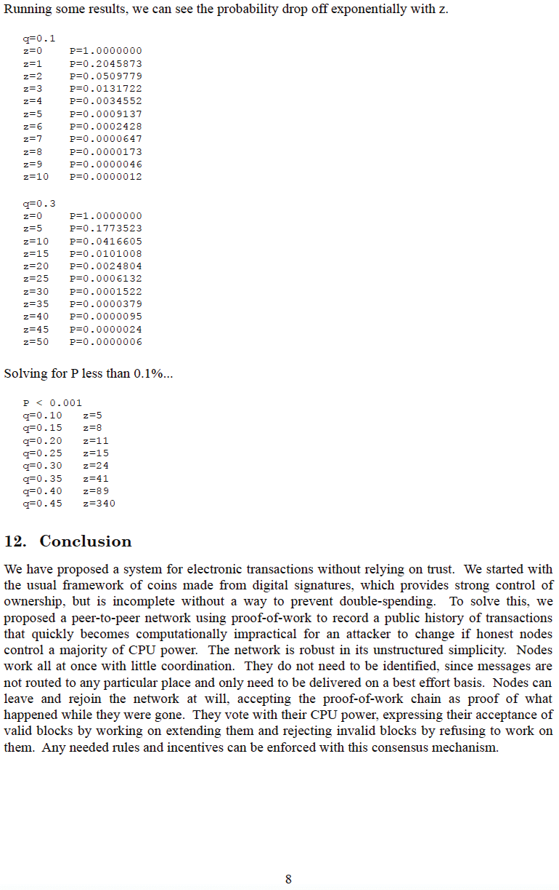

# Incwadi Emhlophe yeBitcoin
Yethulwe emhlabeni ku-metzdowd.com
2008-10-31

**nguSatoshi Nakamoto**

I-cypherpunk enegama mbumbulu, ogcine ukuxhumana
nomphakathi we-cypherpunk enkundleni ye-bitcointalk.org
ngo-2010-12-10.

Ngokuhamba, uvumele iBitcoin ukuthi ibe isivivinyo seqiniso
endle. Wonke umuntu osebenza kuyo uyivolontiya ngandlela thile
<-> ephefumulelwe amandla okukhulula isintu
ezibophweni zohlelo lwemali olukhohlisayo, olusekelwe ezikweletini,
futhi esikhundleni salokho, ubambe iqhaza kwinethiwekhi yembulunga yonke, engathembeki,
engenazimvume, emelana nokucwaninga, eyivelakancane ngempela, eyontanga-kuya-kontanga,
eyehlukaniselwe izindawo, yemali nenethiwekhi yokukhokha yemali, leyo ephefumulela ukuhleleka okusafufusa ukuthi kuphume
emlotheni we-fiat

**Sonke singuSatoshi**
>*I-The Times 03/Jan/2009 Ushansela usemphethweni
wesiqalo sesibili sokuhlenga amabhange*

~ Umbhalo wesihloko sezindaba ezivela ku-The Times yaseLondon,
oqoshwe kwibhlokhi yeGenesis yeBitcoin nguSatoshi
Nakamoto ngo-2009-01-03

---

---

---

---

---

---

---

---

---

---

## Ibhokhi leGenesis yeBitcoin ~ Inguqulo eluhlaza yeHex 2009-01-03

kanjalo,

inkathi entsha,

yakhululwa

---
