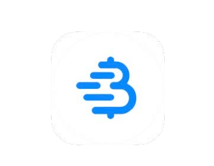

# INDLELA YOKUSEBENZISA I-BITCOIN

>**Ukusebenzisa i-Bitcoin:** (isenzo) /tuːˈbɪtkɔɪn/
Ngingathanda ukusikisela ukuthi 'ukusebenzisa i-bitcoin' kube yisenzo,
esihlanganisa konke ukubamba iqhaza
ohlelweni lwemvelo lwe-bitcoin/Bitcoin.

* Kulungile, njengoba manje usuyitholile, ngethemba ;) inkolelo ye-orangepill, futhi usukulungele ukuzenzela ibhange, ngokubamba iqhaza emalini yokuqala yenkululeko yomhlaba,
nansi ingxenye ejabulisayo!

---

## UKUZENZA IBHANGE
* Yilapho kushintsha khona kakhulu ukuzimela ngokwezimali, futhi, kungathatha isikhathi
ukuqonda ngempela, ukuthi kusho ukuthini lokhu.
* Kudingeka **inhloso nokuzinikela ukuze
uqonde ukuthi ungakwenza kanjani ngendlela evikeleke kakhulu
.**
* Ngenhloso yokugcina le ncwadi ‘iyincwadi ye-bitcoin elula kunazo
zonke ezake zabhalwa’, ngizohlinzeka ngohlaka lapha, bese nginikeza izinsiza ekugcineni
ukuze ungene ujule kunalokho
okukule ncwadi eyisisekelo.

>**HODL:** (isenzo) /ho’dill/

: ukubambelela ku-bitcoin yakho

: ukungathengisi

-Kuthathwe kokuthunyelwe kwango-2013 ku-bitcointalk.org, lapho umuntu
ayezisholo ukuthi udakiwe, elibhale kabi igama elithi ‘BAMBELELA’

-bitcointalk.org/index.php?topic=375643.0

* Nakuba inethiwekhi isakhula, kunenani elikhulu
ezigidini zabantu abagcina i-hodl’rs yomhlaba.

---

## UKUTHOLA I-BITCOIN
* **I-Bitcoin ingena emakethe ngokuthi abavukuzi bathengise enye
yama-bitcoin abawatholayo njengemiklomelo,** ukuze bakhokhele
izindleko zabo zokusebenza.
* **Ungathola i-bitcoin ngokuthenga endaweni yokuhweba yontanga-kuya-kontanga, ngokuyamukela njengenkokhelo
yezimpahla noma amasevisi owanikezayo, njengesipho, noma ngokuyivukuza
.** (Indlela yokugcina yokugcina, engatuswa, ukuyithenga
endaweni yokushintshanisa ebhalisiwe).
* Uma uyithola, empeleni uthola
izihluthulelo eziyimfihlo zokufinyelela i-bitcoin yakho.
> * **Khumbula:** I-bitcoin ngokwayo ayilokothi ishiye i-
 timechain.

* Ungathola i-bitcoin ngokungaziwa, noma
ngokuqinisekiswa kobunikazi (i-KYC - Yazi Ikhasimende Lakho)

* I-KYC iyadingeka ngokomthetho ukuze kugcwaliseke i-AML (imithetho yokulwa nokushushumbiswa kwemali) lapho uthenga ezindaweni zokushintshanisa.

>* Ukuthenga i-bitcoin engeyona i-KYC **kulondoloza ilungelo lakho
lobumfihlo esikhathini esizayo.**

---

## Engeyona i-KYC >> Ngokungaziwa
**Ungayithola Kanjani I-Bitcoin Engeyona i-KYC (Ayikho I-ID):**

KUNCONYWA

>1. Landa uhlelo lokusebenza lwesikhwama se-bitcoin kuphela (bheka ikhasi 102).
>2. Khetha indlela (bheka ngezansi).
>3. Thenga, thola noma vukuza i-bitcoin.
>4. Khipha i-bitcoin yakho uye esikhwameni sakho.
>5. HODL, noma usebenzise bese uyayithatha indawo.

* **Yithenge ku-Robosats, Bisq, HodlHodl, Peach Bitcoin.**
* **Yithenge ku-ATM ye-bitcoin** - Qiniseka ukuthi uyahlola, njengoba
ezinye zidinga i-ID. Ezinye zicela igama nenombolo
(ungasebenzisa # yefoni yesikhashana).
* **Thenga ivawusha ye-Azteco** - Vakashela i-azte.co ukuze uthole izindawo.
* **Yithole ngomsebenzi owenzayo** - Cela ukukhokhelwa nge-bitcoin.
Hlinzeka ngokwehlisa intengo yakho.
* **Yithenge mathupha emhlanganweni we-bitcoin.**
* **Yivukuze** - Kuya ngokuya kuba lula ukuyivukuza ekhaya, noma
ungajoyina ichibi labavukuzi, kodwa-ke DYOR ukuze uhlale
ungenayo i-KYC. I-Ocean Pool iyindlela enhle.

---

## I-KYC >> Kuyafuneka Ukuqinisekiswa Kobunikazi

**Ungayithenga Kanjani I-Bitcoin ye-KYC (nge-ID):**

AKUNCONYWA

>1. Landa uhlelo lokusebenza lwesikhwama se-bitcoin kuphela (bheka ikhasi 102).
>2. Khetha indawo yokushintshanisa i-bitcoin kuphela.
>3. Dala i-akhawunti bese uxhuma indlela yokukhokha.
>4. Gcwalisa izidingo ze-KYC.
>5. Thenga i-bitcoin.
>6. **Khipha i-bitcoin yakho uye esikhwameni sakho.**
>7. HODL noma usebenzise bese uyayithatha indawo.

* **Qaphela ukuthi i-bitcoin yakho izohlala ixhumene
nobunikazi bakho** uma uyithenga ngale ndlela, ngaleyo ndlela ulahlekelwe
ukuzimela kwesikhathi esizayo maqondana nalokhu okuthengile.
* Uma ukhetha le ndlela, ngincoma ukuthola indawo
yokushintshanisa ***ye-bitcoin kuphela*** enedumela elihle
* ***Qiniseka ukuthi indawo yokushintshanisa ikuvumela ukuthi ukhiphe
i-bitcoin yakho uye esikhwameni sakho!***
* **Izindawo zokushintshanisa ziyadingeka ngokomthetho ukuthi ‘zibe yi-KYC’.**
* Zizothatha **igama lakho eligcwele, ikheli, inombolo yomshuwalense
wakho wokuhlalisana, i-imeyili, inombolo yefoni futhi ngokuvamile isithombe
sakho uphethe i-ID yakho.**
* **Qinisekisa ukuthi indawo yokushintshanisa inokusekelwa kwefoni ne-imeyili
kwensizakalo yamakhasimende.**

---

* Bacele bakusize ekuthumeleni i-bitcoin yakho
isuka ku-akhawunti yakho nabo iye esikhwameni sakho, ukuze
uziphathele ngokwakho i-bitcoin yakho
= **Ukuphatha izihluthulelo zakho.**

>* **Qaphela:** Lokhu AKUYISUSI iqiniso lokuthi
>uthenge i-bitcoin kubo.
>* **Okwenziwayo kuyalandeleka ku-chain, futhi
>emazweni amaningi unomthwalo wemfanelo wentela lapho
>usebenzisa i-bitcoin yakho.**

* Uma ufuna ukuthenga nge-Venmo noma i-Paypal, qiniseka
ukuthi **uqala uqinisekise ukuthi usengakwazi ukukhipha
ama-sat wakho uye esikhwameni sakho esizinikele.** Esikhathini
esidlule ubungeke ukwazi ukwenza kanjalo.
* Njengoba besho:
> **“Azikho izihluthulelo, alukho ushizi”** noma
>
>**“Azikho izihluthulelo zakho, ayiyona i-bitcoin yakho”**

* Lokhu kusho ukuthi, inqobo nje uma isevisi emaphakathi
ibambe izihluthulelo eziyimfihlo ze-bitcoin yakho, kuhlala
kukhona ukuthi ipulatifomu yabo igetshengwe, noma ukuthi
bangenwe yimithetho futhi ulahlekelwe yi-
bitcoin yakho.

>* **Njalo khipha i-bitcoin yakho uye
esikhwameni sakho esizinikele ngokushesha nje lapho
uyithengile.**

---
## EO 6102
* Ngo-1933 **uMongameli Roosevelt wakhipha i-Executive Order
6102, eyayidinga ukuthi sonke isakhamuzi sase-US sinikeze
ingxenye enkulu yegolide laso ukuze sithole amanothi asebhange.**
* Igolide lalibaluleke ngo-$20.67/oz. Ngonyaka olandelayo,
uhulumeni wandisa intengo yegolide yaya ku-$35/oz nge-Gold Reserve Act yango-1934,
empeleni ehlisa amanani amanothi abantu
ababethole cishe ngesigamu, njengoba inani
lamanothi abo lingazange lenyuke ngenani legolide elinyukile.

---

* Kwathatha kwaze kwaba ngo-1975, **eminyakeni engama-42 kamuva, ukuze i-EO6102
ichithwe,** futhi izakhamuzi ezizimele ziphinde
zivunyelwe ukuba ziphathe ngaphezu kwama-5oz egolide.
* Kulesi sigaba, asinayo imiqondo yokuthi abalawuli
bazosabela kanjani ku-bitcoin njengoba iqhubeka
nokuthola ukuthandwa nokwamukelwa okubanzi.
* Kuze kube manje, kube nokwamukelwa okuxubile. Okwamanje-ke, kubonakala sengathi abaningi
bayaqonda, noma mhlawumbe bamane bamukele, ukuthi i-bitcoin
ayinakugcinwa ekugcineni.
* Kunenani losopolitiki abaqala ukukhuluma
ngokusekela i-bitcoin njengengxenye yeplatifomu yabo.
Kukhona futhi abanye abamelene nayo.
* Ukuba wunyaka wokhetho e-US, u-2024 uthakazelisa kakhulu,
ngabo bonke abakhethiwe abathathu abakhulu be-Presidential
bamukela iminikelo yomkhankaso we-bitcoin!
* I-El Salvador yenze ukuba ibe uhlobo olusemthethweni lwemali ngo-2021.
Kuyothakazelisa ukubona ukuthi yiliphi izwe elilandelayo.

>* **Ekugcineni, kuzoba yinzuzo kuhulumeni ngamunye ukuthi ayemukele futhi ayengeze ebhalansini
yawo, njengendlela yokuzivikela ekunyukeni okusheshayo
kwemali yawo eyi-fiat.**

---

## UKUGCINA I-BITCOIN NGOKUPHEPHILE

* Uma usuthathe isinyathelo esishintsha impilo sokuthenga owakho wokuqala, udinga **ukunquma ukuthi ungasigcina kanjani ngokuphephile
.**
>* **Ukuzenzela ibhange kuyindlela enamandla
>yokuzimela.**
>* Kudingeka ithathwe **ngokungathí sina**
* ***Sicela u-DYOR - Yenza Ucwaningo Lwakho * ngaphandle
kwezincomo zami eziyisisekelo lapha.**
* **Uhlelo lwemvelo lwe-bitcoin luyashintsha njalo ngomzuzu.**
* I-Nostr, i-Twitter ne-bitcointalk.org yizindawo ezinhle
zokuhlala unolwazi lwakamuva.

## HLOLA LAMA-SITES ALANDELAYO UKUZE UTHOLE IZIFUNDO:
> * BTCSessions.ca ngu-@BTCSessions
>* Bitcoiner.guide ngu-@QnA
>* Armantheparman.com ngu-@ArmanTheParman
>* @SouthernBitcoiner ku-YouTube
>* @wickedsmartbitcoin ku-YouTube

---

## IZIKHWAMA ZE-BITCOIN KUPHELA
* I-Bitcoin igcinwa kangcono kweyakho
 * **ezizinikele**
 * **engeyona eyokugcina**
 * **esikhwama se-bitcoin kuphela**

* ‘Isikhwama’ empeleni siyi-software eyithuluzi
lokusayina. Iqukethe izihluthulelo zakho eziyimfihlo ezisebenzisayo
ukusayina okwenziwayo okuthumelayo (okusakazwayo).

## ISIKHWAMA ESISHISAYO
* **Lolu uhlelo lokusebenza lwesikhwama se-bitcoin oluku-inthanethi olulanda efonini noma kukhompyutha yakho.**
* Kungcono kakhulu ukulisetshenziselwa amanani amancane, okusetshenziswa kwansuku zonke
## ISIKHWAMA SESIBAKHENI ESIPHOLILE
* **Lolu isikhwama esingaxhunyiwe ku-inthanethi.** Esaziwa nangokuthi ihadiwe
yesikhwama
* Kuyithuluzi elihlukile lehadiwe ongagcina kulo
izihluthulelo zakho.

>* Nakuba zombili zisebenza kahle, ngokuvamile kunconywa
ukusebenzisa isikhwama esibandayo uma usunemali engaphezu
kuka-$500-1000 ye-bitcoin, njengoba **ivikeleke kakhulu.**

---
* **Sicela u-DYOR ukuze uqhathanise izici kanye
nokulinganiselwa phakathi kwezikwama eziboniswe ngezansi.**

* **IZINHLELO ZOKUSEBENZA ZESIKHWAMA ESISHISAYO** - Ezingezona Ezokugcina
Isikhwama Esiluhlaza, Isikhwama se-Muun, Isikhwama se-Mutiny
Isikhwama se-Sparrow, Isikhwama Esiluhlaza, i-Phoenix
Isikhwama, Isikhwama se-Zeus, Isikhwama se-Breez

* **IZIKHWAMA ZOKUGCINA EZIBANDAYO** - Ezingezona Ezokugcina
Ikhadi Elibandayo, i-Trezor, i-Foundation Passport,
I-Blockstream Jade, i-Seed Signer, i-Bitbox,

>* **NJALO** thenga isikhwama sakho sokugcina esibandayo **ngqo
kumkhiqizi,** ukuze uqiniseke ukuthi asizange
sicutshungulwe.

---

## UKUSETWA KWESIKHWAMA
* Landela u-@BTCSessions ku-YouTube ukuze uthole
izifundo ezinhle kakhulu zokusetha isikhwama, nokunye okuningi.

>* Lapho usetha isikhwama sakho, qiniseka ukuthi ***ubhalela phansi
>i-Seed Phrase yamagama angu-12 noma angu-24 ephepheni.***
>* ***Yigcine ingaxhunyiwe ku-inthanethi. Ungalokothi uthathe isithombe-skrini sayo.***
>* **GCINA I-SEED PHRASE NGOKUPHEPHILE KAKHULU.**
>* **NGOKUPHEPHILE KAKHULU!**

* **Izinkampani eziningi zenza izitsha zensimbi zembewu
ongafaka kuzo inkulumo yakho yembewu ukuze uthole okwengeziwe
ukuproteka umlilo/amanzi/ukulimala. Kunconywa kakhulu!**
* Uma kwenzeka ulahlekelwa ukufinyelela esikhwameni sakho esishisayo noma esibandayo,
ungasibuyisela ngenkulumo yembewu futhi ubuyise
izimali zakho.
* Ungakwenza kunoma yisiphi isikhwama esisekela lolo hlobo
lwenkulumo yembewu ye-BIP39 (amagama angu-12/24).
* Umkhuba omuhle kakhulu kungaba ukugcina
incazelo yesikhwama sakho ngaphezu kwembewu yakho.
>* **KHUMBULA: Noma ubani onezimbewu zakho
uyakwazi ukufinyelela i-bitcoin yakho!**

---
## MAYELANA NOBUMFIHLO
* Ubumfihlo lapho **uthenga (ngeyona i-KYC), uvikeleka, ugcina
futhi usebenzisa** i-bitcoin buya ngokuya bubaluleka, ikakhulukazi
uma kubhekwa izenzakalo zakamuva ngama-akhawunti asebhange abanjwayo/aqandisiwe.
>* Ngaphezu kwalokho, **ubumfihlo obujwayelekile bedijithali bubalulekile uma
ufisa ukuthola ukuzimela ku-inthanethi, futhi uzivikele ekuqashelweni nasebugebengwini obungafanele.**

* Ngezansi kukhona ezinye izinsiza zamanje ezigxile ekuvikelweni.
* Kudlula amandla ale ncwadi ukuthi ingangena ngokujulile
ngayinye yezilandelayo, ngakho-ke nakanjani DYOR, futhi
landela ama-akhawunti engiwabalulayo ngezansi ku-Nostr noma
ku-Twitter ukuze uthole izibuyekezo.

>*Ubumfihlo buyadingeka emphakathini ovulekile enkathini yezobuchwepheshe.
Ubumfihlo akuyona imfihlo. Indaba eyimfihlo iyinto
umuntu angafuni ukuthi umhlaba wonke uyazi, kodwa indaba eyimfihlo
iyinto umuntu engafuni ukuthi noma ubani ayazi.
Ubumfihlo amandla okuziveza ngokukhetha
emhlabeni.*

~Eric Hughes, Kuthathwe Kokuthi ‘A Cypherpunk’s Manifesto’

---